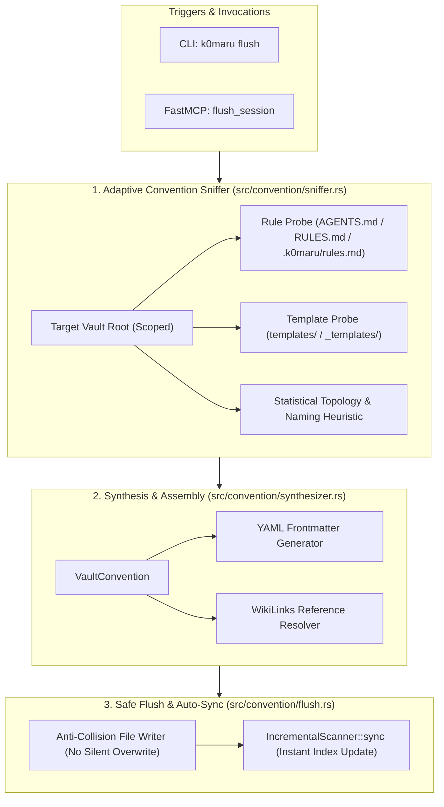

# Spec: Adaptive Vault Convention & Experience Flush Engine (`k0maru flush` & FastMCP `flush_session`)

## 1. Background & Problem Statement

Currently, `k0maru` provides robust, high-performance read-only context recall (`loadout`, `recall_memory`, `search`) and execution log offloading (`offload`, `inspect`). However, the agent memory lifecycle loop is half-open:
- When an AI coding agent completes an engineering milestone, implements a complex architectural feature, or solves a tricky debugging problem, there is no standardized, low-friction mechanism to **crystallize and write back** its learnings into the long-term knowledge base.
- **Critical Architectural Invariant (User-Specified)**:
  - **Zero Hardcoding**: The system must NOT hardcode or assume any specific folder topology (such as `10_Projects/` or `20_Cards/` or `SecondBrain`).
  - **Dynamic Convention Sniffing**: The engine must inspect the target vault (specified by `--vault` or MCP startup) to dynamically read existing user conventions (`AGENTS.md`, `RULES.md`, `templates/`) and infer the vault's statistical organization patterns (directory layout, naming styles, Frontmatter schema).
  - **Scope Isolation**: All operations must be strictly bounded within the designated `vault_root`, with strict path traversal protections.

---

## 2. System Architecture



---

## 3. Detailed Component Specifications

### 3.1 Convention Sniffer (`src/convention/sniffer.rs`)
Given a `vault_root: &Path`:
1. **Explicit Rule Probe**:
   - Searches for `AGENTS.md`, `CLAUDE.md`, `RULES.md`, `CONVENTIONS.md`, or `.k0maru/rules.md`.
   - Parses sections mentioning directory destinations (e.g., `decisions: docs/adr/` or `logs: journal/`).
2. **Template Probe**:
   - Inspects `templates/`, `_templates/`, or `.obsidian/templates/` for files matching `log.md`, `adr.md`, `decision.md`, `note.md`.
   - Extracts body layout and placeholder tokens (e.g. `{{title}}`, `{{date}}`, `{{tags}}`, `{{content}}`).
3. **Statistical Heuristics**:
   - **Target Subdirectory Detection**:
     - For `category == "decision"`: checks for existing `decisions/`, `adr/`, `architecture/`, `docs/adr/`.
     - For `category == "log"`: checks for `logs/`, `journal/`, `daily/`, `records/`.
     - If none match, or if vault is flat: targets `vault_root`.
   - **Filename Naming Style**:
     - Analyzes existing `.md` files in target directory.
     - Categorizes dominant pattern: `YYYY-MM-DD-<slug>.md` (default), `YYYYMMDD-<slug>.md`, or `<slug>.md`.
   - **YAML Frontmatter Style**:
     - Inspects whether existing notes contain `---` YAML frontmatter, and what common keys are present (`title`, `date`, `tags`, `type`, `status`).

### 3.2 Synthesis & Markdown Assembly (`src/convention/synthesizer.rs`)
- Assembles valid, pristine Markdown content:
  - Generates YAML Frontmatter adhering to the detected schema.
  - Substitutes template placeholders if a template is found; otherwise applies a clean, structured ADR/Log template.
  - Automatically wraps related notes in `[[Note Title]]` WikiLinks.

### 3.3 Safe Flush & Auto-Sync (`src/convention/flush.rs`)
- **Path Verification**: Canonicalizes and confirms path does not escape `vault_root`.
- **Anti-Collision**:
  - If target file does not exist: creates cleanly.
  - If target file exists: checks if content differs. Appends version suffix (e.g. `<name>-v2.md` or timestamp) to prevent silent data loss.
- **Dry-Run Support**:
  - When `dry_run == true`, simulates full resolution and returns `FlushResult` with rendered Markdown preview without touching disk.
- **Instant Index Refresh**:
  - On actual disk write, instantiates `IncrementalScanner` and re-indexes the new file immediately so `recall_memory` in the next agent turn can immediately find it.

---

## 4. User Interfaces & Developer Ergonomics

### 4.1 CLI Command (`k0maru flush`)
```bash
k0maru flush [--vault <path>] \
  --title "Migrate Cache from SQLite to SQLite-Vec" \
  [--summary "Performance evaluation and virtual table schema decisions"] \
  [--category decision|log|concept] \
  [--tags rust,sqlite,vectors] \
  [--related "Hybrid Search Architecture"] \
  [--dry-run] [--json]
```

### 4.2 FastMCP Tool (`flush_session`)
Registered in `src/mcp/server.rs`:
```json
{
  "name": "flush_session",
  "description": "Crystallize learnings, architectural decisions, or task summaries back into the Markdown knowledge base according to the vault's conventions.",
  "inputSchema": {
    "type": "object",
    "properties": {
      "title": { "type": "string", "description": "Title of the decision or log note" },
      "summary": { "type": "string", "description": "Brief one-line summary" },
      "content": { "type": "string", "description": "Detailed Markdown content" },
      "category": { "type": "string", "description": "Category: 'decision', 'log', 'concept', or custom", "default": "log" },
      "tags": { "type": "array", "items": { "type": "string" }, "description": "Associated tags" },
      "related_notes": { "type": "array", "items": { "type": "string" }, "description": "Related existing notes to link via WikiLinks" }
    },
    "required": ["title", "content"]
  }
}
```

---

## 5. Work Breakdown & Ticket DAG

1. **Ticket 29: `29-adaptive-vault-convention-sniffer`** (Blocked by: None)
   - Domain types: `NamingStyle`, `NoteCategory`, `VaultConvention`, `FlushRequest`, `FlushResult`.
   - `ConventionSniffer` implementation: explicit rule probe, template probe, directory & filename heuristic.
   - Comprehensive TDD unit tests with mock vaults (flat vault, structured Obsidian vault, vault with custom rules).

2. **Ticket 30: `30-flush-engine-cli-and-mcp-integration`** (Blocked by: 29)
   - `FlushEngine` safe writer with anti-collision and dry-run preview.
   - Auto-sync integration with `IncrementalScanner`.
   - CLI command `k0maru flush` (`--dry-run`, `--json`, `--stdin`).
   - FastMCP tool `flush_session` in `src/mcp/server.rs`.
   - End-to-end integration tests and documentation updates.
