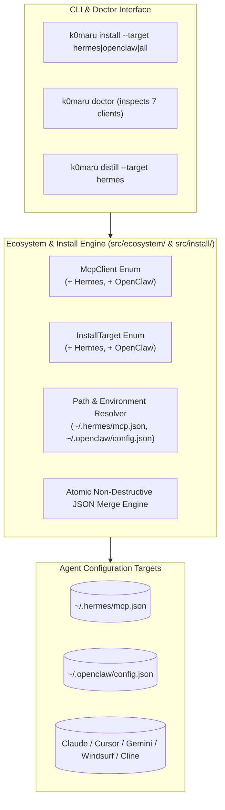

# Spec: Open-Source Agent Ecosystem Connectors (Hermes Agent & OpenClaw)

## 1. Background & Motivation

In version `v0.7.0`, K0maru-Agent-Memory achieved dynamic experience crystallization (**Trace-to-Skill**) and cross-platform binary distribution.
Currently, `k0maru install` and `k0maru doctor` support:
- Claude Code (`~/.claude.json` / `~/.claude/`)
- Cursor (`~/.cursor/mcp.json`)
- Antigravity / Gemini CLI (`~/.gemini/config/mcp_config.json`)
- Windsurf (`~/.codeium/windsurf/mcp_config.json`)
- Cline / Roo Code (`cline_mcp_settings.json` across OS paths)

### 1.1 The Ecosystem Opportunity: Nous Research Hermes Agent & OpenClaw
Open-source agent frameworks are rapidly emerging as high-autonomy coding assistants:
1. **Nous Research Hermes Agent**:
   - Built around the Hermes models (Hermes 2, Hermes 3) and dynamic tool calling loops;
   - Supports FastMCP stdio client configuration via `~/.hermes/mcp.json` or `~/.hermes/config.json` (also honoring `$HERMES_HOME`);
   - Pioneer of the "Dynamic Skill" concept: skills are stored in `~/.hermes/skills/` or repository `.skills/` with structured YAML frontmatter (`name`, `description`, `parameters`, `tags`) and Markdown guidance.
2. **OpenClaw**:
   - Modern open-source modular coding agent framework;
   - Stores MCP server configuration in `~/.openclaw/config.json` or `~/.openclaw/mcp.json` with standard `mcpServers` format.

Connecting K0maru directly into Hermes Agent and OpenClaw allows developers and agents in these ecosystems to mount local Markdown memory and dynamic skills with zero manual configuration.

---

## 2. Architecture & Design

---

## 3. Component Details & Path Resolutions

### 3.1 Nous Research Hermes Agent
- **Display Name**: `"Hermes Agent"`
- **Config Path Resolution**:
  1. Check `$HERMES_HOME/mcp.json` or `$HERMES_HOME/config.json` if environment variable is set;
  2. Fallback to `$HOME/.hermes/mcp.json`;
  3. If `$HOME/.hermes/config.json` exists and `mcp.json` does not, pick `config.json`;
- **Installed Check**:
  - `config_path.exists()` OR `$HOME/.hermes` exists OR `$HERMES_HOME` is set.
- **Config Format**: Standard `{"mcpServers": { "k0maru-memory": { "command": "k0maru", "args": ["mcp", "--vault", "..."] } } }`.

### 3.2 OpenClaw
- **Display Name**: `"OpenClaw"`
- **Config Path Resolution**:
  1. Check `$OPENCLAW_HOME/config.json` or `$OPENCLAW_HOME/mcp.json` if set;
  2. Fallback to `$HOME/.openclaw/config.json`;
  3. If `$HOME/.openclaw/mcp.json` exists, pick `mcp.json`;
- **Installed Check**:
  - `config_path.exists()` OR `$HOME/.openclaw` exists OR `$OPENCLAW_HOME` is set.
- **Config Format**: Standard `{"mcpServers": { ... } }`.

---

## 4. Ticket Breakdown

- **Ticket 32-1: Hermes & OpenClaw Ecosystem Domain Models, Detectors & Doctor Checks**
  - Add `McpClient::Hermes` and `McpClient::OpenClaw` to `src/ecosystem/mod.rs`;
  - Add path resolution and existence checks;
  - Extend `InstallTarget::Hermes` and `InstallTarget::OpenClaw` in `src/install/mod.rs`;
  - Update `k0maru doctor` ecosystem diagnostics;
  - Unit tests covering path resolution, home override, env vars, and client inspection.

- **Ticket 32-2: Hermes & OpenClaw One-Click Installation & CLI Integration**
  - Update `k0maru install` subcommand args to accept `hermes` and `openclaw`;
  - Test non-destructive JSON merges for Hermes and OpenClaw targets;
  - CLI integration tests (`test_install.rs`) for `--target hermes` and `--target openclaw`.

- **Ticket 33-1: Hermes Dynamic Skill Schema Alignment**
  - Support `--target hermes` in `k0maru distill`;
  - Synthesize Hermes-compatible YAML frontmatter (`name`, `description`, `parameters`, `tags`).

- **Ticket 33-2: Hermes Skills Export & Directory Synchronization**
  - Write directly to `~/.hermes/skills/` or local `.skills/` on request.
