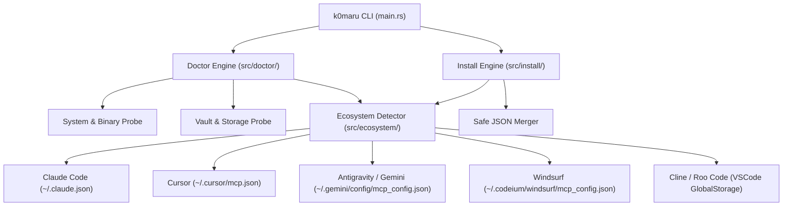

# Spec: One-Click Ecosystem Installer & Health Diagnostics (`k0maru install` & `k0maru doctor`)

## 1. Background & Problem Statement

Currently, when a user or developer wants to use `k0maru-memory` with their AI coding agents (Claude Code, Cursor, Antigravity/Gemini CLI, Windsurf, Cline), they must manually configure JSON-RPC stdio settings in client-specific configuration files. This manual process is prone to:
1. JSON syntax errors and accidental deletion of other MCP servers;
2. Incorrect or relative vault path configurations resulting in empty or broken memory loads;
3. Silent failures when the `k0maru` binary is not in the system `$PATH`;
4. Lack of diagnostic visibility into SQLite FTS5 indices, `sqlite-vec` extension availability, and ONNX model caches.

To make `k0maru` truly turnkey for the open-source community, we introduce two first-class CLI commands:
- `k0maru doctor`: System and environment health diagnostics command with clear `✓ / ⚠ / ✗` status reporting and `--json` support.
- `k0maru install`: Safe, atomic, one-click MCP client configurator with automatic client detection, `--dry-run` preview, and multi-target support.

---

## 2. Command Specifications & User Experience

### 2.1 `k0maru doctor`

```bash
k0maru doctor [--vault <path>] [--json]
```

#### Diagnostic Checks
1. **Binary & System**:
   - `k0maru` binary path (`current_exe`) and version.
   - `$PATH` resolution check: confirms `k0maru` is executable from anywhere.
   - Operating System & architecture.
2. **Vault & Hierarchy**:
   - Canonical vault path resolution.
   - Vault directory existence and accessibility.
   - Markdown document count (`.md` files).
   - Knowledge hierarchy detection (Projects `10_Projects`, Evergreen `20_Cards`, etc.).
3. **Storage & Embedding Engine**:
   - Disposable SQLite cache (`<vault>/.k0maru/cache.sqlite`): existence, file size, FTS5 readiness.
   - `sqlite-vec` extension status and vector index count/coverage.
   - Embedding engine backend: `FastEmbed (ONNX)` or `Mock` provider, cache directory status (`~/.k0maru/models/`).
4. **Agent MCP Ecosystem**:
   - Probes installed client configs:
     - **Claude Code**: `~/.claude.json`
     - **Cursor**: `~/.cursor/mcp.json`
     - **Antigravity / Gemini CLI**: `~/.gemini/config/mcp_config.json`
     - **Windsurf**: `~/.codeium/windsurf/mcp_config.json`
     - **Cline / Roo Code**: `~/Library/Application Support/Code/User/globalStorage/.../cline_mcp_settings.json`
   - Reports whether `k0maru-memory` is mounted, and if the mounted vault path matches and exists.
5. **Output**:
   - Terminal: Beautiful colorized sections with summary counters (`X passed, Y warnings, Z failures`).
   - `--json`: Complete machine-readable `DoctorReport` struct.

---

### 2.2 `k0maru install`

```bash
k0maru install [--vault <path>] [--target <all|claude|cursor|gemini|windsurf|cline>] [--dry-run]
```

#### Installation Workflow
1. **Vault Resolution**: Resolves target vault path, canonicalizes to absolute path.
2. **Client Selection**:
   - If `--target` is specified (e.g. `claude`), targets only that client.
   - If `--target all` (default), scans for all installed/existing client configurations or creates defaults.
3. **Atomic Safe Merge**:
   - Reads target client configuration file.
   - If missing, creates initial JSON structure: `{ "mcpServers": {} }`.
   - Safely parses JSON: preserves existing server entries, formatting, and keys.
   - Injects/updates `k0maru-memory`:
     ```json
     "k0maru-memory": {
       "command": "k0maru",
       "args": ["mcp", "--vault", "<canonical_vault_path>"]
     }
     ```
4. **Dry Run & Preview**:
   - With `--dry-run`, outputs the planned diff or JSON representation without writing to disk.
5. **Atomic Write**:
   - Writes updated JSON via temporary file replacement or direct atomic write to prevent corruption.

---

## 3. Architecture & Data Structures



### Domain Types (`src/ecosystem/mod.rs`)
```rust
#[derive(Debug, Clone, Copy, PartialEq, Eq, Serialize, Deserialize)]
pub enum McpClient {
    Claude,
    Cursor,
    Gemini,
    Windsurf,
    Cline,
}

#[derive(Debug, Clone, Serialize, Deserialize)]
pub struct ClientConfigInfo {
    pub client: McpClient,
    pub name: String,
    pub config_path: PathBuf,
    pub installed: bool,
    pub configured: bool,
    pub configured_vault: Option<PathBuf>,
}
```

---

## 4. Quality & Testing Standards
- Full unit tests for client path resolution across OSes (macOS, Linux, Windows mocks).
- TDD tests for JSON merging (ensuring existing keys/servers are never overwritten or corrupted).
- Integration test for `k0maru doctor` and `k0maru doctor --json`.
- Integration test for `k0maru install` with `--dry-run` and mock directory targets.
- 100% pass on `cargo test`, `cargo clippy --all-targets -- -D warnings`, `cargo fmt --check`.
