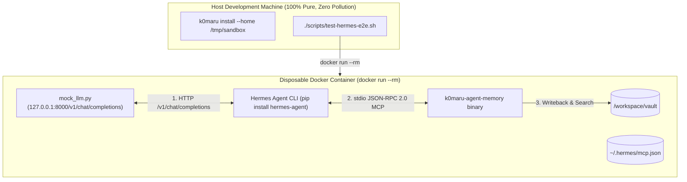

# Spec: Hermes Agent & OpenClaw Sandbox Gate & Black-Box Docker E2E Verification

## 1. Context & Two Non-Negotiable Invariants

To achieve true ecosystem acceptance without relying on self-contained mocks alone, we implement a two-tier verification architecture:
1. **Tier 1 (Local Protocol & Sandbox Gate)**:
   - Built-in `--home <PATH>` argument for `k0maru install` and `k0maru doctor`;
   - Strict `$HERMES_HOME` and `$OPENCLAW_HOME` environmental sandboxing;
   - Complete stdio MCP pipe conformance testing (`initialize`, `tools/list`, and multiple `tools/call` commands).
2. **Tier 2 (Black-Box Containerized E2E with Zero API Cost & Zero Host Pollution)**:
   - **Invariant 1: Zero Host Pollution**: Strict isolation inside `docker run --rm` containers. No `pip install` on host macOS.
   - **Invariant 2: Zero API Cost & Zero Leaks**: In-container Python standard library mock OpenAI server (`mock_llm.py`) serving `http://127.0.0.1:8000/v1/chat/completions`. Simulates two-turn tool calling:
     - Turn 1: Returns OpenAI JSON with `tool_calls` for `k0maru-memory`;
     - Turn 2: Returns natural language completion acknowledging tool result.
   - **Invariant 3: Zero-Daemon Compliance**: Post-execution process tree inspection verifying zero orphaned `k0maru` daemons remain.

---

## 2. Architecture & Workflow

---

## 3. Tickets Breakdown

- **Ticket 32-3: CLI `--home <PATH>` Parameter & Complete MCP Pipe Conformance**
  - Add `--home` to `InstallArgs` and `DoctorArgs` in `src/main.rs`;
  - Pipe `home_override` into `InstallOptions` and `run_diagnostics`;
  - Add `tests/test_mcp_conformance.rs` verifying full `initialize` -> `tools/list` -> `tools/call` for `recall_memory`, `flush_session`, and `distill_session_skill`.

- **Ticket 32-4: Zero-API Hermes Black-Box Docker E2E Test Suite**
  - Create `tests/ecosystem/hermes/mock_llm.py`;
  - Create `tests/ecosystem/hermes/Dockerfile`;
  - Create `tests/ecosystem/hermes/run_e2e.sh`;
  - Create host entrypoint `./scripts/test-hermes-e2e.sh`.
