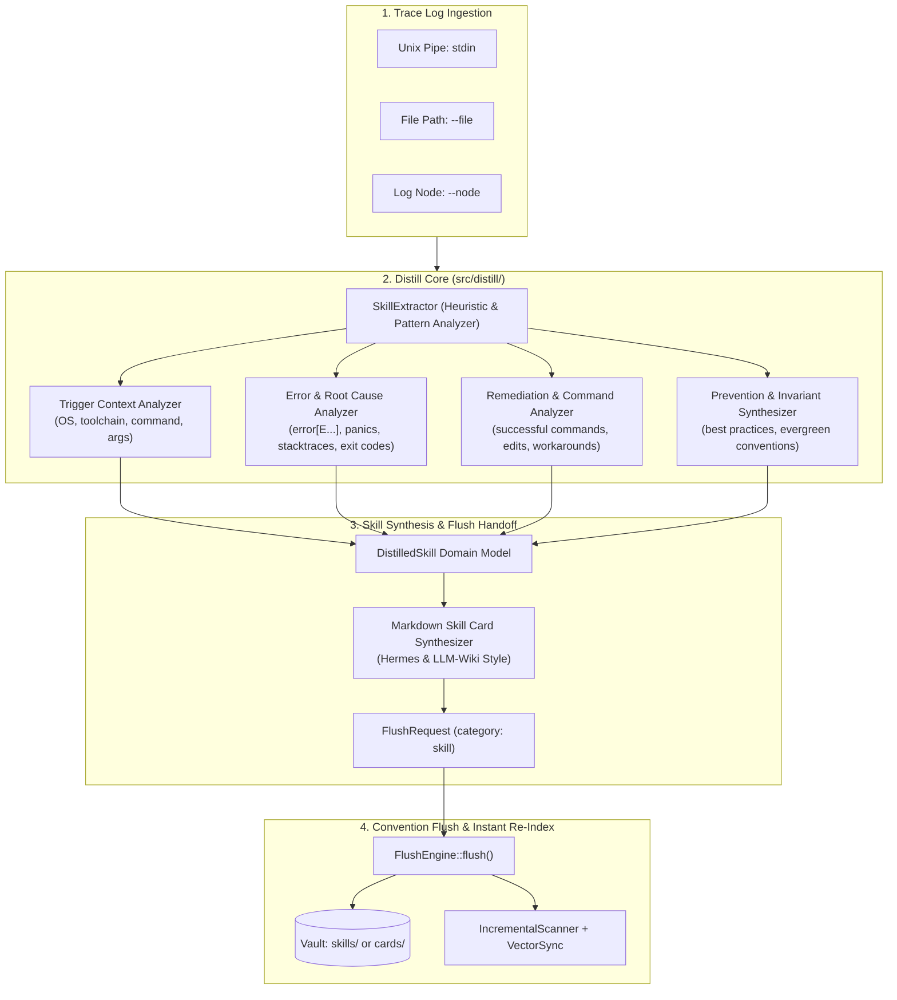

# Spec: Dynamic Experience Distillation Engine — Trace-to-Skill (`k0maru distill` & FastMCP `distill_session_skill`)

## 1. Background & Problem Statement

Currently in `v0.6.0`, K0maru-Agent-Memory provides:
1. **Execution Log Offloading (`k0maru offload` / `offload_context`)**: Intercepts verbose terminal output and test logs (>50 lines), storing them to `.scratch/refs/<task_id>_<node_id>.log` and leaving a compact Mermaid state diagram in context;
2. **Adaptive Convention Flush (`k0maru flush` / `flush_session`)**: Discovers vault folder conventions and writes back structured Markdown notes with anti-collision and automatic incremental vector/FTS5 synchronization.

### 1.1 The Missing Link (Core Pain Point)
Between raw troubleshooting traces (e.g. compiler errors, stack traces, test failures, multi-step debugging iterations) and crystallized long-term knowledge notes, there is no automated bridge. Developers and AI coding agents currently have to manually re-read verbose raw logs, mentally dissect root causes, type out remediation steps, and formulate prevention guidelines.

### 1.2 Upstream Inspiration & Technical Lineage
- **Nous Research Hermes Agent**: Dynamical skill evolution from tool execution traces. A skill is not just conversational chat history; it is a reusable action manual containing:
  - **Trigger Context**: Under what conditions, commands, or environment this skill applies;
  - **Error Signature & Root Cause**: What failed, error stack traces, compiler output, exit codes;
  - **Remediation & Commands**: Exact series of commands, code modifications, or configuration adjustments that successfully resolved the issue;
  - **Prevention Rules / Invariants**: Guidelines and best practices to prevent future recurrence.
- **LLM-Wiki Bidirectional Memory Loop**:
  - Raw Execution (`offload` L1/L2) $\to$ Trace-to-Skill Distillation $\to$ Structured Skill Card (L3 Evergreen) $\to$ Next Session Loadout / Recall.

---

## 2. Architecture & Workflow



---

## 3. Detailed Component Specifications

### 3.1 Domain Model (`src/distill/model.rs`)
```rust
#[derive(Debug, Clone, PartialEq, Eq, Serialize, Deserialize)]
pub struct DistilledSkill {
    /// Skill title (e.g. "Resolve sqlite-vec dynamic linking failure on macOS")
    pub title: String,
    /// Environmental and operational context where issue was encountered
    pub trigger_context: String,
    /// Root cause analysis and key error signatures/snippets
    pub root_cause: String,
    /// Concrete series of commands or actions that remediated the issue
    pub remediation: String,
    /// Defensive rules and evergreen practices for agents and developers
    pub prevention_rules: Vec<String>,
    /// Tags associated with the skill (e.g. ["#type/skill", "#topic/rust", "#topic/build"])
    pub tags: Vec<String>,
    /// Related notes or wiki links for graph traversal
    pub related_notes: Vec<String>,
}
```

### 3.2 Skill Extractor (`src/distill/extractor.rs`)
Analyzes raw trace lines with multi-pass heuristics:
1. **Command & Environment Extraction**:
   - Detects CLI invocations (e.g., `cargo build`, `pytest`, `npm test`, `git`, `docker`);
   - Detects toolchain indicators (Rust, Python, Node, Go, C/C++);
2. **Error Pattern Recognition**:
   - Matches Rust compiler errors (`error[E0...]`, `cannot find value`), Panics (`thread 'main' panicked at`), Python tracebacks (`Traceback (most recent call last):`), C/C++ linker failures (`ld: symbol(s) not found`), Exit codes (`exited with code`, `status: 1`);
   - Extracts leading error lines and truncated stack snippet;
3. **Remediation & Fix Discovery**:
   - Detects successful follow-up commands (`Finished`, `passed`, `OK`, `Success`);
   - Extracts manual remediation instructions or context hints passed by the caller (`--context`);
4. **Prevention & Rule Synthesis**:
   - Extracts actionable invariants ("Always run ... before ...", "Verify dynamic library paths with ...");
   - Supplies structured fallback guidelines if trace is purely error-output.

### 3.3 Distill Engine (`src/distill/engine.rs`)
```rust
pub struct DistillEngine {
    vault_root: PathBuf,
    refs_dir: PathBuf,
}

pub struct DistillOptions {
    pub title: Option<String>,
    pub context_hint: Option<String>,
    pub category: Option<String>,
    pub tags: Vec<String>,
    pub related_notes: Vec<String>,
    pub dry_run: bool,
}

impl DistillEngine {
    pub fn distill_text(&self, raw_trace: &str, opts: DistillOptions) -> Result<DistillResult, ...>;
    pub fn distill_node(&self, node_id: &str, opts: DistillOptions) -> Result<DistillResult, ...>;
    pub fn distill_file(&self, path: &Path, opts: DistillOptions) -> Result<DistillResult, ...>;
}
```

### 3.4 Integration with `ConventionSniffer` and `FlushEngine`
- `NoteCategory::Skill`:
  - Added to `NoteCategory` in `src/convention/mod.rs`;
  - `ConventionSniffer::probe_category_topology` checks candidates: `["skills", "playbooks", "recipes", "troubleshooting", "cards"]`;
  - `synthesize_markdown` formats the skill note with standard frontmatter and four clear sections.

---

## 4. User Interfaces & Developer Ergonomics

### 4.1 CLI Interface: `k0maru distill`
```bash
# Distill from an offloaded node reference
k0maru distill --node node_1a2b3c4d --context "Dynamic linking error with sqlite-vec"

# Distill from a local trace log file
k0maru distill --file /path/to/trace.log --title "Fix Svelte 5 Rune Hydration Mismatch"

# Distill from standard input pipeline
pytest | k0maru distill --context "Test failure in auth middleware"

# Options:
#   --vault <path>       Target vault path (defaults to current/nearest)
#   --node <node_id>     Node ID from refs
#   --file <path>        Path to trace log file
#   --title <title>      Explicit skill title (auto-generated if omitted)
#   --context <hint>     Context / prompt hint explaining the trace
#   --category <cat>     Category (default: skill)
#   --tags <t1,t2>       Comma-separated tags
#   --dry-run            Preview generated skill without writing to vault
#   --json               Output structured JSON
```

### 4.2 FastMCP Tool: `distill_session_skill`
Exposed over stdio JSON-RPC 2.0:
- **Name**: `distill_session_skill`
- **Description**: "Distill an execution trace, error log, or debugging session into a reusable skill card and crystallize it into the vault."
- **Parameters**:
  - `raw_trace` (string, optional if `node_id` provided)
  - `node_id` (string, optional if `raw_trace` provided)
  - `title` (string, optional)
  - `context_hint` (string, optional)
  - `category` (string, optional, default: `"skill"`)
  - `tags` (array of strings, optional)
  - `related_notes` (array of strings, optional)
  - `dry_run` (boolean, optional, default: false)

---

## 5. Verification & Testing Criteria
1. **Unit Tests**:
   - `test_extractor_rust_error_trace`: Extracts error snippet and compiler code from Rust error log;
   - `test_extractor_python_traceback`: Extracts Python traceback and root cause;
   - `test_distill_markdown_format`: Validates 4 mandatory sections and YAML frontmatter;
   - `test_distill_with_context_hint`: Combines raw trace with agent's natural language explanation.
2. **Integration Tests**:
   - CLI test: `k0maru distill` reads stdin and creates `<vault>/skills/YYYY-MM-DD-<slug>.md`;
   - CLI test: `k0maru distill --node <node_id>` loads from `.scratch/refs/` and writes to mock vault;
   - CLI test: `--dry-run` outputs full preview without touching disk;
   - FastMCP test: invokes `distill_session_skill` via JSON-RPC, validates skill created, and queries `recall_memory` to verify instant auto-sync;
3. **Quality Gates**:
   - `cargo test --all-targets` passes 100%;
   - `cargo clippy --all-targets -- -D warnings` zero warnings;
   - `cargo fmt --check` zero formatting diffs.
