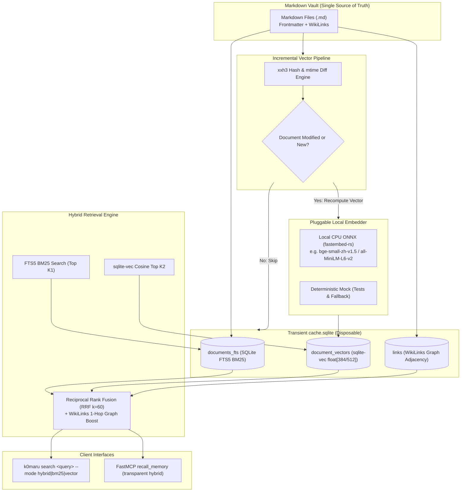

# Specification: Phase 4 — Disposable Vector Cache & Hybrid Search Engine (sqlite-vec + Local Embeddings)

## 📌 Executive Summary & Architecture Overview

Phase 4 upgrades **K0maru-Agent-Memory** from lexical-only (BM25 FTS5 + WikiLinks Graph) to an **industrial-grade Hybrid Retrieval Engine** combining:
1. **BM25 Lexical Ranking** (`documents_fts` via SQLite FTS5 `unicode61`);
2. **Dense Vector Cosine Similarity** (`document_vectors` via C-native `sqlite-vec`);
3. **Reciprocal Rank Fusion (RRF)**: Merges BM25 and Vector rankings with WikiLinks 1-hop graph routing bonus;
4. **"Disposable Vector Cache" Philosophy**: Vector embeddings are strictly stored within the transient `cache.sqlite`. No external database, zero network locks, and 100% losslessly rebuildable from Markdown files.



---

## 📐 Detailed Functional Specifications

### 1. Vector Virtual Table Schema (`sqlite-vec`)
- `document_vectors` virtual table created using `sqlite-vec` extension:
  ```sql
  CREATE VIRTUAL TABLE IF NOT EXISTS document_vectors USING vec0(
      id TEXT PRIMARY KEY,
      embedding float[384] distance_metric=cosine
  );
  ```
- Dimension: Default 384 (standard for `all-MiniLM-L6-v2` / `bge-micro`), configurable to 512/768.
- Foreign Key: `id` matches `documents.id` (canonical relative file path).

### 2. Pluggable Embedding Trait Seam
```rust
#[async_trait::async_trait]
pub trait EmbeddingEngine: Send + Sync {
    /// Generates normalized float embeddings for a batch of text segments.
    fn embed_batch(&self, texts: &[&str]) -> Result<Vec<Vec<f32>>, VectorError>;
    
    /// Returns the embedding dimension.
    fn dimension(&self) -> usize;
}
```
- **Implementations**:
  - `FastEmbedBackend`: Local ONNX Runtime execution using `fastembed-rs`. Models cached at `~/.k0maru/models/` (or `<vault>/.k0maru/models/`). Cold boot is isolated: only loaded during indexing/search, zero impact on `offload` or `loadout`.
  - `MockEmbeddingEngine`: Deterministic pseudo-random / hash-based unit test engine with 0 external downloads and <1ms execution.

### 3. Incremental Vector Indexing & Synchronization
- Embedded documents are tracked by a metadata table:
  ```sql
  CREATE TABLE IF NOT EXISTS vector_metadata (
      document_id TEXT PRIMARY KEY,
      content_hash INTEGER NOT NULL,
      updated_at INTEGER NOT NULL
  );
  ```
- **Zero-dirty skip**: If `content_hash` matches current `documents.content_hash`, skip re-embedding.
- **Batching**: Process embeddings in configurable chunks (default: 32 documents/batch) to maintain low RAM ceiling.

### 4. Reciprocal Rank Fusion (RRF) Hybrid Search
- **Standard RRF Formula** ($k = 60$):
  $$\text{Score}(d) = \sum_{m \in \{\text{BM25}, \text{Vector}\}} \frac{w_m}{k + \text{rank}_m(d)} + \text{GraphBoost}(d)$$
- $w_{\text{BM25}} = 0.5$, $w_{\text{Vector}} = 0.5$ (default configurable).
- **GraphBoost**: If document $d$ has WikiLink bidirectional connections to other top-ranking candidates, award a $+0.05$ connectivity bonus.

### 5. CLI & FastMCP Interface Updates
- **New CLI Command**:
  ```bash
  k0maru search "<query>" --vault <path> [--mode hybrid|bm25|vector] [--limit 5] [--json]
  ```
- **Updated Sync Command**:
  ```bash
  k0maru sync --vault <path> --vector   # Automatically embeds new/modified documents
  ```
- **FastMCP `recall_memory`**:
  - Automatically queries using `hybrid` mode when vectors are available, falls back to `bm25` if vectors are absent.

---

## 🛡️ Non-Functional Requirements & Performance Budgets
1. **Cold Start & Binary Hygiene**:
   - `k0maru --version` and `k0maru offload` latency must remain **< 5ms** (zero ONNX loading on non-vector paths).
2. **Memory Ceiling**:
   - In non-vector mode: RSS **< 15MB**.
   - During active ONNX embedding: peak RAM **< 200MB**.
3. **Disposable Guarantee**:
   - Deleting `cache.sqlite` and running `k0maru sync --vector` fully recreates FTS5, WikiLinks graph, and `sqlite-vec` indexes.
4. **Test Isolation**:
   - 100% automated tests must run hermetically in `tempfile::tempdir` without network calls.
