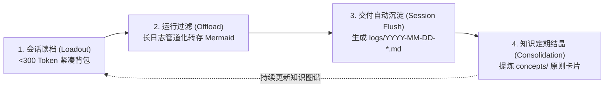
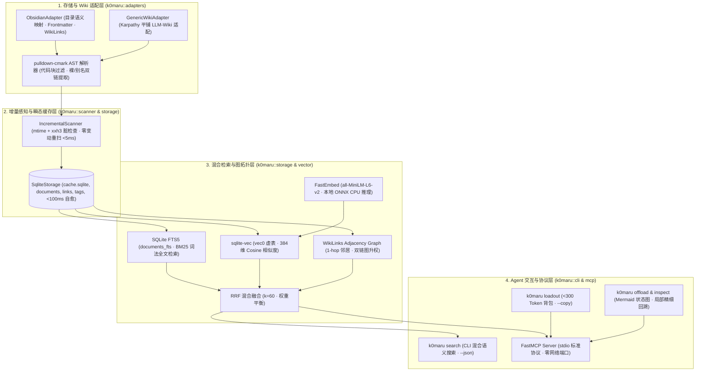

# K0maru-Agent-Memory

> **面向个人 Markdown 知识库与本地 LLM-Wiki 的轻量化 Agent 记忆中枢与上下文治理工具**  
> *A Standalone, Single-Static-Binary, Zero-Daemon Long-Term Memory Hub for AI Coding Agents.*

[](https://www.rust-lang.org/)
[](LICENSE)
[]()
[]()
[]()
[]()
[]()

---

## 📌 背景与设计动因 (Motivation & Design Goals)

在现代软件工程中，AI 编码智能体（如 Claude Code、Cursor、Windsurf、Antigravity 等）已经深度融入开发工作流。然而在复杂系统与长周期项目中，智能体与上下文交互时普遍面临以下工程挑战：

1. **跨会话上下文丢失（Cross-Session Amnesia）**：开辟新任务会话时，智能体无法自动获知项目的顶层架构约束（ADR）与近期开发进展，往往需要开发者反复复制粘贴背景，或因注入过多无关文档导致提示词冗余。
2. **终端长日志挤占上下文窗口（Terminal Log Bloat）**：运行单测、构建工具或排障命令时，数十至上千行的堆栈输出容易迅速填满上下文窗口，诱发注意力漂移（Attention Drift）并大幅增加 Token 成本。
3. **本地开发环境下的架构权衡**：许多现有的记忆或向量检索系统采用基于 Docker、PostgreSQL 或常驻后台守护进程的微服务架构。这类架构在团队多租户云端协作中具有优势，但在个人开发者的单机轻量化场景中，存在依赖链条长、内存占用高以及网络端口冲突等问题。

### 🌟 核心设计原则

* **自备文档（Bring Your Own Markdown）**：以用户已有的本地 Markdown 笔记（如 Obsidian Vault、Karpathy 风格 LLM-Wiki）作为唯一的事实源泉（Single Source of Truth），不引入私有二进制文件格式，不强制更改文件后缀或现有目录层级。
* **瞬态缓存（Disposable Cache）**：底层仅维护单文件 SQLite 数据库（`cache.sqlite`），用于 FTS5 BM25 全文检索、`sqlite-vec` 向量虚表与双链图拓扑加速。该数据库被视为随时可抛弃的瞬态缓存，删除后可在数十毫秒内完全自愈重建。
* **零守护进程与极简开销（Zero-Daemon & Low Overhead）**：纯 Rust 编写并静态编译为单个二进制可执行文件，冷启动耗时 ~3.4ms，常驻内存仅 ~11MB，不占用任何常驻网络端口，通过标准 CLI 管道与 `stdio` MCP 协议即用即走。

---

## ⚡ 核心功能与工作流 (Core Capabilities)

### 1. 项目级读档装配背包（`k0maru loadout`）
开辟新开发任务时，根据项目标识提取该项目的核心目标、关联的常青架构原则（L3）以及最近的开发日志（L2），将高密度上下文严格控制在 **< 300 Token**（维持在模型的 Smart-Zone 推理黄金区）：

```bash
# 提取指定项目的装配背包，并自动写入系统剪贴板 (macOS / Linux / Windows)
k0maru loadout my-project --vault ~/wiki --copy
```

在新会话中直接粘贴即可为智能体提供必要的项目背景，避免重复解释。

### 2. 终端长日志符号化卸载（`k0maru offload` & `inspect`）
在执行自动化测试或编译命令时，通过标准 Unix 管道对输出进行治理：
- 小于等于 50 行的输出原样透传；
- 超过 50 行的超长日志自动截断并持久化至外部引用目录（`.scratch/refs/`），在控制台仅输出带 `node_id` 的结构化 Mermaid 状态图；
- 智能体如需深入排查某处失败，可凭 `node_id` 精准调取局部错误堆栈切片。

```bash
# 管道化执行过滤，防上下文撑爆
cargo test | k0maru offload

# 按需定向检索特定故障切片
k0maru inspect node_54697ed3
```

### 3. 一次性本地向量缓存与 RRF 混合检索（`k0maru search`）
基于 C 原生 `sqlite-vec` 向量虚表与本地 CPU ONNX 嵌入引擎（`fastembed-rs`，默认 `all-MiniLM-L6-v2` 384 维向量），实现 BM25 词法全文检索与语义向量检索的互易倒数融合（Reciprocal Rank Fusion, RRF $k=60$），并结合 1-hop 双链拓扑图升权（Graph Boost +0.05）：

```bash
# 混合检索指定关键词或语义概念（默认 hybrid 模式，支持 bm25 / vector / hybrid）
k0maru search "架构约束与上下文治理" --vault ~/wiki --mode hybrid --limit 5

# 输出结构化 JSON 供脚本与智能体流式消费
k0maru search "vector cache" --vault ~/wiki --json
```

- **一次性向量缓存契约（Disposable Vector Cache）**：向量仅存在于可随时丢弃重建的 `cache.sqlite` 中，`sync --vector` 自动基于 `xxh3` 内容哈希进行 0 增量跳过计算；
- **冷启动与轻量化隔离**：高频热路径（`loadout`、`offload`、`--version`）严格零加载 ONNX 运行环境，冷启动性能保持严格在 <5ms。

### 4. 内嵌式可视化控制台与调试台（`k0maru ui`）
按需在本地临时启动高性能可视化控制台（支持 `--open` 自动唤醒默认浏览器），前端静态资源通过 `rust-embed` 完全内嵌编译进单静态二进制，退出（`Ctrl+C`）即刻释放所有端口与内存，绝无常驻守护进程：

```bash
# 唤醒本地可视化控制台并自动打开浏览器
k0maru ui --vault ~/wiki --open
```


- **中英双语国际化 (Bilingual I18n)**：顶栏配备 `🌐 中文 / EN` 一键无缝即时切换，首访自动识别系统语言偏好并支持 `localStorage` 本地记忆持久化；
- **多路检索调试台 (Search Debugger)**：支持交互式查询与模式切换，全景展示 BM25 排名、Vector 距离、RRF 得分与醒目的 Emerald `+0.05 Graph Boost` 拓扑升权徽标；
- **符号化日志切片透视 (Log & Trace Inspector)**：原生离线渲染 Mermaid 流程状态图，行号对齐且带错误高亮（`error` / `panicked`）的折叠堆栈查看器，支持一键复制 Node ID 与原始报错切片；
- **缓存健康与 Token 计分板 (Token Scoreboard)**：实时统计向量覆盖率、缓存物理体积、基于量化基准的累积 Token 缩减量与 TRR 压缩比，提供一键实时增量同步；
- *(注：WikiLinks 知识图谱图鉴底层数据模型与 `/api/graph` 保持就绪，前端 UI 默认保持精简收起)*。

> 📖 **详尽控制台图文教程与实操工作流请参阅**：[docs/UI_TUTORIAL.md](docs/UI_TUTORIAL.md)


### 5. FastMCP 协议原生集成（`k0maru mcp`）
无需启动任何后台网络常驻服务，通过标准 `stdio` 暴露 Model Context Protocol（JSON-RPC 2.0），随 IDE 或 Agent 进程唤醒与退出：
- `get_project_loadout`：获取项目紧凑型读档提示词包（严格受控预算 <300 Token）；
- `recall_memory`：基于 FTS5 BM25 + `sqlite-vec` + RRF + 双链图拓扑加速的混合语义记忆检索（自动附加反链拓扑与精准上下文摘要）；
- `offload_context`：提供字符串级的长文本符号化卸载；
- `inspect_log_node`：检索已卸载的局部日志切片。

#### 💡 自然语言意图驱动（无需任何特定关键词）
很多用户会问：*“我必须说某些特定口令或关键词才能触发吗？”*  
**完全不需要！** MCP 机制是通过每个工具的 Schema 语义描述工作的。大语言模型（如 Claude 3.5 Sonnet、GPT-4o 等）能够根据对话上下文自主推断意图并调用对应工具：

| 人类大白话提问示例 | AI 自主理解并触发的底层工具 | 触发逻辑 |
| :--- | :--- | :--- |
| *“准备开发新任务，先熟悉一下项目背景”*<br/>*“我们仓库有什么必须遵守的架构铁律吗？”* | `get_project_loadout` | 模型识别出「需要读档与对齐项目背景」意图，自动加载核心常青卡片与近期日志 |
| *“数据库超时我们一般建议怎么配？”*<br/>*“看看我们以前有没有讨论过 JWT 刷新的笔记”*<br/>*“这块代码感觉容易死锁，查查知识库最佳实践”* | `recall_memory` | 模型识别出「需要查阅私有知识库」意图，自动提取概念关键词进行混合语义检索 |
| *“刚才跑单测报了 300 多行错，看看失败的具体堆栈”* | `inspect_log_node` | 模型识别出「需要调取已截断报错切片」意图，按 ID 精准提取局部原始日志 |

> 🌟 **检索免字面精确匹配**：由于底层采用了 **Hybrid 混合检索（向量 ONNX + BM25 + 双链升权）**，哪怕您提问的用词与笔记标题不完全一样（例如搜“库存超卖”，笔记叫“防重放扣减”），向量模型也会自动泛化识别并成功召回。

#### 🚀 进阶技巧：如何让 AI 100% 主动翻阅知识库？
如果您希望 AI 在写代码前**完全不需要您提醒、自主主动翻看笔记库**，只需在项目根目录的 `AGENTS.md`（或全局 System Prompt）中添加一行指引：
```markdown
> 在设计系统架构、排查疑难 Bug 或编写核心业务逻辑前，优先调用 `k0maru-memory` 翻阅本地知识库，严格对齐已沉淀的技术规范与历史决策。
```
添加后，哪怕您只说一句普通的 *“帮我写个用户注册模块”*，AI 也会在后台先行查阅您的安全规范与密码哈希标准，杜绝凭空臆造（No Vibe Coding）。


### 6. 增量感知与快速同步（`k0maru sync`）
基于文件的最后修改时间（`mtime`）与 `xxh3` 校验和状态机，仅增量处理新增、修改或删除的文档，支持 `--vector` 增量嵌入与 `--json` 输出供外部工具与自动化脚本调用。

```bash
# 仅增量扫描 Markdown 结构与 FTS 索引
k0maru sync --vault ~/wiki

# 联动增量嵌入向量索引 (批量 32 篇，自动跳过未修改文档)
k0maru sync --vault ~/wiki --vector
```

---

## 🔄 记忆生命周期：LLM-Wiki 的双向闭环与经验结晶

知识库与智能体之间应当形成可持续复利的双向反馈回路。系统遵循**「仅在产生阶段交付或明确决策点时才沉淀」**的原则，防止琐碎会话毒化长期记忆：



1. **唤醒与读档（Loadout）**：每次开启新任务时，动态注入精简的项目愿景、关联设计原则与最新日志。
2. **运行与过滤（Offload）**：长耗时命令通过管道过滤，将冗长堆栈转储为外部切片，主上下文仅维护拓扑图。
3. **阶段交付自动沉淀（Session Flush）**：任务或工单达成时，智能体在 `logs/` 写入当日研发记录与技术决策（ADR），并同步更新项目状态。
4. **知识提炼与定期结晶（Consolidation）**：周期性巡检日志中的高频经验与踩坑规约，升维提炼为 `concepts/` 或常青原子卡片，实现知识库自演进。

---

## 🏗️ 架构设计：四层解耦引擎



---

## 📊 方案对比矩阵 (Architectural Comparison)

不同应用场景在架构权衡上各有侧重：

| 评估维度 | 全量手动粘贴 (Vanilla Context) | 容器化微服务方案 (如 Letta / TencentDB) | 专有后台守护工具 (如 agentmemory) | **K0maru-Agent-Memory (本项目)** |
| :--- | :--- | :--- | :--- | :--- |
| **存储媒介** | 散落文本或无持久化 | 外部数据库 (PostgreSQL, pgvector, Redis) | 专有格式或隐藏目录数据库 | **本地既有 Markdown 笔记 (纯文本)** |
| **部署与运行模型** | 无依赖 | Docker Compose 多容器集群 | 需常驻后台守护进程 (`iii-engine` 等) | **单静态二进制，按需运行 (零守护进程)** |
| **网络端口占用** | 0 | 1 ~ 4 个网络端口 | 1 ~ 4 个网络端口 | **0 端口** (纯 Unix 管道与 stdio 通信) |
| **冷启动延迟** | 即时 | 2,500 ms ~ 3,500 ms (容器及环境启动) | 1,000 ms ~ 2,000 ms | **3.38 ms** (Rust 原生执行) |
| **常驻内存开销** | 0 | ~850 MB - 2,000 MB | ~150 MB - 300 MB | **~11.7 MB** (任务完成后完全归还操作系统) |
| **长日志治理** | 截断由人肉或大模型被动截取 | 需经由网络 API 传输处理 | 依赖内部处理逻辑 | **标准 Unix 管道过滤器 (`\| k0maru offload`)** |
| **索引自愈机制** | 无 | 强依赖外部数据库快照与备份 | 依赖本地私有数据库完整性 | **单文件 `cache.sqlite` 随时可删，74ms 快速全量重建** |

---

## 📈 量化评测与性能基准 (Quantitative Benchmarks)

项目内置了可完全独立复现的离线基准测试套件（见 [benchmarks/README.md](benchmarks/README.md)），在同一台标准开发机上对真实工业级日志与系统开销进行了量化测量：

### 1. 长排障任务 Token 压缩效果 (Token Reduction Ratio)
测试集涵盖 Rust 编译器报错（500行）、Python 测试失败回溯（800行）、TypeScript/Jest 异步异常（1,200行）及多线程崩溃转储（2,500行），采用 `tiktoken`（`cl100k_base` 与 `o200k_base`）测量：

| 评估日志样本 | 原始行数 | 原始 Tokens (`cl100k`) | Offload 后 Tokens | **Token 压缩率 (TRR %)** |
| :--- | :---: | :---: | :---: | :---: |
| `cargo_build_error.log` | 500 行 | 5,455 | 148 | **97.29%** |
| `pytest_failures.log` | 800 行 | 10,621 | 152 | **98.57%** |
| `jest_test_failures.log` | 1,200 行 | 12,362 | 151 | **98.78%** |
| `multithread_crash.log` | 2,500 行 | 78,943 | 151 | **99.81%** |
| **总体加权综合** | **5,000 行** | **107,381** | **602** | **99.44%** |


在模拟的 10 轮排错交互中，未治理的智能体由于多轮日志累加在第 6 轮即突破 128k 上下文红线（累计达到 162.5k Token），而采用符号化卸载的智能体全程平稳维持在 1,505 Token（实现 99.1% 的累积 Token 缩减）：


### 2. 系统能效与轻量化指标 (Systems Footprint)
对二进制执行 100 次冷启动采样，并针对 500 篇包含 YAML 元数据与双链的 Markdown 文档进行全量索引重建：


- **冷启动延迟**：Median (p50) **3.38 ms**，P95 为 4.30 ms，P99 为 5.54 ms；
- **缓存瞬态重建吞吐量**：500 篇文档从零创建 SQLite FTS5 索引总耗时 **74.55 ms**（吞吐量达 **6,707 篇/秒**）；
- **零变动增量扫描耗时**：**11.67 ms**；
- **二进制大小**：**3.66 MB**。

---

## 🙏 致谢与开源参考 (Acknowledgments & Technical Ancestry)

K0maru-Agent-Memory 的设计直接吸收了开源社区与前沿研究的优秀思想，在此向以下项目、作者与团队致以诚挚敬意：

1. **Andrej Karpathy ([LLM-Wiki](https://gist.github.com/karpathy))**：
   - **设计理念参考**：吸收了由平铺 Markdown 页面与语义双链图谱构成的知识复利模式，确立了“文件系统即唯一真理源泉”的核心原则。
2. **腾讯云 ([TencentDB-Agent-Memory](https://github.com/TencentCloud/TencentDB-Agent-Memory))**：
   - **功能与思想参考**：吸收了其“Mermaid 符号化日志卸载（Symbolic Log Offloading）”算法以及“L0-L3 语义分层模型（Daily/Ephemeral ➔ Resource ➔ Log ➔ Evergreen）”的架构思想。本项目基于 Rust 进行了 100% 独立的净室重构（Clean-Room Implementation），将其解耦为纯 CLI 管道过滤器与本地瞬态缓存引擎。
3. **Colby McHenry ([CodeGraph](https://github.com/colbymchenry/codegraph))**：
   - **设计理念参考**：借鉴了其采用 100% 本地 Rust 预索引代码与双链拓扑图谱的高性能架构思想。
4. **Nous Research ([Hermes Agent](https://github.com/nousresearch/hermes-agent))**：
   - **机制参考**：借鉴了其从执行轨迹（Execution Traces）中自生长并沉淀标准化技能的动态经验循环概念。
5. **Anthropic ([Model Context Protocol](https://modelcontextprotocol.io/))**：
   - **协议标准参考**：遵循其标准化的 stdio 进程间 JSON-RPC 2.0 协议规范。
6. **开源底层基础库**：
   - 感谢 [`pulldown-cmark`](https://github.com/pulldown-cmark/pulldown-cmark)（高速 CommonMark AST 事件流解析）、[`rusqlite`](https://github.com/rusqlite/rusqlite)（嵌入式 SQLite 与 FTS5 全文索引）以及 [`clap`](https://github.com/clap-rs/clap) 等优质 Rust 生态库。

---

## 🚀 安装与快速上手 (Installation & Quickstart)

详细步骤见 [QUICKSTART.md](QUICKSTART.md)。

```bash
# 1. 编译生成单静态二进制 (全量测试验证)
cargo build --release

# 2. 安装至系统环境
cp target/release/k0maru ~/.local/bin/

# 3. 验证运行
k0maru --version
# 输出: k0maru 0.3.0
```

### 挂载至 Claude Code / Cursor (FastMCP)
在客户端 MCP 配置文件中添加：
```json
{
  "mcpServers": {
    "k0maru-memory": {
      "command": "k0maru",
      "args": ["mcp", "--vault", "/path/to/your/markdown-vault"]
    }
  }
}
```

---

## ⚖️ 开源协议 (License)

本项目采用 [MIT License](LICENSE) 授权开源。
