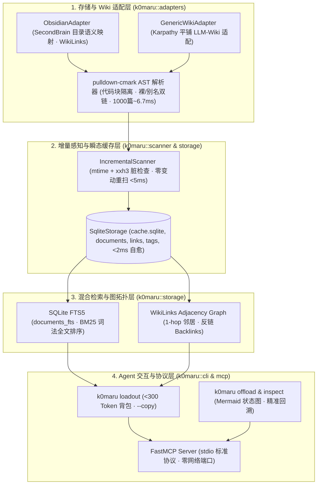

# 🚀 K0maru-Agent-Memory

> **面向个人 LLM-Wiki 与第二大脑的独立轻量化 Agent 记忆引擎**  
> *A Standalone, Single-Static-Binary, Zero-Daemon Long-Term Memory Hub for AI Coding Agents.*

[](https://www.rust-lang.org/)
[](LICENSE)
[]()
[]()
[]()
[]()

---

## 💡 为什么需要 K0maru-Agent-Memory？

成千上万的开发者与极客拥有精心维护的 **Obsidian Vault（如 SecondBrain）** 或 **Karpathy 风格的平铺 LLM-Wiki**。这些是人类与 AI 协作最宝贵的事实资产。

然而，现存的记忆中枢工具（如 TencentDB-Agent-Memory、Letta、rohitg00/agentmemory）存在巨大的痛点：
* ❌ **强行推行封闭数据库**：逼迫用户安装 Docker、PostgreSQL、Redis，把知识录入进私有黑盒数据库，割裂了本地已有笔记；
* ❌ **霸占网络端口与后台资源**：在后台开常驻守护进程，霸占 4 个网络端口，经常端口冲突或僵死；
* ❌ **长日志撑爆 Agent 上下文**：终端跑测试跑出 500 行堆栈，全塞进 Prompt，直接引发注意力漂移、大模型降智和 Token 剧烈消耗。

### 🌟 我们的核心哲学

1. **"Bring Your Own Wiki"（自备笔记库）**：用户的 Markdown 文件是**唯一的真理源泉（Single Source of Truth）**，零格式侵入，不改文件后缀，不强制移动目录；
2. **"真理在文件，性能在缓存"（Disposable Cache）**：底层仅维护一个瞬态的单文件 `cache.sqlite`（FTS5 BM25 + 双链有向图），随时可物理删除，**2 毫秒内无损秒级自愈重建**；
3. **"零守护进程（Zero-Daemon）与单文件 3.6MB 分发"**：纯 Rust 编写，静态编译，冷启动 **< 5 毫秒**，内存仅占用 **~5MB**，不占任何网络端口，支持标准 CLI 管道交互与标准 stdio MCP 协议。

---

## ⚡ 三大杀手级核心场景

### 1. 秒级读档装配背包（`k0maru loadout`）
开新会话写代码时，AI 总是“失忆”？一键提取项目愿景、5 条 L3 常青规则卡片核心概念与最近 3 条研发日志，严格控制在 **< 300 Token**：
```bash
# 提取项目背包并自动注入系统剪贴板 (macOS / Linux / Windows)
k0maru loadout OKX --vault ~/Documents/SecondBrain --copy
```
在新会话直接 `Cmd + V` 粘贴，AI 瞬间满血读档！

### 2. 终端日志符号化卸载防撑爆（`k0maru offload` & `inspect`）
运行测试或长命令时，防止刷屏日志吃光上下文：
```bash
# 日志 <= 50 行原样透传；> 50 行自动截断存入 .scratch/refs/ 并生成 Mermaid 状态图
cargo test | k0maru offload
```
遇到失败节点时，AI 凭提取码精准回溯局部堆栈：
```bash
k0maru inspect node_54697ed3
```

### 3. 零配置的 FastMCP 原生集成（`k0maru mcp`）
无需后台常驻常开微服务，通过标准 `stdio` 暴露 Model Context Protocol：
- 在 Claude Code / Cursor / Windsurf 挂载后，AI 凭**自然语言**（*“查一下 OKX 项目背景”*、*“帮我翻翻关于资金费率的卡片”*）自主触发工具调用，随 IDE 启动唤醒，关闭即退出。

---

## 🏗️ 架构设计：四层解耦引擎



---

## 🆚 与 TencentDB-Agent-Memory 对比矩阵

| 评估维度 | TencentDB-Agent-Memory (2.7万星) | K0maru-Agent-Memory (本项目) |
| :--- | :--- | :--- |
| **存储载体** | PostgreSQL, pgvector, Redis (Docker 容器强制绑定) | **人类已有的 Markdown 笔记** (纯文件，零侵入) |
| **部署与运行开销** | Docker Compose 微服务，常驻 4 个端口，占 ~2GB RAM | **单静态二进制 3.6MB**，0 端口，冷启动 <5ms，占 ~5MB RAM |
| **缓存机制** | 强依赖外部集中式数据库 | **单文件瞬态 `cache.sqlite`**，随时物理删除，2ms 自动全量重建 |
| **长日志治理** | Mermaid 符号化卸载算法 | **纯 Unix 管道化过滤器**（`cmd \| k0maru offload`） |
| **跨会话读档** | 依赖 Web 管理后台 | **`<300 Token` 极简背包**（CLI 管道直达剪贴板） |
| **IDE 协议** | HTTP / 自有 Web API | **标准 FastMCP (stdio)**，原生兼容 Claude Code、Cursor、Windsurf |

---

## 🚀 极速安装与开始

详细指引见 [QUICKSTART.md](QUICKSTART.md)。

```bash
# 1. 编译生成单文件二进制 (已通过 73 项全量测试)
cargo build --release

# 2. 安装至系统环境
cp target/release/k0maru ~/.local/bin/

# 3. 验证运行
k0maru --version
# 输出: k0maru 0.1.0
```

### 挂载至 Claude Code / Cursor (FastMCP)
在 `~/.claude.json` 或 Cursor MCP 配置中增加：
```json
{
  "mcpServers": {
    "k0maru-memory": {
      "command": "k0maru",
      "args": ["mcp", "--vault", "/Users/yourname/Documents/SecondBrain"]
    }
  }
}
```

---

## ⚖️ 开源协议与知识产权 (MIT License)

本项目采用 **MIT License** 开放源码。吸收了行业前沿的“Mermaid 日志符号化卸载”与“L0-L3 语义分层”架构思想，全程采用 Rust 进行了 **100% 独立的净室实现（Clean-Room Implementation）**，绝不包含任何侵权源码与商业品牌绑定。
