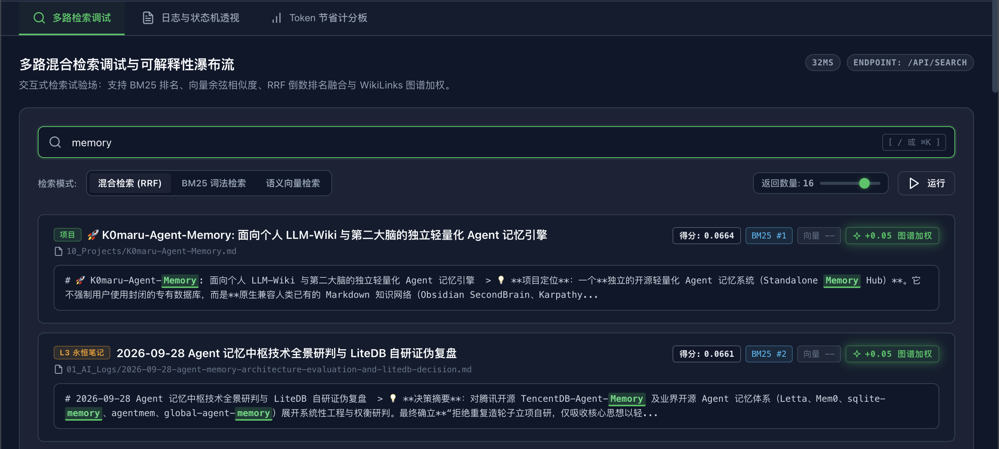
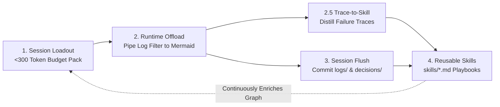
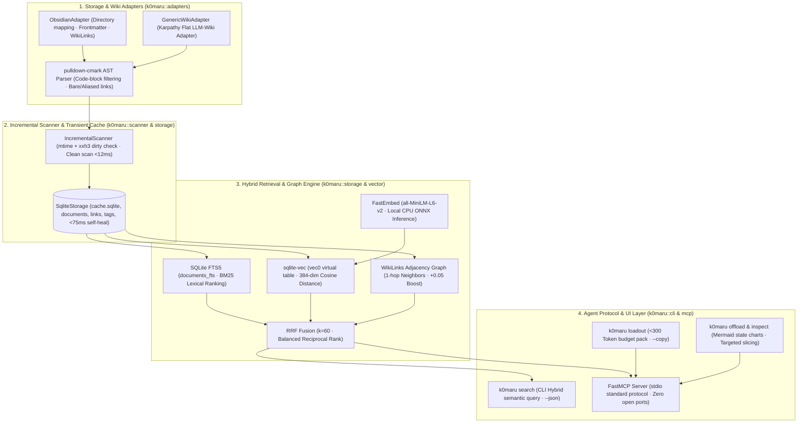
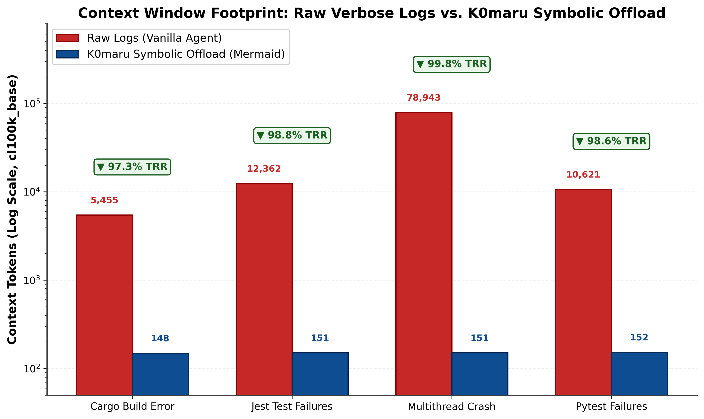
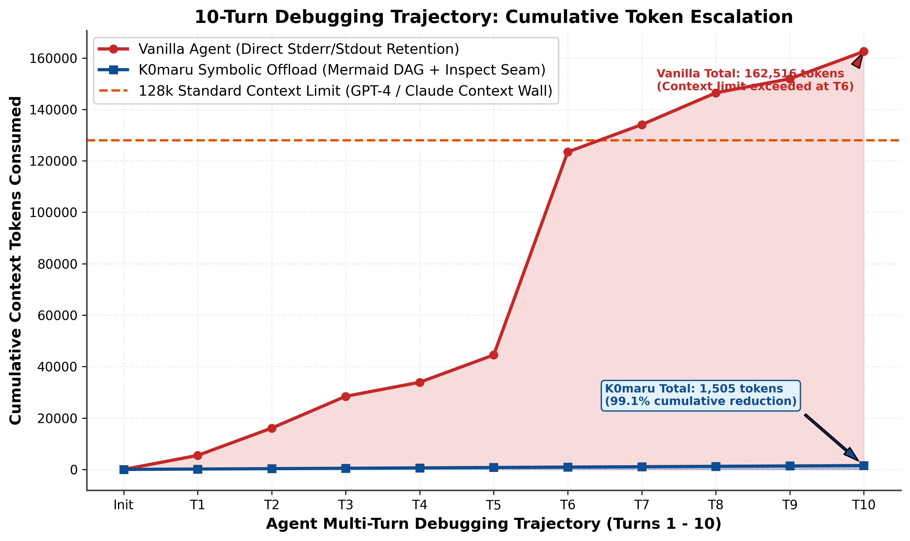
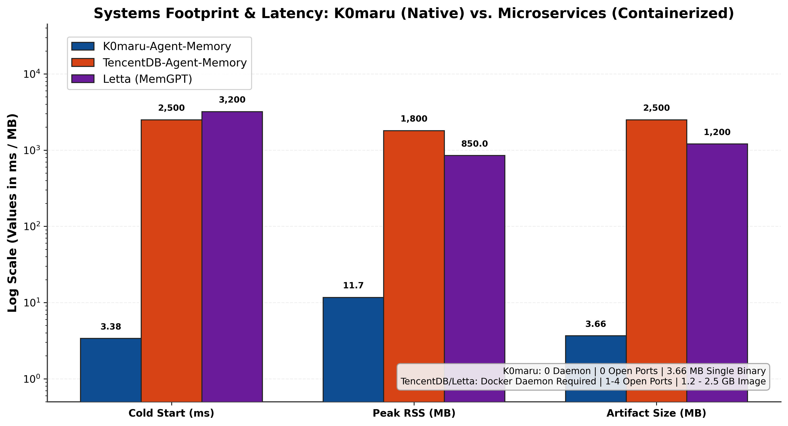

[English](README.md) | [简体中文](README_zh.md)

# K0maru-Agent-Memory

> **A Standalone, Single-Static-Binary, Zero-Daemon Long-Term Memory Hub for AI Coding Agents.**  
> *Mounting personal Markdown vaults (Obsidian & Karpathy LLM-Wiki) with instant sub-millisecond context retrieval and token governance.*

[](https://www.rust-lang.org/)
[](LICENSE)
[]()
[]()
[]()
[]()
[]()

---

## 📌 Motivation & Design Principles

Modern AI coding agents (such as Claude Code, Cursor, Windsurf, Antigravity, and Codex CLI) have fundamentally transformed software engineering. However, in complex codebases and extended engineering sessions, agents continually run into three critical bottlenecks:

1. **Cross-Session Amnesia**: When initiating a fresh session, the agent has zero recollection of top-level architectural constraints (ADRs), domain invariants, or yesterday's progress. Developers are forced into repetitive copy-pasting or bloated system prompts that overwhelm the model's working memory.
2. **Terminal Log Bloat**: Running build commands, test suites, or diagnostic tools often produces hundreds or thousands of lines of terminal output. This flood quickly consumes the context window, triggers severe attention drift, degrades reasoning, and escalates API costs.
3. **Microservice Overkill in Local Environments**: Existing agent memory solutions frequently rely on heavyweight multi-container Docker topologies (PostgreSQL, pgvector, Redis) or resident background daemons. While justifiable for multi-tenant cloud deployments, for individual developers on local workstations they introduce fragile dependencies, high RAM usage (800MB–2GB), port conflicts, and orphaned processes.

### 🌟 Core Design Principles

* **Bring Your Own Markdown**: Your existing local Markdown notes (Obsidian Vault, Karpathy-style flat LLM-Wiki) serve as the **Single Source of Truth**. No proprietary binary formats, no forced file renaming, and no rigid folder hierarchies.
* **Disposable Transient Cache**: The system maintains only a lightweight, single-file SQLite database (`cache.sqlite`) storing FTS5 BM25 full-text indices, C-native `sqlite-vec` virtual tables, and WikiLinks graph adjacency. This cache is strictly disposable—delete it anytime and it self-heals from scratch in under 75ms.
* **Zero-Daemon & Low Overhead**: Written in 100% pure Rust and statically compiled into a single ~3.6MB binary. Cold start takes just **3.4ms**, execution memory is only **~11.7MB** (released immediately upon command completion), zero background ports are occupied, and communication is handled entirely via standard Unix pipes and `stdio` MCP JSON-RPC 2.0.

---

## ⚡ Core Capabilities & Workflows

### 1. Project-Level Rapid Context Loadout (`k0maru loadout`)
When kicking off a new coding session, `k0maru` extracts the project's core mission, active goals, evergreen architectural principles (L3), and recent engineering logs (L2), strictly condensing the high-density context into **< 300 Tokens** (safely within the LLM's high-attention reasoning zone):

```bash
# Extract project loadout and copy directly to the system clipboard (macOS / Linux / Windows)
k0maru loadout my-project --vault ~/wiki --copy
```

Paste directly into your fresh agent chat to provide instant context alignment without token waste.

### 2. Symbolic Terminal Log Offloading (`k0maru offload` & `inspect`)
Manage verbose command output through standard Unix pipes:
- Terminal output under 50 lines passes through untouched.
- Output exceeding 50 lines is automatically intercepted, truncated, and persisted into `.scratch/refs/`. The console receives only a compact, structured Mermaid state diagram with a unique `node_id`.
- When an agent needs to diagnose a build or test failure, it can pinpoint the exact stack trace slice on demand using `node_id`.

```bash
# Pipe test execution to prevent context window explosion
cargo test | k0maru offload

# Retrieve targeted failure stack trace slice on demand
k0maru inspect node_54697ed3
```

### 3. Disposable Vector Cache & Hybrid Search (`k0maru search`)
Powered by C-native `sqlite-vec` virtual tables and an embedded local CPU ONNX engine (`fastembed-rs`, default `all-MiniLM-L6-v2` 384-dimensional dense vectors), `k0maru` blends BM25 lexical keyword matching with dense semantic vector search via Reciprocal Rank Fusion (RRF $k=60$), enhanced by a 1-hop bidirectional link graph boost (+0.05):

```bash
# Hybrid search across your notes (modes: hybrid [default], bm25, vector)
k0maru search "architectural constraints and state management" --vault ~/wiki --mode hybrid --limit 5

# Structured JSON output for streaming agents and scripting
k0maru search "vector cache" --vault ~/wiki --json
```

- **Disposable Vector Cache Contract**: Dense embeddings exist solely inside the disposable `cache.sqlite`. Running `sync --vector` relies on `xxh3` content hashes to skip unchanged files with zero redundant computation.
- **Cold-Start Isolation**: High-frequency commands (`loadout`, `offload`, `--version`) bypass the ONNX runtime entirely, maintaining a sub-5ms cold start.

### 4. Embedded Developer Console (`k0maru ui`)
Spin up a local, high-performance visual dashboard on demand (supports `--open` to launch your default browser). Frontend assets are compiled directly into the binary via `rust-embed`. Terminating with `Ctrl+C` immediately releases all ports and memory—zero lingering background services:

```bash
# Launch local developer console and auto-open in browser
k0maru ui --vault ~/wiki --open
```



- **Bilingual Internationalization (I18n)**: Seamless one-click `🌐 中文 / EN` switching in the header, automatic system locale detection, and `localStorage` persistence.
- **Multi-Route Search Debugger**: Interactive query testing displaying BM25 ranks, Vector cosine distances, RRF fusion scores, and the distinctive Emerald `+0.05 Graph Boost` topology tag.
- **Symbolic Log & Trace Inspector**: Native offline Mermaid state machine rendering, line-numbered collapsible stack viewer with error highlighting (`error` / `panicked`), and one-click Node ID / raw snippet copying.
- **Token Scoreboard & Cache Health**: Live telemetry tracking vector embedding coverage, cache disk footprint, cumulative token savings (TRR up to 99.4%), and one-click incremental re-indexing.
- *(Note: WikiLinks graph topology data models and `/api/graph` endpoints remain fully active; the frontend tab is kept neatly collapsed by default)*.

> 📖 **For a comprehensive visual guide and workflows, see**: [docs/UI_TUTORIAL.md](docs/UI_TUTORIAL.md)

### 5. Native FastMCP Stdio Integration (`k0maru mcp`)
Connect your agents without running any background HTTP servers. Exposes the Model Context Protocol (JSON-RPC 2.0) over standard `stdio`, starting and stopping seamlessly alongside your IDE or agent process:
- `get_project_loadout`: Generates a compact project loadout prompt package (<300 tokens).
- `recall_memory`: Executes hybrid semantic retrieval combining BM25, `sqlite-vec`, RRF, and WikiLinks graph topology (with backlinks and contextual summaries).
- `offload_context`: Ingests and symbolically offloads long text blocks.
- `inspect_log_node`: Retrieves persisted log slices by node ID.
- `flush_session`: Crystallizes engineering learnings, architectural decisions, and task summaries back into the target vault according to the vault's conventions.
- `distill_session_skill`: Distills raw execution traces, compiler diagnostics, or offloaded log nodes into structured, reusable skills (Trigger Context, Error Signatures, Remediation Commands, Prevention Rules) and writes them to the vault with instant index sync.

#### 💡 Natural Language Intent-Driven (No Rigid Magic Words)
Users often ask: *“Do I need to memorize specific commands or keywords to trigger MCP tools?”*  
**Not at all!** The Model Context Protocol communicates tool capabilities through semantic schemas. Modern foundation models (Claude 3.5 Sonnet, GPT-4o, etc.) infer user intent directly from natural dialogue:

| Natural Language User Prompt | Autonomously Invoked MCP Tool | Trigger Rationale |
| :--- | :--- | :--- |
| *"Starting a new feature on my-project, get me up to speed."*<br/>*"What are our repo's non-negotiable architectural rules?"* | `get_project_loadout` | Model identifies the need to align on project background, loading evergreen guidelines and recent logs. |
| *"What timeout do we recommend for DB connection pools?"*<br/>*"Check if we have previous notes on JWT refresh rotation."*<br/>*"This looks deadlock-prone, check our knowledge base."* | `recall_memory` | Model identifies the need to consult the private knowledge base, extracting semantic keywords for hybrid search. |
| *"Test failed with 300+ lines of output, check the root cause."* | `inspect_log_node` | Model identifies the need to inspect an offloaded error slice, retrieving the raw stack trace by ID. |
| *"We finished implementing RRF hybrid retrieval and settled on k=60, document this decision."* | `flush_session` | Model identifies the milestone completion, distilling ADR into the vault according to local conventions. |
| *"The compiler threw borrow checker errors and here is how we fixed it, crystallize this as a reusable playbook."* | `distill_session_skill` | Model extracts failure patterns and remediation steps, crystallizing a reusable skill card into the vault. |

> 🌟 **Vocabulary-Independent Retrieval**: Because the engine runs **Hybrid Retrieval (Local ONNX + BM25 + Graph Boost)**, queries succeed even when your exact terms differ from note headings (e.g. searching *"prevent overselling"* successfully retrieves *"idempotent balance rollback"*).

#### 🚀 Pro Tip: Ensure 100% Autonomous Memory Lookup
To guarantee that an agent consults your knowledge base before writing critical code, add a single directive to your repository's `AGENTS.md` (or global system prompt):
```markdown
> Before designing system architectures, debugging subtle issues, or writing core business logic, query `k0maru-memory` to align with established technical standards and historical decisions.
```
With this rule in place, asking *"Help me implement user registration"* will prompt the agent to proactively inspect your security guidelines and password hashing policies—eliminating vibe coding.

### 6. Incremental Change Scanner (`k0maru sync`)
Leveraging file modification timestamps (`mtime`) and `xxh3` checksum state machines, `k0maru` processes only added, modified, or deleted documents. Supports `--vector` for incremental batch embedding and `--json` for CI/CD scripting:

```bash
# Incremental scan for Markdown structures and FTS indices (<12ms)
k0maru sync --vault ~/wiki

# Batch incremental vector embeddings (32 docs/batch, auto-skips clean files)
k0maru sync --vault ~/wiki --vector
```

### 7. One-Click Ecosystem Setup & Diagnostics (`k0maru install` & `k0maru doctor`)
No more manual JSON configuration. Automatically detect and configure MCP client integrations across your entire toolchain, with non-destructive atomic JSON merges and system health auditing:

```bash
# One-click install k0maru-memory into Claude Code, Cursor, Gemini CLI, Windsurf, Cline
k0maru install --vault ~/Documents/MyVault

# Preview changes without modifying disk
k0maru install --target claude --dry-run

# Run full health check on binary, vault documents, SQLite indices, and client mounts
k0maru doctor
```

### 8. Adaptive Experience Flush & Write-Back (`k0maru flush` & `flush_session`)
Complete the memory compounding loop without rigid folder assumptions. `k0maru` dynamically reads your vault's explicit rules (`AGENTS.md`, `RULES.md`, `templates/`) or statistically infers your directory structure (e.g. `decisions/`, `logs/`), filename naming styles, and YAML frontmatter conventions to write back notes safely:

```bash
# Preview note creation and destination path without writing to disk
k0maru flush --title "Migrate Cache to SQLite-Vec" --category decision --dry-run

# Write ADR or dev log and immediately refresh search index
k0maru flush --title "Migrate Cache to SQLite-Vec" \
  --summary "Replaced raw float blob scans with C-native vec0 virtual tables" \
  --category decision \
  --tags rust,sqlite,vectors

# Pipe shell output or summary from stdin
cat report.md | k0maru flush --title "Weekly Architecture Review" --category log
```

> 🛡️ **Anti-Collision & Auto-Sync**: If a file with the same title already exists with different content, `k0maru` automatically appends version suffixes (e.g. `-v2.md`) to prevent data loss. Upon writing, it immediately triggers incremental cache indexing so the new knowledge is searchable on the next turn.

### 9. Dynamic Experience Distillation: Trace-to-Skill (`k0maru distill` & `distill_session_skill`)
Turn transient troubleshooting failures into permanent, reusable skills. Inspired by Nous Research Hermes Agent dynamic skills and LLM-Wiki crystallization, `k0maru distill` parses verbose build diagnostics, stack traces, and command trails, extracting four core components: **Trigger Context**, **Root Cause & Error Signatures**, **Remediation Commands**, and **Evergreen Prevention Rules**:

```bash
# Distill directly from standard input (stdin pipe) with dry-run preview
echo "error[E0382]: use of moved value: 'data'\nfix: clone or borrow" | \
  k0maru distill --dry-run

# Distill from an offloaded symbolic log node and flush to skills/
k0maru distill --node 0b7d8d2 --title "Resolve SQLite-Vec Dynamic Linking Failure"

# Distill from a log file with custom context hint and tags
k0maru distill --file build.log --title "Fix CMake OpenSSL Missing" --tags build,c,openssl
```

- **Zero-Friction Flush & Sync**: Automatically routes into `skills/` (or `playbooks/`, `recipes/`, `troubleshooting/` depending on your vault conventions) and immediately re-indexes into FTS5 and vector tables for sub-millisecond retrieval in future sessions.

---

## 🔄 Memory Lifecycle: The LLM-Wiki Closed Loop

A sustainable knowledge base compounds value over time through a bidirectional feedback loop. The system adheres to the rule: **"Only crystallize upon deliverable completion, troubleshooting success, or explicit decision points"**, keeping daily scratchpad noise out of long-term memory:



1. **Awaken & Loadout**: At the start of a session, dynamically inject concise project scope, relevant design principles, and recent logs.
2. **Execute & Offload**: Long-running commands pass through pipe filters, storing heavy output into external references while keeping the main context uncluttered.
3. **Session Flush**: Upon completing an issue or ticket, the agent documents decisions and learnings in `logs/` and updates project status.
4. **Knowledge Consolidation**: Periodically review logs for recurring patterns and pitfalls, synthesizing them into evergreen `concepts/` notes to compound knowledge.

---

## 🏗️ Architecture: 4-Layer Decoupled Engine



---

## 📊 Architectural Comparison Matrix

| Evaluation Dimension | Vanilla Context (Copy-Paste) | Containerized Microservices (Letta / TencentDB) | Resident Background Daemons (agentmemory) | **K0maru-Agent-Memory (This Project)** |
| :--- | :--- | :--- | :--- | :--- |
| **Storage Medium** | Ephemeral chat history | External DBs (PostgreSQL, pgvector, Redis) | Proprietary DB in hidden directories | **Local Markdown Vaults (Plain Text)** |
| **Deployment Model** | Manual copy | Multi-container Docker Compose clusters | Background daemon process (`iii-engine`, etc.) | **Single static binary, on-demand (Zero-Daemon)** |
| **Network Port Footprint** | None | 1–4 open ports | 1–4 open ports | **0 ports** (Unix pipes & stdio streams) |
| **Cold Start Latency** | Instant | 2,500 ms – 3,500 ms (container boot) | 1,000 ms – 2,000 ms | **3.38 ms** (native Rust binary) |
| **Resident Memory (RAM)** | 0 MB | ~850 MB – 2,000 MB | ~150 MB – 300 MB | **~11.7 MB** (released instantly on command exit) |
| **Terminal Log Governance**| Manual or LLM truncation | Network API transfer required | Internal bespoke truncation | **Standard Unix pipe filter (`\| k0maru offload`)** |
| **Index Self-Healing** | None | Snapshot & backup dependent | Local database integrity dependent | **`cache.sqlite` disposable anytime, rebuilt in 74ms** |

---

## 📈 Quantitative Benchmarks

The repository includes a fully reproducible benchmark suite (see [benchmarks/README.md](benchmarks/README.md)) measured on a standard developer workstation using industrial log samples and real-world vaults:

### 1. Token Reduction Ratio (TRR)
Evaluated across compiler errors (Rust, 500 lines), test failure traces (Python pytest, 800 lines; TypeScript Jest, 1,200 lines), and multithreaded crash dumps (2,500 lines), measured using `tiktoken` (`cl100k_base` and `o200k_base`):

| Evaluation Sample | Raw Lines | Raw Tokens (`cl100k`) | Offloaded Tokens | **Token Reduction Ratio (TRR %)** |
| :--- | :---: | :---: | :---: | :---: |
| `cargo_build_error.log` | 500 lines | 5,455 | 148 | **97.29%** |
| `pytest_failures.log` | 800 lines | 10,621 | 152 | **98.57%** |
| `jest_test_failures.log` | 1,200 lines | 12,362 | 151 | **98.78%** |
| `multithread_crash.log` | 2,500 lines | 78,943 | 151 | **99.81%** |
| **Weighted Total** | **5,000 lines** | **107,381** | **602** | **99.44%** |



In a 10-turn debugging scenario, an unmanaged agent breaches the 128k context window limit by Turn 6 (accumulating 162.5k tokens), whereas the offload-managed agent stays steady at 1,505 tokens (delivering **99.1%** cumulative token savings):



### 2. Systems Footprint & Speed
Measured over 100 cold-start iterations and full index rebuilds of 500 Markdown documents with YAML frontmatter and WikiLinks:



- **Cold Start Latency**: Median (p50) **3.38 ms**, P95 **4.30 ms**, P99 **5.54 ms**.
- **Index Rebuild Throughput**: 500 documents indexed into SQLite FTS5 in **74.55 ms** (**6,707 docs/sec**).
- **Clean Rescan Duration**: **11.67 ms**.
- **Binary Size**: **3.66 MB**.

---

## 🚀 Installation & Quick Start

For detailed step-by-step instructions, see [QUICKSTART.md](QUICKSTART.md).

### Option A: One-Line Script (macOS & Linux - Recommended)
No Rust toolchain required. Automatically detects OS and chip architecture, verifies SHA-256 checksums, and installs the standalone binary:
```bash
curl -fsSL https://raw.githubusercontent.com/K0maru/k0maru-agent-memory/main/install.sh | bash
```

### Option B: Homebrew (macOS & Linux)
```bash
brew install K0maru/tap/k0maru
```

### Option C: Build from Source via Cargo
```bash
# Install directly from git
cargo install --git https://github.com/K0maru/k0maru-agent-memory

# Or clone and compile locally
git clone https://github.com/K0maru/k0maru-agent-memory.git
cd k0maru-agent-memory
cargo build --release
cp target/release/k0maru ~/.local/bin/
```

### Configure Your Ecosystem in One Click
Once installed, connect K0maru to your coding agents and verify health:
```bash
# 1. One-click install to your AI agent clients (Claude Code, Cursor, Gemini CLI, Windsurf, Cline)
k0maru install --vault ~/Documents/MyVault

# 2. Verify system & client integration health
k0maru doctor
```

### Manual Configuration (Optional)
If you prefer manual setup, add `k0maru` to your client's MCP configuration file (e.g. `~/.claude.json` or `~/.gemini/config/mcp_config.json`):

```json
{
  "mcpServers": {
    "k0maru-memory": {
      "command": "k0maru",
      "args": ["mcp", "--vault", "/path/to/your/markdown-vault"]
    }
  }
}
```

---

## 📖 CLI Cheat Sheet

| Command | Key Flags | Description |
| :--- | :--- | :--- |
| `k0maru install` | `--vault <path>` | One-click install `k0maru-memory` to agent clients |
| | `--target <client>` | Target specific client (`all`, `claude`, `cursor`, `gemini`, `windsurf`, `cline`) |
| | `--dry-run` | Preview planned configuration diffs without writing to disk |
| `k0maru doctor` | `--vault <path>` | Run comprehensive system, vault, storage, and ecosystem diagnostics |
| | `--json` | Output machine-readable structured diagnostic report |
| `k0maru ui` | `--vault <path>` | Start local embedded developer console (default `127.0.0.1:3721`) |
| | `--port <port>` | Bind custom local port (default: 3721) |
| | `--open` | Automatically open console in system default browser |
| `k0maru loadout <query>` | `--vault <path>` | Specify target Markdown vault root directory |
| | `--copy` | Copy assembled budget loadout (<300 tokens) directly to clipboard |
| | `--json` | Output structured JSON loadout data |
| | `-l`, `--list` | List all active projects in the vault |
| `k0maru search <query>` | `--vault <path>` | Specify target Markdown vault root directory |
| | `--mode <hybrid\|bm25\|vector>` | Retrieval mode (default: `hybrid` RRF) |
| | `--limit <N>` | Maximum search results to return (default: 5) |
| | `--json` | Output structured JSON search results |
| `k0maru sync` | `--vault <path>` | Incremental scan to update SQLite indices and graph topology |
| | `--vector` | Incrementally generate and refresh local vector embeddings |
| | `--json` | Output sync statistics in JSON format |
| `k0maru offload` | `--threshold <N>` | Line threshold before offloading (default: 50 lines) |
| | `--task-id <id>` | Bind task identifier for structured log archiving |
| `k0maru inspect <id>` | `<node_id>` | Retrieve offloaded raw stack trace slice by node ID |
| `k0maru flush` | `--vault <path>` | Crystallize decisions or dev logs back into the Markdown vault |
| | `--title <title>` | Title of the note to write |
| | `--category <cat>` | Note category (`decision`, `log`, `concept`, or custom) |
| | `--summary <text>` | One-line executive summary |
| | `--tags <t1,t2>` | Comma-separated tags |
| | `--related <r1,r2>`| Comma-separated related note titles to link via `[[WikiLinks]]` |
| | `--dry-run` | Preview synthesized Markdown and path without writing to disk |
| | `--json` | Output structured JSON flush outcome |
| `k0maru mcp` | `--vault <path>` | Launch standard stdio MCP server for agent/IDE integration |

---

## 🔒 Data Privacy, Transparency & Provenance

K0maru is engineered under the **Cleanroom & Zero-Telemetry Principle**:
- **100% Local-First & Zero-Telemetry**: K0maru never collects, uploads, or telemeters your Markdown notes, codebase, or queries. All indexing and inference run entirely offline on your local CPU.
- **Reproducible Public Data Provenance**: All benchmark evaluation metrics and rule extractors are derived strictly from public, open-source corpora (e.g. SWE-bench execution traces, public GitHub Actions CI logs, BEIR/CoIR retrieval benchmarks, and public documentation). Zero private user data is ever used in model calibration, benchmarking, or rule synthesis.

For in-depth provenance documentation and privacy invariants, see [docs/TUNING_AND_DATA.md](docs/TUNING_AND_DATA.md).

---

## 🛠️ Personalization & Developer Customization

Tune K0maru to your exact repository layout, hardware constraints, and agent preferences:
- **Custom Vault Conventions**: Declare custom directory mappings (`decisions: docs/adr`, `logs: 01_AI_Logs`, `skills: playbooks`) in `.k0maru/rules.md` or `AGENTS.md`.
- **Retrieval Engine Profiles**: Toggle between instant **BM25 lexical search** (`--mode bm25`, <1ms latency, 0MB ONNX memory) for exact symbols/code, and **Hybrid RRF** (`--mode hybrid`) for conceptual discovery.
- **Resource Footprint**: Run on low-spec VPS (<1GB RAM) using `--mode bm25` or compile without `fastembed` for a featherlight ~2.8MB binary.
- **Log Thresholds**: Adjust `--threshold <N>` to fine-tune log truncation for compact (32k) or expansive (1M+) agent context windows.

For complete configuration snippets, templates, and best practices, see the [Developer Tuning Guide](docs/TUNING_AND_DATA.md).

---

## 🙏 Acknowledgments & Technical Ancestry

K0maru-Agent-Memory builds on pioneering ideas from the open-source and research communities. Sincere thanks to:

1. **Andrej Karpathy ([LLM-Wiki](https://gist.github.com/karpathy))**: For the paradigm of personal knowledge compounding via flat Markdown files and semantic WikiLinks graphs—solidifying the principle that the local filesystem is the single source of truth.
2. **Tencent Cloud ([TencentDB-Agent-Memory](https://github.com/TencentCloud/TencentDB-Agent-Memory))**: For pioneering the "Mermaid Symbolic Log Offloading" algorithm and the "L0–L3 Semantic Hierarchy (Daily/Ephemeral ➔ Resource ➔ Log ➔ Evergreen)". K0maru is a 100% independent, clean-room Rust reimplementation decoupled into a standalone CLI pipe filter and transient local cache.
3. **Colby McHenry ([CodeGraph](https://github.com/colbymchenry/codegraph))**: For demonstrating the high-performance potential of 100% local Rust pre-indexing of code and bidirectional link topology.
4. **Nous Research ([Hermes Agent](https://github.com/nousresearch/hermes-agent))**: For the concept of dynamic experience loops that self-crystallize reusable knowledge from execution traces.
5. **Anthropic ([Model Context Protocol](https://modelcontextprotocol.io/))**: For the standardized stdio JSON-RPC 2.0 communication protocol.
6. **Open-Source Rust Ecosystem**: Especial gratitude to [`pulldown-cmark`](https://github.com/pulldown-cmark/pulldown-cmark), [`rusqlite`](https://github.com/rusqlite/rusqlite), [`sqlite-vec`](https://github.com/asg017/sqlite-vec), [`fastembed-rs`](https://github.com/Anush008/fastembed-rs), [`axum`](https://github.com/tokio-rs/axum), [`rust-embed`](https://github.com/pyrossh/rust-embed), and [`clap`](https://github.com/clap-rs/clap).

---

## ⚖️ License

Distributed under the [MIT License](LICENSE).
