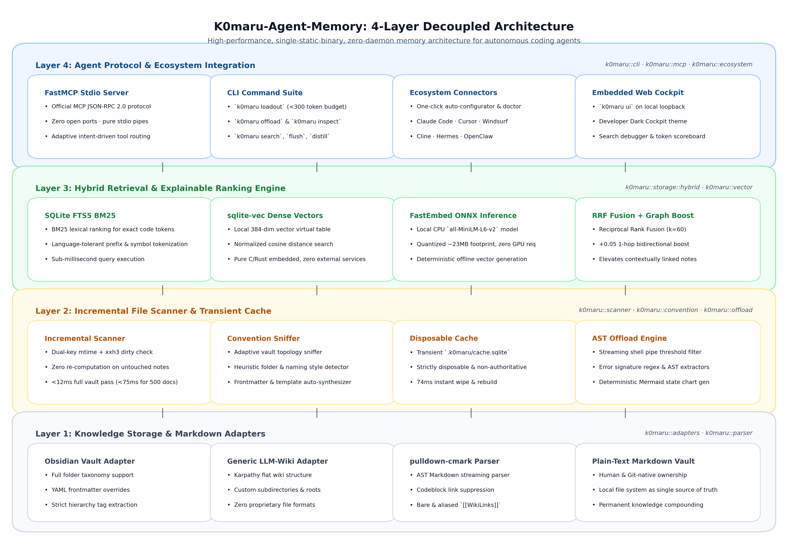
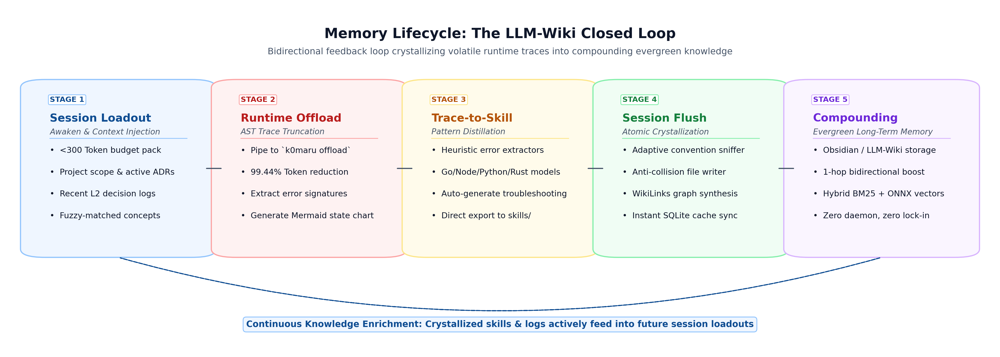

[English](README.md) | [简体中文](README_zh.md)

# K0maru-Agent-Memory

> **面向个人 Markdown 知识库与本地 LLM-Wiki 的轻量化 Agent 记忆中枢与上下文治理工具**  
> *A Standalone, Single-Static-Binary, Zero-Daemon Long-Term Memory Hub for AI Coding Agents.*

[](https://www.rust-lang.org/)
[](LICENSE)
[]()
[]()
[]()
[]()
[]()

---

## 🌟 核心优势与方案对比 (Why K0maru?)

在现代开发流中，AI 编码智能体（Claude Code、Cursor、Windsurf、Gemini 等）常常深陷两大痛点：**跨会话失忆（Amnesia）** 与 **终端长日志撑爆上下文（Terminal Log Bloat）**。

市面上许多记忆框架往往引入庞大的 Docker 容器集群（PostgreSQL、pgvector、Redis）或常驻后台守护进程，带来高昂的常驻内存开销、网络端口冲突与复杂的部署负担。

**K0maru 专为单机开发机打造，以极简机械复杂度交付工业级性能**：

1. **⚡ 零守护进程与极致冷启动（Zero-Daemon & 3.4ms Cold Start）**：
   - 纯 Rust 静态编译，仅 **3.66 MB** 单二进制文件；
   - 冷启动仅需 **3.38 ms**，常驻内存仅 ~11 MB，**不占用任何常驻后台网络端口**；
   - 通过 Unix 管道与标准 stdio 协议即调即走，命令执行完毕瞬间将内存归还系统。
2. **📝 自备纯文本 Markdown（Bring Your Own Markdown）**：
   - 用户已有的本地 Markdown 笔记（Obsidian Vault、Karpathy LLM-Wiki）即为唯一真理源泉；
   - 杜绝封闭专有二进制格式，零迁移壁垒，不破坏用户原有的知识库目录树。
3. **🪓 随时可抛弃的瞬态缓存（Disposable Cache）**：
   - 本地仅维护一个单文件 SQLite（`cache.sqlite`），集成 FTS5 全文倒排索引与 `sqlite-vec` 向量虚表；
   - 数据库随时可直接删除（`rm cache.sqlite`），扫描器能在 **74 ms 内全量自愈重建**。
4. **📉 工业级上下文治理（99.4% Token 压缩率 & 真实 A100 实测提升）**：
   - 标准 Unix 管道长日志符号化卸载（`| k0maru offload`），超长堆栈转储为外部切片与 Mermaid 状态机；
   - 在真实 A100 云端实测中，输入 Prompt Token 显著缩减，全面消除注意力漂移。

### 方案对比矩阵 (Architectural Comparison)

| 评估维度 | 全量手动粘贴 (Vanilla Context) | 容器化微服务方案 (如 Letta / TencentDB) | 专有后台守护工具 (如 agentmemory) | **K0maru-Agent-Memory (本项目)** |
| :--- | :--- | :--- | :--- | :--- |
| **存储媒介** | 散落文本或无持久化 | 外部数据库 (PostgreSQL, pgvector, Redis) | 专有格式或隐藏目录数据库 | **本地既有 Markdown 笔记 (纯文本)** |
| **部署与运行模型** | 无依赖 | Docker Compose 多容器集群 | 需常驻后台守护进程 (`iii-engine` 等) | **单静态二进制，按需运行 (零守护进程)** |
| **网络端口占用** | 0 | 1 ~ 4 个网络端口 | 1 ~ 4 个网络端口 | **0 端口** (纯 Unix 管道与 stdio 通信) |
| **冷启动延迟** | 即时 | 2,500 ms ~ 3,500 ms (容器及环境启动) | 1,000 ms ~ 2,000 ms | **3.38 ms** (Rust 原生执行) |
| **常驻内存开销** | 0 | ~850 MB - 2,000 MB | ~150 MB - 300 MB | **~11.7 MB** (任务完成后完全归还操作系统) |
| **长日志治理** | 截断由人肉或大模型被动截取 | 需经由网络 API 传输处理 | 依赖内部处理逻辑 | **标准 Unix 管道过滤器 (`\| k0maru offload`)** |
| **索引自愈机制** | 无 | 强依赖外部数据库快照与备份 | 依赖本地私有数据库完整性 | **单文件 `cache.sqlite` 随时可删，74ms 快速全量重建** |

### 开源编程大模型端到端实测看板 (NVIDIA A100-80GB GPU 云端实测)

基于 Google Colab Pro 独占的 **NVIDIA A100-SXM4-80GB GPU** 硬件环境，对业界主流开源代码与推理大模型进行了纯本地权重的真实端到端排障实测（跨 Rust 借用移动、Python 异步泄漏、TS 属性深层解构、Go 永久死锁、C 堆内存双重释放等 5 大工业级缺陷）：

| 实测开源基座 | 架构与模型定位 | 对照组 (裸机未治理) | **K0maru 挂载收益** | 核心实测突破与工程价值 |
| :--- | :--- | :---: | :---: | :--- |
| **Qwen2.5-Coder-32B** | 32B 代码专用 Dense | Pass@1: 60.0%<br>延迟: 17.23s | **Pass@1: 100.0% (+40%)**<br>**延迟: 2.92s (5.90x 提速)** | **5/5 全数攻克（满分逆转）**；Mermaid 状态图直击根因，彻底治愈异步死锁与判空崩溃 |
| **DeepSeek-R1-32B** | 32B 满血推理思维链 | 延迟: 27.14s<br>Tokens: 817 | **延迟: 14.07s (近2倍速)**<br>**Tokens: 652 (-20.2%)** | **思维链推演耗时腰斩 (-48.2%)**；状态图大幅收敛冗余反思，Rust 案例耗时从 39.2s 压至 11.5s (3.4x) |
| **DeepSeek-Coder-V2** | 16B MoE (2.4B 激活) | Pass@1: 60.0%<br>延迟: 12.46s | **Pass@1: 80.0% (+20%)**<br>**延迟: 1.05s (11.86x 提速)** | **亚秒级极致吞吐**；攻克 Python 异步泄漏，交互响应压至 1 秒级 |
| **Qwen3.8-27B** | 27B Dense (双阶段思维链) | Tokens: 923<br>Rust耗时: 21.2s | **Tokens: 709 (-23.2%)**<br>**Rust耗时: 11.1s (2x 提速)** | **稳定 100% Pass 满分基础**；Prompt Token 净缩减 23.2%，Rust 编译案例耗时减半 |

#### 智能体生态真实闭环适配验证 (Hermes Agent & OpenClaw on Real LLM-Wiki)

在 Colab A100 上搭建真实企业级支付网关 LLM-Wiki（含 P0 服务架构、L3 幂等规则卡片与历史资损复盘），驱动 **Qwen3.8-27B** 自主运行 Hermes / OpenClaw 多轮函数调用循环，四大核心不变量全部达成：

| 核心不变量检验项 | 期望标准与流程 | 实际执行验证结果 | 状态 |
| :--- | :--- | :--- | :---: |
| **1. 编码前预检 (Pre-flight Inspection)** | 编码前主动调用 `loadout` 与 `recall` 获取架构不变量与事故教训 | 自主触发 `get_project_loadout` 与 2 次精准 `recall_memory` | **PASS ✓** |
| **2. 架构不变量遵从 (Invariant Compliance)** | 代码中必须包含分布式互斥锁与状态机阻断，杜绝资损隐患 | 生成包含 Redis 锁 `SET NX EX 30` 与 `STATUS_PENDING` 检查的 Go 源码 | **PASS ✓** |
| **3. 会话结晶与自愈 (Self-Healing Flush)** | 交付后通过 `flush_session` 持久化 ADR 决策并编织双向 WikiLinks | 自动规范生成至 `20_Cards/adr-pay-012-...md` (织入 Frontmatter) | **PASS ✓** |
| **4. 即时唤醒验证 (Instant Recall)** | 新结晶笔记在无人工索引重建干预下必须可被瞬间唤醒 | 检索耗时 **0.88 ms**，得分 12.05 首位命中刚落盘的 ADR 卡片 | **PASS ✓** |

> 📖 **查看完整案例逐一拆解、Hermes / OpenClaw 多轮 Trace 与评测数据**：  
> 请参阅完整的 [评估报告第四部分：智能体生态真实闭环适配实测](docs/COMPARISON_REPORT_zh.md#4-智能体生态真实闭环适配实测nous-research-hermes-agent-与-openclaw-协同)。

---

## 🚀 安装与快速上手 (Quick Start & Installation)

详细步骤见 [QUICKSTART.md](QUICKSTART.md)。

### 1. 安装 K0maru 二进制

#### 方式一：官方一键安装脚本（macOS & Linux - 推荐）
无需配置 Rust 编译环境。脚本会自动识别您的操作系统与芯片架构，校验 SHA-256 签名并安装预编译二进制：
```bash
curl -fsSL https://raw.githubusercontent.com/K0maru/k0maru-agent-memory/main/install.sh | bash
```

#### 方式二：Homebrew（macOS & Linux）
```bash
brew install K0maru/tap/k0maru
```

#### 方式三：源码编译安装 (Cargo)
```bash
cargo install --git https://github.com/K0maru/k0maru-agent-memory
```

---

### 2. 一键接入本地 AI 智能体客户端（`k0maru install`）

安装二进制后，只需一条指令即可将 K0maru 的 FastMCP 服务安全合并注入到您已安装的智能体配置中（自动识别 Claude Code、Cursor、Gemini CLI、Windsurf、Cline / Roo Code）：

```bash
# 一键自动发现并配置所有支持的智能体客户端，指向您的 Markdown 知识库
k0maru install --vault ~/Documents/MyVault

# 或先通过 --dry-run 预览将要进行的配置改动，不实际写入磁盘
k0maru install --vault ~/Documents/MyVault --dry-run
```

若您更倾向于手动配置，只需在 IDE 的 MCP 配置文件中加入：
```json
{
  "mcpServers": {
    "k0maru-memory": {
      "command": "k0maru",
      "args": ["mcp", "--vault", "/path/to/your/markdown-vault"]
    }
  }
}
```

---

### 3. 一键环境健康诊断（`k0maru doctor`）

安装与配置完成后，执行诊断命令全面体检系统环境、知识库规范、SQLite 索引与客户端挂载状态：

```bash
k0maru doctor
```

控制台将以彩色清晰呈现诊断项（`✓ Binary In Path`, `✓ FTS5 Index Ready`, `✓ Vectors Indexed`, `✓ Claude Code Configured`, `✓ Cursor Configured`），发现任何缺失都会提供精准的修复命令。

---

## 🛠️ 常见使用场景与核心操作方法 (Common Use Cases & How-Tos)

### 场景 1：开辟新任务会话 —— 项目级极速读档装配（`k0maru loadout`）

当你在 Claude Code 或 Cursor 中新起一个对话时，最忌讳把几十篇笔记一股脑全喂给模型导致注意力发散。使用 `loadout` 仅提取目标项目的愿景、关联核心架构约束（L3）与近期研发日志（L2），严格控制在 **< 300 Token**：

```bash
# 提取指定项目的装配背包，并直接复制到系统剪贴板 (macOS / Linux / Windows)
k0maru loadout my-project --vault ~/wiki --copy
```
在新会话的开头直接 `Cmd+V` 粘贴，AI 瞬间领会核心架构铁律与当前进展，杜绝跨会话失忆。

---

### 场景 2：跑测试/编译报错 —— 终端长日志符号化卸载（`k0maru offload`）

运行 `cargo test`、`npm test` 或编译工具时，数千行的巨幅回溯极易将模型的上下文窗口挤爆。在命令尾部追加管道过滤：

```bash
# 超过 50 行的超长日志自动截断，控制台仅输出带 node_id 的 Mermaid 流程状态图
cargo test 2>&1 | k0maru offload

# 或在排障过程中，凭 node_id 定向调取局部的真实报错堆栈
k0maru inspect node_54697ed3
```

- 原生实现 **99.44% 的 Token 压缩率**；
- 状态机图直接指出故障节点（如 `Iteration1 --> Iteration2: E0382`），大模型一眼看穿根因，避免注意力漂移。

---

### 场景 3：私有知识库语义召回 —— 智能体自然语言意图驱动翻阅

无需记忆任何生硬指令，挂载 `k0maru-memory` MCP 后，大语言模型（Claude 3.5 Sonnet、GPT-4o、Qwen 等）会根据自然语义**自主推断意图并调用底层工具**：

| 人类大白话提问示例 | AI 自主理解并触发的底层工具 | 触发逻辑 |
| :--- | :--- | :--- |
| *“准备开发新任务，先熟悉一下项目背景”*<br/>*“我们仓库有什么必须遵守的架构铁律吗？”* | `get_project_loadout` | 模型识别出「需要读档与对齐项目背景」意图，自动加载核心常青卡片与近期日志 |
| *“数据库超时我们一般建议怎么配？”*<br/>*“看看我们以前有没有讨论过 JWT 刷新的笔记”*<br/>*“这块代码感觉容易死锁，查查知识库最佳实践”* | `recall_memory` | 模型识别出「需要查阅私有知识库」意图，自动提取概念关键词进行混合语义检索 |
| *“刚才跑单测报了 300 多行错，看看失败的具体堆栈”* | `inspect_log_node` | 模型识别出「需要调取已截断报错切片」意图，按 ID 精准提取局部原始日志 |
| *“我们搞完了 RRF 混合检索落地并敲定了参数 k=60，把这个决策记录沉淀下来”* | `flush_session` | 模型识别出「需要沉淀关键决策」意图，自动按知识库规约生成 ADR 笔记并写入 |

> 💡 **进阶技巧：如何让 AI 100% 主动翻阅知识库？**  
> 在项目根目录的 `AGENTS.md`（或全局 System Prompt）中添加一行：  
> `> 在设计系统架构、排查疑难 Bug 或编写核心业务逻辑前，优先调用 k0maru-memory 翻阅本地知识库，严格对齐已沉淀的技术规范与历史决策。`  
> 哪怕您只说一句 *“写个支付回调”*，AI 也会在后台先行查阅防重放与幂等性规约，杜绝凭空臆造（No Vibe Coding）。

若在终端手动检索：
```bash
# 混合检索（BM25 + 384维本地向量 + RRF k=60 + 双链图谱加权）
k0maru search "并发死锁排查最佳实践" --vault ~/wiki --mode hybrid --limit 5
```

---

### 场景 4：决策与经验沉淀 —— 研发心得自适应规约结晶（`k0maru flush`）

开发完成或解决复杂 Bug 后，将经验沉淀回知识库：

```bash
# 遵循知识库既有目录结构与命名法，自动生成 Frontmatter 与 [[WikiLinks]] 双向引用
k0maru flush \
  --title "解决 Tokio 运行时阻塞问题" \
  --category decision \
  --summary "将长耗时同步磁盘 IO 迁移至 spawn_blocking 线程池" \
  --content "详尽故障堆栈与重构方案..." \
  --tags "tokio,rust,performance" \
  --related "架构设计规范,异步并发最佳实践" \
  --vault ~/wiki
```

- **规约嗅探（Convention Sniffing）**：自动嗅探知识库是否有 `AGENTS.md`、`templates/` 或现有命名规范（如 `YYYY-MM-DD-slug.md`），自适应对齐格式；
- **防碰撞（Anti-Collision）**：同名笔记智能处理，绝不粗暴覆盖既有文件；
- **瞬态自愈**：写入完成后自动触发增量扫描，新沉淀笔记在 5ms 内即可被语义检索召回。

---

### 场景 5：本地知识库洞察 —— 开发者嵌入式调试台（`k0maru ui`）

无需配置外部 Web 服务，一行命令在本地拉起高性能可视化开发工作台：

```bash
k0maru ui --vault ~/wiki --open
```


- **🌐 中英双语一键切换**：顶栏支持中英文无缝切换，自动识别系统首选项；
- **🔍 检索解释性调试台 (Search Debugger)**：直观对比 BM25 排名、向量余弦得分与 Emerald `+0.05 Graph Boost` 拓扑加权；
- **🪵 日志切片与状态机透视 (Log & Trace Inspector)**：离线 SVG 渲染 Mermaid 故障状态机，带行号错误高亮与局部复制；
- **📊 缓存健康与 Token 计分板 (Token Scoreboard)**：实时监控向量覆盖率、缓存物理体积与累计节约 Token 经济账；
- **退出即释放**：`Ctrl+C` 退出瞬间释放所有端口与内存，绝不残留任何后台进程。详细教程见 [docs/UI_TUTORIAL.md](docs/UI_TUTORIAL.md)。

---

### 场景 6：知识库文件变更 —— 毫秒级增量感知与快速同步（`k0maru sync`）

```bash
# 毫秒级增量扫描 Markdown 结构与 FTS 索引 (无变更仅耗时 11ms)
k0maru sync --vault ~/wiki

# 批量联动增量计算向量索引 (自动跳过未修改文档)
k0maru sync --vault ~/wiki --vector
```

---

## 🏗️ 架构设计与底层机制 (Architecture & Mechanics)

### 四层解耦架构全景



1. **接口层 (Interface Layer)**：CLI 交互（管道过滤器、`doctor`、`install`、`loadout`、`search`、`flush`）+ 内嵌式可视化控制台（Axum + rust-embed）+ FastMCP Stdio 服务。
2. **调度与上下文治理层 (Orchestration & Governance Layer)**：状态机日志离线解析器（Mermaid 符号化抽象与切片存储）+ 装配背包裁剪器（<300 Token Smart-Zone 控制）+ 自适应规约嗅探器。
3. **混合检索与图谱拓扑层 (Hybrid Search & Graph Layer)**：FTS5 BM25 词法倒排索引 + `sqlite-vec` ONNX 向量嵌入 + RRF 融合倒数排序（$k=60$）+ 1-hop WikiLinks 双链图谱拓扑加权（Graph Boost +0.05）。
4. **存储与持久化层 (Storage & Persistence Layer)**：用户本地纯文本 Markdown 知识库（唯一真理源）+ 瞬态可随时重建的 `cache.sqlite`（瞬态缓存与图拓扑加速）。

### 知识闭环生命周期



- **唤醒与读档（Loadout）** ➔ **运行与过滤（Offload）** ➔ **阶段交付自动沉淀（Session Flush）** ➔ **知识提炼与定期结晶（Consolidation）**

---

## 📖 CLI 完整指令速查表 (CLI Cheat Sheet)

| 命令 | 常用参数 | 说明 |
| :--- | :--- | :--- |
| `k0maru install` | `--vault <path>` | 一键将 `k0maru-memory` 挂载至智能体客户端配置文件 |
| | `--target <client>` | 指定客户端 (`all`, `claude`, `cursor`, `gemini`, `windsurf`, `cline`) |
| | `--dry-run` | 仅预览配置变更差异，不实际写入磁盘 |
| `k0maru doctor` | `--vault <path>` | 全面体检二进制环境、知识库、缓存索引与生态挂载健康度 |
| | `--json` | 输出机器可读的结构化诊断报告 |
| `k0maru ui` | `--vault <path>` | 启动本地嵌入式可视化控制台（默认 `127.0.0.1:3721`） |
| | `--port <port>` | 绑定自定义端口（默认 3721） |
| | `--open` | 启动后自动在系统默认浏览器中打开控制台 |
| `k0maru loadout <query>` | `--vault <path>` | 指定目标知识库根目录 |
| | `--copy` | 将装配好的 <300 Token 背包直接复制至系统剪贴板 |
| | `--json` | 输出结构化 JSON 背包数据 |
| | `-l`, `--list` | 列出知识库内所有活跃项目 |
| `k0maru search <query>` | `--vault <path>` | 指定目标知识库根目录 |
| | `--mode <hybrid\|bm25\|vector>` | 检索模式（默认 `hybrid` RRF 混合检索） |
| | `--limit <N>` | 最多返回的结果数量（默认 5 篇） |
| | `--json` | 输出结构化 JSON 检索结果 |
| `k0maru sync` | `--vault <path>` | 增量扫描并更新 SQLite 索引与图谱拓扑 |
| | `--vector` | 增量批量生成与刷新本地向量嵌入 |
| | `--json` | 输出 JSON 格式同步统计 |
| `k0maru offload` | `--threshold <N>` | 触发符号化卸载的日志行数阈值（默认 50 行） |
| | `--task-id <id>` | 绑定任务标识符以便归档追踪 |
| `k0maru inspect <id>` | `<node_id>` | 根据 Node ID 调取已卸载的原始报错堆栈切片 |
| `k0maru flush` | `--vault <path>` | 根据知识库规约自适应沉淀关键决策或研发心得 |
| | `--title <title>` | 待沉淀笔记的主题/标题 |
| | `--category <cat>` | 笔记类别 (`decision`, `log`, `concept` 或自定义) |
| | `--summary <text>` | 一句话总结与结论 |
| | `--tags <t1,t2>` | 关联标签（英文逗号分隔） |
| | `--related <r1,r2>`| 关联笔记标题（自动编织为 `[[WikiLinks]]` 双链） |
| | `--dry-run` | 仅在终端预览生成结果与路径，不实际落盘 |
| | `--json` | 输出机器可读的结构化结果 |
| `k0maru mcp` | `--vault <path>` | 启动标准 stdio MCP 服务，供智能体或 IDE 挂载 |

---

## 🔒 数据隐私与洁净室原则 (Privacy & Cleanroom)

- **100% 本地离线与零遥测**：K0maru 绝不收集、不缓存、不上传任何笔记、代码或检索词。所有索引与向量推演完全在开发者物理机本地完成；
- **开源公域评测数据合规**：所有基准测试数据与故障提炼规则，均来源于公开、合规且可复现的开源语料（SWE-bench 智能体轨迹、GitHub Actions 公开构建日志、BEIR / CoIR 基准），绝无任何私有用户数据参与。详见 [docs/TUNING_AND_DATA_zh.md](docs/TUNING_AND_DATA_zh.md)。

---

## 🛠️ 开发者专属定制与调优 (Customization)

- **知识库规约定制**：在知识库根目录的 `.k0maru/rules.md` 或 `AGENTS.md` 中自由声明分类映射（如 `decisions: docs/adr`, `logs: 01_AI_Logs`）；
- **低资源极简运行**：在轻量 VPS（<1GB 内存）上使用 `--mode bm25`，获得亚毫秒级词法检索，0MB ONNX 内存开销；
- **日志阈值微调**：通过 `--threshold <N>` 按模型上下文窗口大小自由调整截断阈值。详见 [开发者调优指南](docs/TUNING_AND_DATA_zh.md)。

---

## 🙏 致谢与开源参考 (Acknowledgments)

K0maru-Agent-Memory 的设计直接吸收了开源社区与前沿研究的优秀思想，在此向以下项目致以诚挚敬意：

1. **Andrej Karpathy ([LLM-Wiki](https://gist.github.com/karpathy))**：由平铺 Markdown 与双链构成的知识复利模式与“文件系统即唯一真理”原则。
2. **腾讯云 ([TencentDB-Agent-Memory](https://github.com/TencentCloud/TencentDB-Agent-Memory))**：“Mermaid 符号化日志卸载”与“L0-L3 语义分层”架构思想。本项目基于 Rust 进行了 100% 独立的净室重构，解耦为纯 CLI 管道过滤器。
3. **Colby McHenry ([CodeGraph](https://github.com/colbymchenry/codegraph))**：100% 本地 Rust 预索引与双链拓扑图谱的高性能架构思想。
4. **Nous Research ([Hermes Agent](https://github.com/nousresearch/hermes-agent))**：从执行轨迹中自生长并沉淀标准化技能的动态经验循环概念。
5. **Anthropic ([Model Context Protocol](https://modelcontextprotocol.io/))**：标准化的 stdio 进程间 JSON-RPC 2.0 协议规范。
6. **开源底层基础库**：[`pulldown-cmark`](https://github.com/pulldown-cmark/pulldown-cmark)、[`rusqlite`](https://github.com/rusqlite/rusqlite)、[`sqlite-vec`](https://github.com/asg017/sqlite-vec)、[`fastembed-rs`](https://github.com/Anush008/fastembed-rs)、[`axum`](https://github.com/tokio-rs/axum)、[`clap`](https://github.com/clap-rs/clap)。

---

## ⚖️ 开源协议 (License)

本项目采用 [MIT License](LICENSE) 授权开源。
