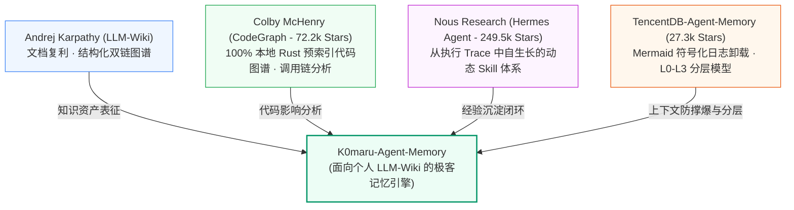
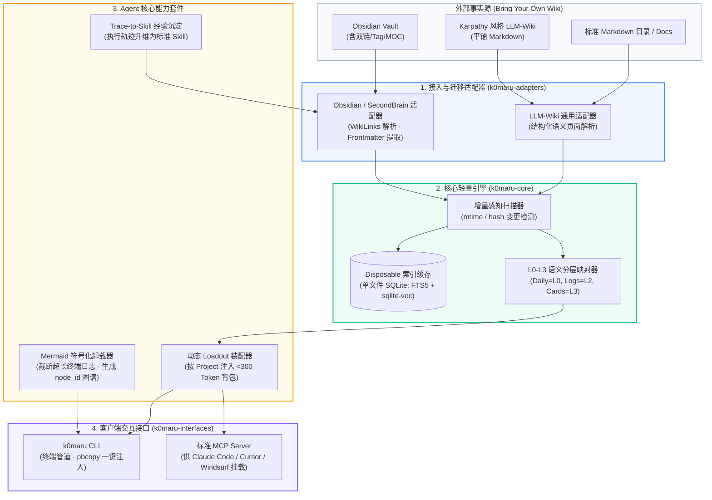

# 🚀 K0maru-Agent-Memory: 面向个人 LLM-Wiki 与第二大脑的独立轻量化 Agent 记忆引擎

> 💡 **项目定位**：一个**独立的开源轻量化 Agent 记忆系统（Standalone Memory Hub）**。它不强制用户使用封闭的专有数据库，而是**原生兼容人类已有的 Markdown 知识网络（Obsidian SecondBrain、Karpathy LLM-Wiki、Logseq 等）**，通过极轻量的单文件缓存、动态 Loadout 装配、Mermaid 符号化日志卸载与标准 MCP 协议，为现代 AI 编码智能体（Claude Code、Cursor、Windsurf 等）提供秒级读档与长程防撑爆能力。

---

## 🎯 一、 核心痛点与差异化定位

### 1. 行业现状痛点
- **大厂方案（TencentDB、Letta）**：强行推行自己的数据存储格式与微服务集群（Docker、PostgreSQL、专有向量库），要求用户把知识“录入进他们的系统”，彻底割裂了开发者已有的本地笔记。
- **头部工具（rohitg00/agentmemory）**：后台强制下载专有引擎（`iii-engine`），霸占 4 个网络端口，把数据存进系统隐藏目录，依然是机器黑盒。
- **现实开发者的巨大诉求**：成千上万的极客已经拥有了精心维护的 **Obsidian Vault、Karpathy 风格 LLM-Wiki、或者基于 Git 的 Markdown 知识库**。这些知识是人类与 AI 协作的天然资产，但目前没有任何独立工具能“无缝接入现有 Wiki，为其赋予 Agent 记忆中枢能力”。

### 2. K0maru-Agent-Memory 的核心定位
- **“Bring Your Own Wiki” 原则**：用户无需抛弃现有的 Obsidian 或 LLM-Wiki，只需一条指令将现有 Vault 挂载或迁移进来。
- **真理源泉在文件，性能加速在缓存**：Markdown 是唯一人类可读的事实来源，底层仅生成一个单文件、可随时完全重建的 `cache.sqlite`（FTS5 + 本地向量）。
- **零守护进程（Zero-Daemon）与零网络端口占用**：支持标准 CLI 管道交互与按需拉起的标准 MCP 协议服务。
- **Dogfooding 验证**：我们当前的 **SecondBrain 知识库将作为该项目的“零号真实生产样板间（Ground Truth Dogfooding Vault）”**。

---

## 🧬 二、 技术渊源与上游巨人肩膀 (The Upstream Ancestry)

腾讯开源的 TencentDB-Agent-Memory 并非空中楼阁，其官方致谢与源码实现明确锚定了开源社区的**三大上游巨人**。K0maru-Agent-Memory 将直接站在这些巨人的肩膀上，吸收纯粹的内核，剔除企业级的附赘：

1. **知识层源泉：Andrej Karpathy 的 “LLM-Wiki” 范式**：
   - **核心思想**：由 LLM 增量维护、可持续复利的 Markdown 知识页面与链接图谱。
   - **K0maru 的承接**：原生支持 Karpathy 风格的平铺 Wiki 与 Obsidian 双链体系，不自造私有存储，让 Markdown 成为跨时代的通用事实源。
2. **代码层源泉：Colby McHenry 的 [`CodeGraph`](https://github.com/colbymchenry/codegraph) (72.2k Stars)**：
   - **核心思想**：基于 Rust 内核的 100% 本地代码图谱，自动感知代码改动，精准提供函数/类级的 callers、callees 与改动波及范围（Impact Analysis）。原生支持 Claude Code、Cursor、Antigravity。
   - **K0maru 的承接**：**绝不从零手写代码语法树分析**。腾讯明确复用了 CodeGraph 的源码；K0maru 同样可以直接通过 CLI 或本地二进制与 CodeGraph 联动，直接坐享 7.2 万星的高性能代码智能。
3. **能力层源泉：Nous Research 的 [`Hermes Agent`](https://github.com/nousresearch/hermes-agent) (249.5k Stars)**：
   - **核心思想**：Agent 的经验不仅是静态的 Chat 历史，更是带触发边界、执行步骤与验证规则的动态 Skill，能从报错和工具调用轨迹中自主提炼。
   - **K0maru 的承接**：吸纳 Hermes 的 Skill 数据结构，打通“长任务排障 $\to$ Trace 提取 $\to$ 标准可执行 Skill”的反向沉淀闭环。
4. **短期降本源泉：腾讯云 [`TencentDB-Agent-Memory`](https://github.com/TencentCloud/TencentDB-Agent-Memory) (27.3k Stars)**：
   - **核心思想**：Mermaid 符号化短期记忆（日志写 `refs/` + 上下文仅留带 `node_id` 的拓扑图）与 L0–L3 语义金字塔。
   - **K0maru 的承接**：剔除其 Docker 微服务群、Web 鉴权与后台盲目抽取，将这套高价值算法提炼为纯 CLI 管道工具（`k0maru offload`）与秒级装配器（`k0maru loadout`）。

---

## 🏗️ 三、 整体架构设计：解耦的模块化引擎

---

## ⚡ 四、 四大杀手级核心能力 (Core Features)

### 1. 任意个人 LLM-Wiki 的无损挂载与渐进迁移 (`k0maru-adapters`)
- **零破坏性接入**：运行 `k0maru init --vault /path/to/my-vault`，不修改用户现有文件后缀，不强制移动目录结构；
- **智能语义嗅探**：
  - **针对 Obsidian / SecondBrain**：自动识别 `[[WikiLinks]]` 网络、YAML Frontmatter、`#tag` 标签以及 MOC 索引；
  - **针对 Karpathy LLM-Wiki**：解析平铺式 Markdown 页面与相对链接，构建轻量拓扑关系；
- **双向同步沉淀**：Agent 新沉淀的经验可以作为新卡片或 Skill 反向写回用户的知识库目录。

### 2. 项目维度“秒级读档”装配背包 (`k0maru loadout`)
- **告别会话失忆**：针对具体工程任务（如 `k0maru loadout okx`），毫秒级提取绑定的 L3 规则卡片（如风控铁律）、近期 L2 研发日志与项目愿景；
- **极限 Token 控制**：生成一段 `< 300 Token` 的紧凑 YAML/Markdown 提示词包，消除跨 Agent 客户端（Claude Code / Cursor / Antigravity）重复解释项目背景的痛点。

### 3. 符号化短期记忆与长日志卸载 (`k0maru offload`)
- **长程排障防撑爆**：提供 CLI 管道工具（如 `pytest | k0maru offload`）。
- **运行机制**：
  - 超过 50 行的命令输出或报错堆栈自动沉淀至 `scratch/refs/<task_id>.log`；
  - 终端与上下文仅保留带 `node_id` 的极简 Mermaid 状态迁移图；
  - 遇到故障时 Agent 按需执行 `k0maru inspect <node_id>` 局部精准回溯。
- **收益**：立竿见影节约 30%~60% Token，彻底消除长日志引发的注意力漂移。

### 4. 零守护进程的标准 MCP 协议支持 (`k0maru-mcp`)
- **无感原生集成**：无需后台常驻常开的独立微服务，通过标准的 `stdio` 方式暴露 MCP 协议；
- **即插即用**：在 `~/.claude.json` 或 Cursor 配置中添加一行，Claude Code 即可直接在需要时调用 `recall_memory`、`get_project_loadout` 或 `offload_context` 工具。

---

## 📅 五、 研发演进路线 (Roadmap)

### Phase 1: 原型与样板间验证 (Dogfooding Stage) - [当前阶段]
- [x] 在 SecondBrain 沉淀架构论证报告与生态真空分析（[[01_AI_Logs/2026-09-28-agent-memory-architecture-evaluation-and-litedb-decision|研发日志]]）
- [x] 在 SecondBrain 验证通用规约（[[AGENTS.md]] Mermaid 卸载准则）
- [x] 在 SecondBrain 跑通单文件原型脚本（`30_Resources/scripts/agent_loadout.py`）

### Phase 2: 独立工程立项与核心包构建 (`k0maru-core` & `k0maru-cli`)
- [ ] 创建独立的 Git 仓库 `K0maru-Agent-Memory`，采用模块化 Python (或 Rust) 架构；
- [ ] 实现 `k0maru-adapters`：编写 Obsidian 适配器（解析 WikiLinks 与 Frontmatter）与通用 LLM-Wiki 适配器；
- [ ] 实现 `k0maru offload` 管道工具：支持从 stdin 读取超长日志，输出 Mermaid 图谱与落盘文件；
- [ ] 实现 `k0maru loadout` 命令：支持管道直接接入系统剪贴板。

### Phase 3: FastMCP 协议与开箱即用接入 (`k0maru-mcp`)
- [ ] 基于 `fastmcp` 封装标准 Model Context Protocol 服务，支持 stdio 通信模式；
- [ ] 编写针对 Claude Code、Cursor、Windsurf 的一键配置安装命令（`k0maru install --client claude`）；
- [ ] 验证端云协同与跨会话自动召回体验。

### Phase 4: 一次性本地向量加速缓存 (Disposable Vector Cache)
- [ ] 接入 `sqlite-vec` 与本地轻量级 CPU 嵌入模型（FastEmbed / ONNX），实现纳秒级 BM25 + 向量混合检索；
- [ ] 验证“文件变动增量同步”与“缓存一键无损重建”机制。

---

## ⚖️ 六、 开源合规与知识产权规约 (Licensing & Compliance)

为了确保 `K0maru-Agent-Memory` 作为独立开源项目发布时合法、合规，彻底规避任何版权与侵权纠纷，团队对所有上游参考项目进行了**严密的法律许可证全景审计**，并确立以下四项合规铁律：

### 1. 上游项目开源协议全景审计矩阵

| 参考/依赖项目 | 开源协议 (SPDX) | 商业友好度 | 传染性 (Copyleft) | 合规义务与注意事项 |
| :--- | :---: | :---: | :---: | :--- |
| **`TencentDB-Agent-Memory`** | **MIT License** | 极高 | **无** | 腾讯使用标准 MIT 授权，仅需在衍生项目中保留原作者版权声明。 |
| **`colbymchenry/codegraph`** | **MIT License** | 极高 | **无** | 宽松自由，调用或借鉴需保留 Colby McHenry 版权。 |
| **`nousresearch/hermes-agent`** | **MIT License** | 极高 | **无** | 宽松自由，规范借鉴需保留 Nous Research 声明。 |
| **`asg017/sqlite-vec`** | **Apache-2.0** | 极高 | **无** | 商业友好，包含明确专利授权，保留 NOTICE 即可作为库依赖。 |
| **`jlowin/fastmcp`** | **Apache-2.0** | 极高 | **无** | 商业友好，直接作为 Python 第三方依赖引入。 |
| **Karpathy LLM-Wiki Gist** | 思想/设计模式 | 极高 | **无** | 计算机设计思想不受版权垄断，在文档中予以明确学术/开源致谢（Attribution）。 |

> 💡 **审计结论**：所有上游参考资产均为**最宽松的宽松型许可证（Permissive Licenses: MIT / Apache-2.0）**，**完全不存在 GPL / AGPL / SSPL 等强传染性协议**，无任何二次开源被强制传染或商业化阻碍的法律风险。

### 2. 防侵权四大工程实操铁律

1. **净室独立实现（Clean-Room Implementation）**：
   - 腾讯项目基于 TypeScript / Docker 构建，而 K0maru-Agent-Memory 采用 Python 进行从零自研编写；
   - 吸收其“Mermaid 符号化卸载”与“L0-L3 分层”的**架构设计哲学**，但代码实现（AST 解析、Markdown 嗅探、CLI 管道、MCP 工具链）均为全新独立编写，**绝不直接 Copy-Paste 任何源码**，杜绝表达层抄袭。
2. **工具联动而非代码嵌入（Tool Orchestration）**：
   - 针对代码图谱能力，不私自搬运或篡改 `CodeGraph` 的 Rust 源码，而是作为可选依赖通过命令行（`codegraph` CLI）或预编译包进行生态联动与调用。
3. **商标与品牌严格脱钩（Trademark Protection）**：
   - “Tencent” 与 “TencentDB” 是腾讯公司的注册商标。K0maru-Agent-Memory 的名称、域名、npm/PyPI 包名及宣传中**严禁冒用或暗示为腾讯官方产品**；
   - 项目名定为独立的 `K0maru-Agent-Memory`，在文档中客观陈述为“受到腾讯开源项目的思想启发”。
4. **完备的版权保留与规范致谢（Attribution & Acknowledgments）**：
   - 在独立仓库的 `README.md` 与 `NOTICE` 文件中，显式列出 Acknowledgments，完整注明 Andrej Karpathy、Colby McHenry、Nous Research 与 Tencent Cloud 的贡献与原仓库链接。

### 3. 本项目自身协议选择
- `K0maru-Agent-Memory` 将正式采用 **MIT License** 发布，与上游生态完全同构，最大化赋能个人开发者与开源社区。

---

## 🔗 七、 关联知识网络与双链

- **主索引 (MOC)**：[[Index]]
- **全局规约**：[[AGENTS.md]]
- **技术调研与决策日志**：[[01_AI_Logs/2026-09-28-agent-memory-architecture-evaluation-and-litedb-decision|2026-09-28 Agent 记忆中枢技术全景研判与决策复盘]]
- **样板间测试脚本**：`30_Resources/scripts/agent_loadout.py`
- **底层架构卡片**：
  - [[20_Cards/AI编码中的上下文卫生与Smart-Zone法则|🧠 AI编码中的上下文卫生与Smart-Zone法则]]
  - [[20_Cards/主从Agent编排与工单派发架构|🧠 主从Agent编排与工单派发架构]]
  - [[20_Cards/深度模块设计与AI代码库架构治理|🧠 深度模块设计与AI代码库架构治理]]
