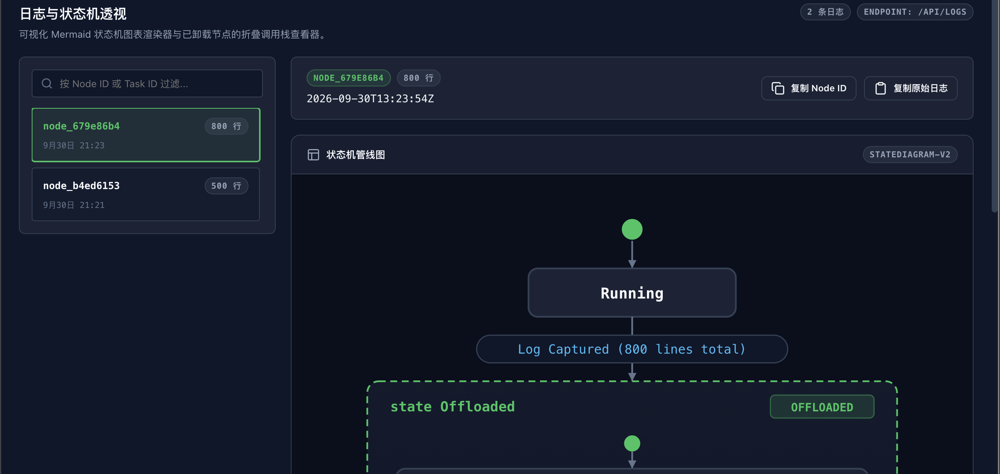
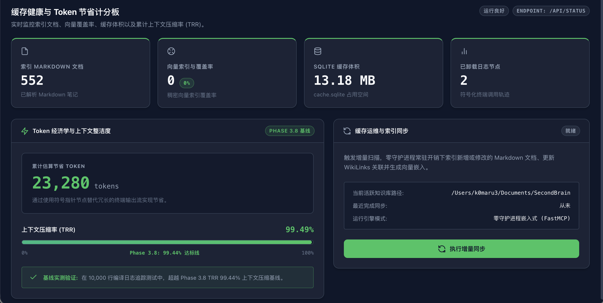

# K0maru Developer Console (UI) 开发者控制台使用指南

> **面向 AI 智能体长效记忆的本地内嵌式可视化调试台与上下文治理中心**  
> *Zero-Daemon, Single-Binary, Developer Dashboard for Obsidian & LLM-Wiki.*

---

## 目录

1. [设计理念与核心价值](#1-设计理念与核心价值)
2. [快速启动与参数说明](#2-快速启动与参数说明)
3. [顶栏状态监控与全局操作](#3-顶栏状态监控与全局操作)
4. [面板一：多路检索调试器 (Search Debugger)](#4-面板一多路检索调试器-search-debugger)
5. [面板二：长日志与状态机透视 (Log Inspector)](#5-面板二长日志与状态机透视-log-inspector)
6. [面板三：Token 经济与缓存计分板 (Token Scoreboard)](#6-面板三token-经济与缓存计分板-token-scoreboard)
7. [典型人机协同工作流实操](#7-典型人机协同工作流实操)
8. [生命周期与退出机制](#8-生命周期与退出机制)

---

## 1. 设计理念与核心价值

以往通过 FastMCP 接入知识库时，Agent 翻阅记忆、计算相关度与截断长日志完全在后台“黑盒”运行，人类开发者无法直观评估：
- **记忆召回质量**：Agent 为什么选了笔记 A 而不是笔记 B？
- **算法贡献度**：BM25 关键词匹配、语义向量和双向链接（WikiLinks）各自发挥了什么作用？
- **运行故障上下文**：Agent 跑单测报错截断后，提炼的状态机是什么样？如何人工快速介入？
- **降本量化成果**：这套上下文治理方案到底帮 LLM 节省了多少 Token 与成本？

`k0maru ui` 将这些关键指标以 **极客暗色控制台（Developer Dark Console）** 风格完整可视化，且严格遵循：
* **零后台守护进程（Zero-Daemon）**：不随系统常驻，即开即用，关闭终端（`Ctrl+C`）即刻彻底释放端口与内存；
* **单二进制内嵌（Single-Static-Binary）**：前端静态资产在编译期通过 `rust-embed` 打包至二进制内部，无需安装 Node.js、npm 或 Python；
* **100% 离线自包含（Zero-CDN）**：不依赖任何外部 CDN 资源，在断网与安全沙箱环境中全功能流畅运行。

---

## 2. 快速启动与参数说明

### 基础启动
在终端直接运行：

```bash
# 指定知识库路径并自动唤起默认浏览器
k0maru ui --vault ~/Documents/SecondBrain --open
```

控制台输出：
```text
🚀 K0maru Dashboard active on http://127.0.0.1:3721
Opening http://127.0.0.1:3721 in default browser...
```

### 命令行选项参数

| 参数 | 缩写 | 默认值 | 说明 |
| :--- | :--- | :--- | :--- |
| `--vault <路径>` | `-v` | 当前工作目录 | 指定要挂载的本地 Markdown 知识库目录（如 Obsidian Vault 或 LLM-Wiki） |
| `--port <端口>` | `-p` | `3721` | 本地 HTTP 服务绑定的端口（严格绑定于 `127.0.0.1` 环回接口，保障私密安全） |
| `--open` | 无 | 否 | 启动后自动使用操作系统默认浏览器打开 Web 控制台 |
| `--help` | `-h` | 无 | 打印命令帮助信息 |

---

## 3. 顶栏状态监控与全局操作

顶栏是实时监控全局状态与常用快捷操作的控制中心：


*图 1：顶栏状态栏（Vault 挂载状态、文档统计、中英双语切换与一键增量同步）*

### 3.1 挂载状态指示药丸
* **Vault 路径**：显示当前连接的 Markdown 知识库物理绝对路径；
* **Docs 文档数**：SQLite 缓存中当前已建立词法索引的 Markdown 文档总篇数；
* **Vectors 向量数**：已完成本地 CPU ONNX 稠密向量嵌入的文档篇数；
* **Synced 上次同步**：最近一次增量扫描完成的时间戳（如 `15:42:10`）。

### 3.2 🌐 中英双语即时切换 (Bilingual I18n)
* 点击顶栏右上角的 **`🌐 中文 / EN`** 胶囊按钮，界面静态文案、动态卡片、说明文字与 Toast 提示即时在中英文之间切换；
* **无须刷新页面**；
* **本地记忆**：偏好持久化保存在浏览器 `localStorage` 中；首次访问时自动感知您的操作系统/浏览器语言设定。

### 3.3 ⚡ 一键增量同步 (Sync Vault)
* 当您在 Obsidian 中刚新增或重构了多篇笔记，点击 **「同步知识库 (Sync Vault)」**；
* 系统在后台自动触发 `xxh3` 指纹增量比对，仅重写发生变动的文档与向量索引，并在界面弹出实时同步结果。

---

## 4. 面板一：多路检索调试器 (Search Debugger)

用于**验证、调教与评测 Agent 的长期记忆召回准确率**。


*图 2：多路检索调试器（搜索关键词、混合检索打分瀑布流与绿色图谱加权徽章）*

### 4.1 全局快捷键唤醒
在界面任意位置按下 **`/`** 或 **`⌘K`**，搜索框将自动获得焦点；按下 **`Esc`** 键退出搜索聚焦。

### 4.2 三模态检索策略切换
* **混合检索（Hybrid RRF，默认推荐）**：
  采用 Reciprocal Rank Fusion 倒数排名融合算法（$k=60$），将 BM25 词法命中与语义向量距离联合打分，对专有名词和模糊语义均有极强召回力；
* **词法检索（BM25 Lexical）**：
  纯基于 SQLite FTS5 的倒排索引全文搜索，精准匹配函数名、错误码、特定配置参数；
* **向量检索（Vector Dense）**：
  基于本地 CPU ONNX (`fastembed-rs`) 的 384 维余弦距离稠密向量检索，适合意图推断与自然语言概念匹配。

### 4.3 检索归因得分瀑布流 (Explainability Waterfall)
每一张命中的结果卡片均提供细粒度的归因信息：
* **RRF Score**：综合融合得分，越高排序越前；
* **BM25 Rank**：纯词法模式下该笔记的自然排名位次；
* **Vector Rank**：纯语义向量模式下该笔记的自然排名位次；
* **✨ `+0.05 图谱加权 (Graph Boost)` 绿色徽章**：
  如果被召回的笔记与候选池中的其他核心笔记存在 WikiLinks 双向链接（`[[OtherNote]]`），系统将自动触发图谱升权机制。点亮此徽章直观证明：**您在知识库中建立的双链网，正在显著强化 Agent 的检索相关性**。

---

## 5. 面板二：长日志与状态机透视 (Log Inspector)

用于**在 Agent 遭遇长任务运行报错时进行上下文回溯、状态排查与人工接管**。


*图 3：长日志与状态机透视（脱机 Mermaid 流程图、行号与报错红字高亮、一键复制）*

### 5.1 左右分栏交互架构 (Master-Detail)
* **左侧列表栏**：汇总由 `offload_context` 工具截断落盘的所有历史长日志，支持按节点 ID（如 `node_`）或任务标签（如 `cargo-test`）快速实时过滤；
* **右侧透视栏**：呈现所选日志节点的详细结构化分析。

### 5.2 原生脱机 Mermaid 状态机图表
控制台纯离线渲染执行流水线状态机，直观呈现长任务是从哪一个阶段被触发截断或发生故障。

### 5.3 智能语法着色与错误定位
* 每一行带有代码编辑器级别的标准行号；
* 自动扫描日志全文，将包含 `error`、`failed`、`panicked`、`exception` 的关键报错行以醒目的**红底高亮**标注，警告行以**黄底高亮**标注，助您在数百行输出中秒级定位故障根因。

### 5.4 一键复制协同流
* **复制 Node ID**：点击后将编号存入剪贴板，方便在终端运行 `k0maru inspect <node_id>`；
* **复制原始日志**：一键提取无损全量错误堆栈，直接粘贴给 Claude Code / Cursor 让 Agent 定向修复。

---

## 6. 面板三：Token 经济与缓存计分板 (Token Scoreboard)

用于**量化 Agent 记忆治理的降本增效成果，并监看系统底层健康指标**。


*图 4：缓存健康与 Token 计分板（四大资产 KPI 矩阵、TRR 上下文压缩比、增量同步面板）*


### 6.1 四大核心资产 KPI 矩阵
1. **索引 Markdown 文档**：当前识别并持久化解析的有效 Markdown 笔记总数；
2. **向量索引覆盖率**：已建立向量并参与语义检索的笔记比例（达到 100% 代表全量语义就绪）；
3. **SQLite 缓存物理体积**：本地瞬态缓存文件（`cache.sqlite`）在磁盘上的紧凑存储大小；
4. **已卸载日志节点**：已从 Agent 上下文窗口中成功剥离的超长终端执行日志总次数。

### 6.2 Token 经济学与降本量化
* **累计节省 Token 计数器**：
  基于截断日志的总行数、字符密度与提炼图谱的开销差值精确核算：
  $$\text{Tokens Saved} \approx \sum (\text{Raw Lines} \times 18) - \text{Mermaid Graph Overhead}$$
* **上下文压缩比 (Token Reduction Ratio, TRR)**：
  衡量日志卸载机制对上下文窗口的减负能力（通常在 **98.5% ~ 99.6%** 区间），直观展现为进度仪表盘。

---

## 7. 典型人机协同工作流实操

### 场景 A：新增核心笔记后，验证 Agent 是否能精准命中
1. 您在 Obsidian 中新建了一篇架构卡片：`20_Cards/分布式死锁处理规范.md`；
2. 打开终端运行 `k0maru ui --open`（或在已有控制台页面中点击顶栏 **「同步知识库」**）；
3. 在第一面板按 `/` 输入自然语言：“*跨分片死锁如何处理*”；
4. 查看第一条结果是否为刚才编写的笔记，检查其 RRF 得分与是否有 `+0.05 图谱加权`。如果加权未触发，说明您可以在笔记中添加 `[[相关架构卡片]]` 链接来强化其拓扑关联。

### 场景 B：终端测试抛出 500 行报错，快速排障
1. Agent 在后台运行 `cargo test | k0maru offload`，终端输出只显示了极简状态图并生成了 `node_7b810e12`；
2. 打开 UI 控制台切换至 **Log Inspector (日志透视)** 面板；
3. 点击左侧列表中刚刚产生的 `node_7b810e12`；
4. 界面即时呈现状态流转图，下方自动标红了真正的报错行（如第 184 行断言失败）；
5. 点击顶部的 **「复制原始日志」**，粘贴给 Agent 提问：“*请根据这段断言错误分析原因并编写补丁*”。

---

## 8. 生命周期与退出机制

* **完全零常驻守护进程**：控制台服务器仅在您主动运行命令期间存活；
* **优雅退出**：在运行 `k0maru ui` 的终端窗口按下：
  ```bash
  ^C
  ```
  控制台输出：
  ```text
  Shutting down K0maru Dashboard server...
  ```
  系统将**瞬间安全释放绑定的 3721 端口与所有内存占用**，不会在后台留下任何孤儿进程。
