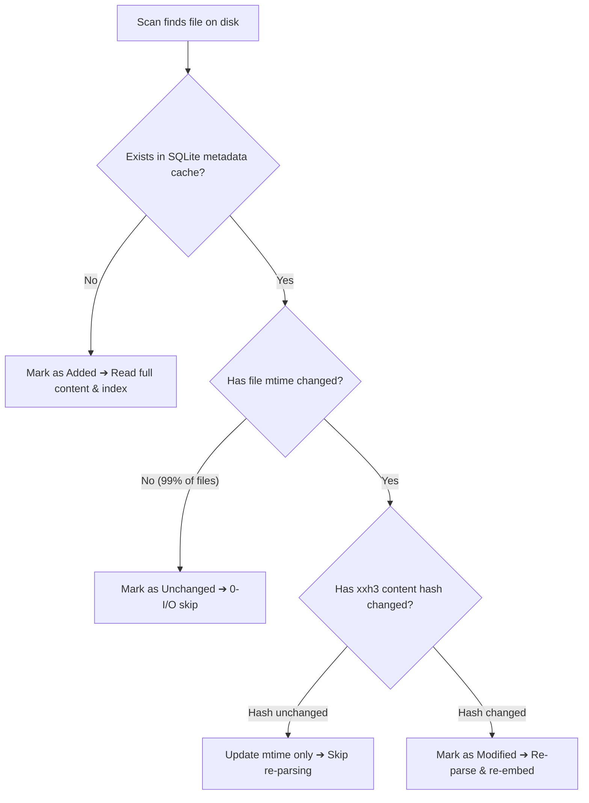

# Key Implementations Deep Dive

This chapter examines the internal mechanics, engineering decisions, and algorithmic implementations powering K0maru-Agent-Memory's 8 core subsystems.

---

## 1. xxh3 Incremental Scanner State Machine & 0-I/O Dirty Detection

To deliver millisecond-level cache synchronization across vaults containing thousands of Markdown notes, K0maru eliminates brute-force file traversal and redundant disk I/O.

### 3-Tier Filtering Pipeline
The incremental scanner (`IncrementalScanner`) evaluates files through a 3-tier in-memory state machine:



1. **Tier 1 (Cache Presence Check)**: Compares relative file paths against an in-memory hash set warmed from the SQLite `documents` table. Files missing from the set enter the `added` collection directly.
2. **Tier 2 (mtime Sub-Nanosecond Check)**: Reads the filesystem modification timestamp (`mtime`). For untouched files, this check requires only a single `stat()` system call and **executes zero content reading I/O**.
3. **Tier 3 (xxh3 64-bit Content Digest)**: If the `mtime` changed, K0maru computes a 64-bit digest using the SIMD-accelerated `xxh3_64` algorithm. If the digest matches the cached hash (for example, if you executed `touch` without modifying text), K0maru updates the stored `mtime` and skips tokenization and vector re-embedding.

On a benchmark vault of 500 documents, clean scans complete in **11.67 ms**, and cold index reconstruction achieves **6,746 documents per second**.

---

## 2. Hybrid Retrieval: BM25 + ONNX Vectors + 1-Hop Graph Boost RRF

Pure vector retrieval often hallucinates or drifts when querying precise software symbols (such as `SQLITE_BUSY`, `E0502`, or `Option<&mut T>`). Conversely, pure keyword search cannot recognize synonyms or architectural abstractions. K0maru fuses three retrieval channels.

### Mathematical Formulation
For any document $d$ in the candidate set, its composite score is computed via Reciprocal Rank Fusion (RRF) with an additive graph topological boost:

$$\text{Score}_{\text{RRF}}(d) = \sum_{m \in \{\text{BM25}, \text{Vector}\}} \frac{w_m}{k + \text{Rank}_m(d)} + \text{GraphBoost}(d)$$

Parameter definitions and production defaults:
- $k$: Smoothing constant set to **$k = 60$** (empirically validated on TREC and BEIR benchmarks to stabilize variance among top ranks);
- $w_{\text{BM25}}$ and $w_{\text{Vector}}$: Channel weights normalized to **$0.5$** each;
- $\text{Rank}_m(d)$: 1-based rank of document $d$ in channel $m$. If a document fails to enter the top-$N$ pool for a channel, its contribution is $0$;
- $\text{GraphBoost}(d)$: **+0.05 topological boost**.

### 1-Hop WikiLinks Bidirectional Graph Boost
After gathering candidate documents (typically `limit * 3`, with a minimum of 20 notes), the graph engine scans candidate pairs:
1. **Forward link matching**: Verifies whether candidate document $A$ contains a `[[B]]` link pointing to candidate document $B$.
2. **Backlink matching**: Verifies whether document $B$'s backlink table references document $A$.

If a candidate connects to any other candidate in the pool via a 1-hop link, K0maru adds **$+0.05$** to its RRF score. This mechanism elevates foundational hub notes (Maps of Content) and shared architectural standards above isolated leaves.

---

## 3. FastMCP Stdio Protocol & Natural Language Intent Mapping

Many agent extensions force developers to memorize rigid trigger keywords. K0maru implements the Anthropic Model Context Protocol (FastMCP) over standard I/O streams (`stdio`) using asynchronous JSON-RPC 2.0.

### Natural Language Intent Routing
K0maru's tool annotations align with natural human phrasing. Leading LLMs (Claude 3.5 Sonnet, GPT-4o, Qwen2.5-Coder, DeepSeek-R1) route conversational prompts to K0maru's native tools autonomously:

| User Conversational Utterance | Inferred Agent Intent | FastMCP Tool Call |
| :--- | :--- | :--- |
| *"I am taking over this microservice; show me the core architecture rules."* | Bootstrap context loadout | `get_project_loadout` |
| *"How did we resolve this error in past sprints? Check our notes."* | Knowledge base search | `recall_memory` |
| *"The test suite dumped a huge crash log; inspect the stack trace."* | Log slice retrieval | `inspect_log_node` |
| *"Save our agreed Redis mutex renewal pattern as an ADR."* | Decision crystallization | `flush_session` |
| *"Synthesize an automated troubleshooting guide from this compiler trace."* | Reusable skill synthesis | `distill_session_skill` |

Because FastMCP runs over standard `stdio` pipes spawned on-demand by the agent client, K0maru requires **zero open network ports and zero reverse proxies**.

---

## 4. Symbolic Log Offloading & Zero-Dependency SVG Mermaid Rendering

When tests crash or compiler builds fail, `k0maru offload` intercepts output streams using an AST-driven streaming parser (`OffloadEngine`).

### Offloading Workflow
1. **Line-threshold trigger**: Triggers when output exceeds 50 lines (configurable via `--threshold`). Shorter logs pass through untouched.
2. **Streaming pattern extraction**:
   - Identifies error codes (such as Rust `E0382`/`E0502`, Python `InvalidStateError`, Go `fatal error: all goroutines are asleep`);
   - Extracts root file paths and line numbers (such as `src/worker.rs:42`).
3. **Physical slice persistence**: Saves raw, uncompressed log traces to `.k0maru/refs/<task_id>_<node_id>.log`.
4. **Mermaid state diagram generation**: Produces a 15-line Mermaid state diagram for terminal output, reducing token consumption by **97% to 99.4%**.

### Zero-Dependency Inline SVG Rendering
Within the embedded developer console, K0maru converts Mermaid syntax directly into inline SVG elements using a lightweight internal parser. The console operates without headless browser instances, Node.js runtimes, or external CDN scripts, functioning reliably in offline environments.

---

## 5. Adaptive Vault Convention Sniffer (`ConventionSniffer`)

Developers organize Markdown vaults in varied layouts. Rather than forcing a rigid folder structure, K0maru detects existing patterns using `ConventionSniffer`:

```rust
pub struct ConventionRules {
    pub category_folders: HashMap<String, String>,
    pub file_naming_style: NamingStyle, // DateSlug vs SlugOnly
    pub template_path: Option<PathBuf>,
}
```

### Detection Precedence
1. **Explicit configuration**: Reads mappings declared in `.k0maru/rules.md`, `AGENTS.md`, or `CONVENTIONS.md`.
2. **Directory heuristics**:
   - Detects Johnny Decimal structures (`10_Projects/`, `20_Cards/`, `00_Logs/`);
   - Detects flat conventions (`docs/adr/`, `decisions/`, `journal/`).
3. **Naming pattern inference**: Analyzes existing files to match timestamped (`YYYY-MM-DD-title.md`) or clean (`title.md`) conventions.

---

## 6. Atomic Crystallization Engine (`FlushEngine`) Anti-Collision Logic

When multiple agents run concurrently or re-run crystallization routines, overwriting existing notes risks data loss. `FlushEngine` implements idempotent writes with automatic collision resolution:

```rust
// Idempotency and collision resolution logic
if target_path.exists() {
    let existing_content = fs::read_to_string(&target_path)?;
    if existing_content == new_content {
        // Idempotent: identical content requires no write
        return Ok(FlushOutcome::UpToDate);
    }
    // Collision: differing content receives an incremental version suffix
    target_path = resolve_collision_path(&target_path); // e.g., adr-001-v2.md
}
```

- **Incremental version suffixes**: If a target file exists with differing content, `FlushEngine` generates `-v2.md` or `-v3.md` suffixes to protect existing human notes.
- **Frontmatter injection and WikiLinks formatting**: Injects YAML metadata (`date`, `tags`, `category`) and wraps entries in `related_notes` into standard `[[WikiLinks]]`.

---

## 7. Trace-to-Skill Heuristic Distiller (`DistillEngine`)

Inspired by Nous Research Hermes Agent playbooks, K0maru's `DistillEngine` synthesizes one-off debugging sessions into permanent, reusable troubleshooting playbooks.

### 4-Step Distillation Pipeline
1. **Trace classification**: Detects stack runtime environments (Rust, Python, TypeScript, Go, C/C++).
2. **Root-cause abstraction**: Isolates error primitives (such as `BorrowMutError` or `heap-use-after-free`).
3. **Structured playbook generation**: Generates a standard Markdown skill note containing symptom signatures, diagnostic steps, and verified code patches.
4. **Hermes ecosystem export (`--export-hermes`)**: Exports generated skill playbooks directly into `~/.hermes/skills/`, allowing autonomous agents to reuse verified solutions in subsequent workflows.

---

## 8. Embedded Developer Dark Cockpit Console (Axum WebUI)

K0maru includes an embedded web console for real-time memory and search introspection:

```bash
k0maru ui --vault ~/my-vault --open
```


### Architectural Highlights
- **Single-binary distribution**: Uses the Axum HTTP framework and embeds HTML, CSS, JS, and SVG assets via `rust-embed`. Requires no Node.js or Nginx installations.
- **Search debugger**: Displays BM25 ranks, vector cosine scores, and highlighted Emerald `+0.05 Graph Boost` badges for every candidate result.
- **Token scoreboard**: Calculates cumulative tokens saved by log offloading and estimates cost reductions across frontier LLM API tiers.
- **Dark cockpit theme**: Matches the `#0F172A` background and `#22C55E` accent colors of the terminal interface.
- **Clean exit**: Pressing `Ctrl+C` terminates the HTTP server and releases bound ports immediately.
