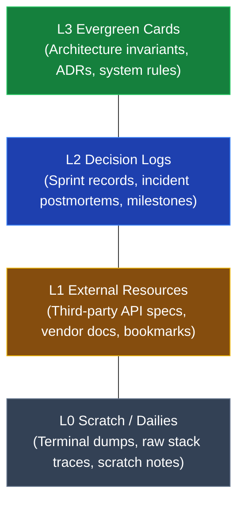
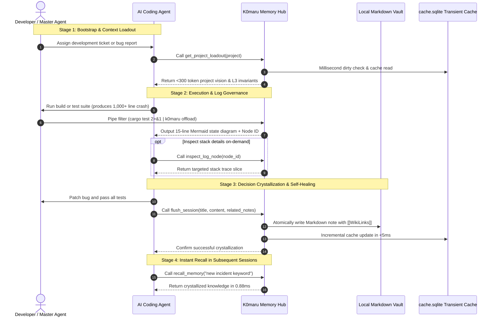

# Architecture Overview & Data Flow

K0maru-Agent-Memory enforces a 4-layer decoupled architecture designed specifically for AI coding agents. Through strict layer boundaries and zero background daemons, it achieves sub-5ms cold starts and robust runtime stability.

---

## 🏗️ 4-Layer Decoupled Architecture

### 1. Presentation & Protocol Layer
Handles bidirectional communication with developers and external AI agent clients:
- **CLI Subsystem**: Built on Rust's `clap` framework. Powers Unix pipe filtering (`| k0maru offload`), environment diagnostics (`k0maru doctor`), bootstrap extraction (`k0maru loadout`), search, and crystallization commands.
- **FastMCP Stdio Server**: Implements the official Anthropic Model Context Protocol (MCP) standard over standard I/O streams (`stdio`) using JSON-RPC 2.0. Requires zero listening network ports and zero background daemons.
- **Embedded Developer Console (Axum WebUI)**: Compiles static assets directly into the binary using `axum` and `rust-embed`. Provides interactive retrieval debugging and zero-CDN inline SVG Mermaid rendering, terminating cleanly upon exit.

### 2. Domain & Processing Layer
Governs business logic, trace syntax analysis, and convention adaptation:
- **Incremental Scanner (`IncrementalScanner`)**: Leverages `xxh3` 64-bit hashing and filesystem modification timestamps (`mtime`) to maintain an in-memory dirty-file state machine, eliminating unnecessary disk I/O.
- **Adaptive Convention Sniffer (`ConventionSniffer`)**: Detects existing directory topologies (Johnny Decimal vs flat), file naming patterns (`date_slug` vs `slug_only`), and YAML frontmatter formats automatically.
- **Distill Heuristic Engine (`DistillEngine`)**: Parses compiler stack traces and test failures, applying AST heuristics to synthesize reusable troubleshooting playbooks.
- **Atomic Crystallization Engine (`FlushEngine`)**: Resolves collision suffixes, generates YAML frontmatter, weaves bidirectional `[[WikiLinks]]`, and triggers post-write cache updates.

### 3. Retrieval & Fusion Layer
Combines exact lexical matching, dense semantic representations, and bidirectional graph connectivity:
- **BM25 Lexical Engine**: Uses native SQLite FTS5 virtual tables to perform sub-millisecond inverted matching across identifiers, keywords, and error codes.
- **ONNX Semantic Engine**: Runs local inference via `fastembed-rs` and `all-MiniLM-L6-v2` (384-dimensional dense vectors) to compute semantic embeddings.
- **RRF Rank Fusion ($k=60$)**: Blends lexical and semantic score distributions using Reciprocal Rank Fusion.
- **1-Hop WikiLinks Graph Boost (+0.05 Boost)**: Scans candidate pairs for bidirectional links, elevating hub notes (Maps of Content) in the final ranking.

### 4. Storage & Persistence Layer
Maintains the invariant that the filesystem is the single source of truth while keeping caches disposable:
- **Standard Markdown Filesystem (Source of Truth)**: Your local Obsidian notes or LLM-Wiki files. All content remains 100% open-standard Markdown versioned with Git.
- **Single-File Disposable Cache (`cache.sqlite`)**: Located at `.k0maru/cache.sqlite`. Houses FTS5 inverted tables and `sqlite-vec` virtual tables. You can delete this file at any time; K0maru rebuilds it in 74 ms.
- **Offline Slice Reference Pool (`.k0maru/refs/`)**: Stores full, untruncated raw compiler traces offloaded from the terminal, retrievable on-demand by Node ID.

---

## 📚 4-Tier Memory Hierarchy (L0–L3)

K0maru organizes all software development knowledge into a 4-tier memory pyramid:

### 1. L3 Evergreen (Invariants & Architecture Decisions)
- **Locations**: `20_Cards/`, `docs/adr/`, `concepts/`
- **Definition**: High-value, rarely changing rules and architectural decision records (ADRs) that every session must observe.
- **Example**: `adr-008-distributed-lock.md` (mandates Redis `SET NX EX 30` mutex locks and state machine idempotency guards).

### 2. L2 Decision Logs (Milestones & Incident Postmortems)
- **Locations**: `00_Logs/`, `logs/`, `journal/`
- **Definition**: Historical accounts of resolved incidents, sprint iterations, or feature milestones.
- **Example**: `2026-10-08-incident-retry-storm.md` (documents root-cause analysis and workarounds for webhook retry storms).

### 3. L1 Resources (External Specifications & API Guides)
- **Locations**: `30_Resources/`, `specs/`
- **Definition**: Third-party API schemas, vendor specifications, and team conventions.
- **Example**: `stripe-webhook-v2024-api.md`.

### 4. L0 Scratch / Dailies (Ephemeral Traces & Slices)
- **Locations**: `.scratch/`, `.k0maru/refs/`
- **Definition**: Raw stack trace slices and transient scratch notes offloaded from terminal output. Has a short lifespan and can be cleaned or overwritten automatically.

---

## 🔄 Memory Lifecycle Closed-Loop

The sequence diagram below illustrates how knowledge compounds across agent sessions:

By completing this loop, every troubleshooting breakthrough and architectural decision transforms into a permanent asset that future agent sessions recall in milliseconds.
