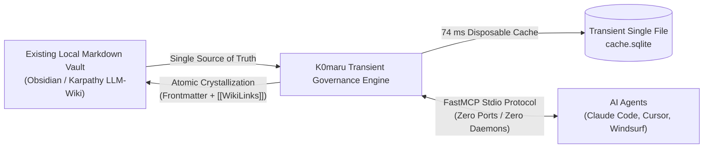

# Introduction & Design Philosophy

K0maru-Agent-Memory (K0maru) is a **standalone, single-static-binary, zero-daemon long-term memory hub and context governance engine** engineered for personal Markdown knowledge bases and local LLM-Wikis.

When you pair with AI coding agents (such as Claude Code, Cursor, and Windsurf) to construct complex software systems, you routinely encounter two fundamental engineering bottlenecks: **cross-session amnesia** and **terminal compiler log explosion**.

K0maru solves both challenges on your local developer machine using pure Rust, delivering industrial-grade performance through mechanical simplicity.

---

## 💥 Three Engineering Bottlenecks in Traditional Agent Workflows

### 1. Cross-Session Amnesia: Knowledge Fails to Compound

Modern AI coding agents start from a blank slate every time you launch a new terminal session or IDE window:
- **Lost architectural decisions**: Distributed lock renewal rules, API idempotency invariants, and state machine transition guarantees agreed upon in previous sessions vanish once the session ends.
- **Repeated debugging cycles**: When a compiler error or race condition recurs, the agent cannot access previous incident postmortems, forcing you through the same trial-and-error cycle again.

Traditional workarounds rely on manually copying and pasting prompt snippets or piling rules into static `AGENTS.md` files. As projects grow, static rule files either bloat the model's context window or drift out of sync with real application code.

### 2. Terminal Log Explosion: Context Window Blowouts and Attention Drift

During automated builds, integration tests, and runtime debugging, commands like `cargo test`, `npm test`, or crash dumps dump 500 to 2,500 lines of stack traces (5,000 to 80,000 tokens) into the terminal:
- **Lost-in-the-Middle amnesia**: Massive stack traces push original business requirements out of the model's effective attention span, causing the agent to drift away from the core task.
- **Context window overflow and soaring API bills**: In unmanaged multi-turn debugging sessions, context size routinely breaches 128k token limits by Turn 6. Resending thousands of lines of identical error output every turn causes your API costs to escalate quadratically.

### 3. Heavy Microservice Container Bloat: Resource Waste and Port Contention

Mainstream agent memory frameworks adopt cloud-native microservice architectures, requiring you to run Docker Compose clusters containing PostgreSQL, pgvector, Redis, and FastAPI containers on your local workstation:
- **High memory consumption**: Background containers consume between 1 GB and 2.5 GB of host RAM continuously.
- **Sluggish cold starts**: Container networks and Python runtimes take 2,500 ms to 3,800 ms to initialize, which breaks the responsiveness required for interactive command-line workflows.
- **Port collisions and orphaned processes**: Binding multiple local ports (such as `8080`, `5432`, and `8283`) triggers firewall warnings, port conflicts, and orphaned zombie containers that complicate maintenance.

---

## 🌟 Core Philosophy: Bring Your Own Markdown (BYOM)

K0maru adheres strictly to the **Bring Your Own Markdown (BYOM)** architecture:

### 1. Plain-Text Filesystem as the Single Source of Truth
Your local Markdown notes—whether stored in an Obsidian vault or an Andrej Karpathy-style LLM-Wiki—serve as the sole data foundation. K0maru introduces no proprietary binary formats. All architectural decision records (ADRs), debugging logs, and concept cards remain standard Markdown files that you can read, edit, search, and version-control with Git.

### 2. Disposable Transient Index Cache Invariant
K0maru maintains a single SQLite database (`cache.sqlite`) inside the `.k0maru/` directory of your vault root to power SQLite FTS5 full-text indexing and `sqlite-vec` vector searches:
- **Physical decoupling**: The database functions strictly as an acceleration cache.
- **Sub-100ms self-healing rebuild**: You can delete the cache file at any time (`rm .k0maru/cache.sqlite`). K0maru's xxh3 incremental scanner rebuilds the entire index for 500 documents in **74 ms** (6,746 documents per second), eliminating data loss risks associated with corrupted proprietary databases.

### 3. Absolute Zero-Daemon Architecture and Instant Cold Starts
K0maru compiles into a single static Rust executable with a binary size of **3.66 MB**:
- **Zero background overhead**: K0maru runs no background daemons and opens no listening network ports.
- **Immediate execution**: Median cold-start invocation completes in **3.38 ms** with a resident memory footprint of ~11.7 MB. Once a CLI command or FastMCP tool call finishes, the operating system reclaims all physical memory immediately.

---

## 📊 Comprehensive Competitor Matrix

The table below contrasts K0maru against mainstream agent memory approaches across eleven system and operational dimensions:

| Evaluation Dimension | Vanilla Context (Copy-Paste) | Mem0 (mem0ai) | Letta (MemGPT) | Chroma Vector DB | SQLite Raw Vector | **K0maru-Agent-Memory** |
| :--- | :--- | :--- | :--- | :--- | :--- | :--- |
| **Primary Storage Format** | Ephemeral chat history | Proprietary vector DB / Cloud | PostgreSQL + pgvector | Proprietary Parquet / SQLite table | SQLite blob table | **Local Plain-Text Markdown (Obsidian / LLM-Wiki)** |
| **Runtime Topology** | Manual | Python resident daemon / Cloud API | Containerized REST (FastAPI + Docker) | Python service / embedded library | C library binding | **Single Static Native Binary (Rust)** |
| **Background Daemon** | None | Required daemon | Required server daemon | Required server | None | **Zero-Daemon (Invoked on-demand)** |
| **Network Port Footprint** | 0 ports | 1 open port | 1–2 open ports (`8283`) | 1 open port (`8000`) | 0 ports | **0 open ports (Unix stdio streams & pipes)** |
| **Cold Start Latency** | Instant | 1,200 ms – 1,800 ms | 2,800 ms – 3,500 ms | 800 ms – 1,500 ms | 5 ms – 20 ms | **3.38 ms (Rust native execution)** |
| **Memory Footprint (RSS)**| 0 MB | ~150 MB – 250 MB | ~850 MB – 1,200 MB | ~350 MB – 600 MB | ~15 MB – 30 MB | **~11.7 MB (Released immediately on exit)** |
| **Data Format Lock-in** | High loss risk | Proprietary vector black-box | Relational schema lock-in | Vector-only format | Binary float array only | **100% Plain Markdown, zero lock-in, Git-native** |
| **Tool Calling Contract** | None | Proprietary Python SDK | Bespoke REST endpoints | Manual client wrapper | Custom SQL queries | **Standard FastMCP Stdio (JSON-RPC 2.0)** |
| **Terminal Log Governance**| Manual truncation | None | Context window eviction | None | None | **Standard Unix pipe filter (`\| k0maru offload`)** |
| **Retrieval & Fusion Engine**| None | Vector cosine similarity | Scalar filter + vector match | Approximate Nearest Neighbor (ANN) | Euclidean / Cosine vector distance | **BM25 + ONNX Vector + 1-Hop Graph Boost RRF** |
| **Index Resilience & Rebuild**| None | Irreversible corruption | Relies on database snapshots | Requires re-embedding all vectors | Requires custom table re-population | **Disposable `cache.sqlite` (6,746 docs/sec rebuild)** |

---

## 🎯 Positioning and Workflow Lifecycle

K0maru does not replace human knowledge curation. Instead, it serves as the **high-performance governor and orchestrator between AI coding agents and your local notes**:

1. **Bootstrap Stage**: Run `k0maru loadout` to extract a compact project vision and L3 architectural constraints constrained to `< 300 tokens`, preventing model hallucinations before coding begins.
2. **Execution Stage**: Pipe long terminal traces into `k0maru offload` to compress thousands of lines of compiler errors into a 15-line Mermaid state diagram, keeping agent attention sharp.
3. **Crystallization Stage**: Run `k0maru flush` or `k0maru distill` to crystallize resolved incidents and architectural decisions into permanent Markdown cards, compounding knowledge across all future sessions.
