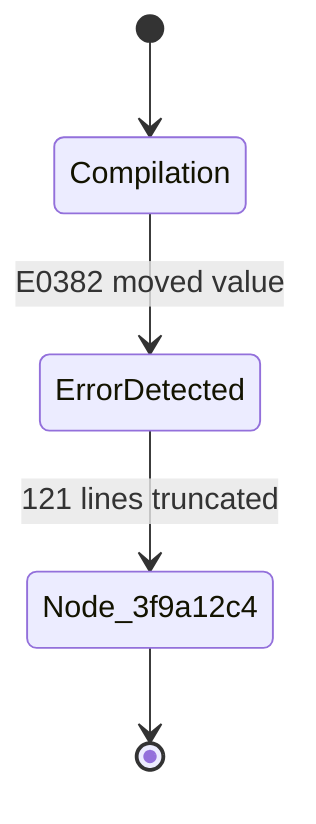

# 3-Minute Quickstart

This walkthrough guides you through K0maru's five core capabilities in 3 minutes: **environment diagnostics, context loadout injection, symbolic log offloading, hybrid search recall, and decision crystallization**.

---

## Prerequisites: Prepare a Local Markdown Vault

K0maru operates on any directory containing standard Markdown files. You can point it to your existing Obsidian vault or scaffold a demonstration LLM-Wiki:

```bash
# Create a sample LLM-Wiki directory structure
mkdir -p ~/mini-wiki/10_Projects ~/mini-wiki/20_Cards
cd ~/mini-wiki

# Create an architectural decision record (L3 Evergreen invariant)
cat << 'EOF' > 20_Cards/adr-001-idempotency.md
# ADR-001: Payment Callback Idempotency Guard

When processing third-party webhook payment callbacks, services must enforce two invariants:
1. Acquire a Redis distributed mutex lock via `SET lock:payment:{event_id} "1" NX EX 30`;
2. Verify within a database transaction that the order status is `STATUS_PENDING` before committing funds, preventing duplicate debits.
EOF

# Create a project specification note
cat << 'EOF' > 10_Projects/payment-gateway.md
# Project: Payment Gateway Core

Handles international acquiring and refund workflows.
Core dependencies: Go 1.22, Redis 7, PostgreSQL 16.
Architecture invariants: [[adr-001-idempotency]].
EOF
```

---

## Step 1: Run Environment Diagnostics (`k0maru doctor`)

Run `k0maru doctor` to initialize the transient index cache and verify your setup:

```bash
k0maru doctor --vault ~/mini-wiki
```

K0maru creates the `.k0maru/` directory, compiles the SQLite FTS5 index, and initializes the local vector space within milliseconds. When all checkmarks display green, proceed to the next step.

---

## Step 2: Inject Bootstrap Context (`k0maru loadout`)

When you open a new session in Claude Code, Cursor, or Windsurf, feeding entire documentation directories into the prompt wastes tokens and induces attention drift. Use `k0maru loadout` to traverse the `[[WikiLinks]]` graph and extract the project vision, L3 architecture invariants, and recent L2 logs—strictly constrained to **< 300 tokens**:

```bash
# Generate the loadout and copy it directly to your system clipboard
k0maru loadout payment-gateway --vault ~/mini-wiki --copy
```

The copied Markdown snippet provides a structured bootstrap summary:

```markdown
# Context Loadout: Payment Gateway Core
- Root: `10_Projects/payment-gateway.md`
- Core Stack: Go 1.22, Redis 7, PostgreSQL 16

## L3 Invariants & Decisions:
- [[adr-001-idempotency]]: Acquire Redis mutex via `SET lock:payment:{event_id} "1" NX EX 30`; verify `STATUS_PENDING` in transaction.

## Recent L2 Logs:
- (No recent logs in this sprint)
```

Paste this 200-token payload into the opening prompt of your agent session. The agent immediately anchors its reasoning to your project's architectural invariants without guesswork.

---

## Step 3: Offload Long Terminal Logs (`k0maru offload`)

When tests fail or compiler builds crash, error outputs often produce hundreds or thousands of lines of noisy stack traces. Pumping these raw traces into your LLM chat window exhausts token limits and triggers "Lost-in-the-Middle" amnesia.

Pipe command output directly through the `k0maru offload` filter:

```bash
# Simulate a 120-line compiler stack trace dump
python3 -c '
import sys
for i in range(120):
    print(f"Stack frame {i}: /core/payment/worker.rs:42 in dispatch_event()")
print("error[E0382]: use of moved value: `tx_channel`")
' | k0maru offload
```

### Output Behavior:
K0maru stores the raw trace slice on disk and renders a concise 15-line Mermaid state diagram in the terminal:



```text
✓ Log offloaded (121 lines, 99.4% token reduction)
  Reference ID: node_3f9a12c4
  Use 'k0maru inspect node_3f9a12c4' to view raw stack frames.
```

Your AI agent reads the error code (`E0382`) and root state transitions immediately without wading through 120 lines of redundant call frames. If the agent needs to inspect a specific stack slice, it calls:

```bash
k0maru inspect node_3f9a12c4
```

---

## Step 4: Search Notes with Hybrid RRF Retrieval (`k0maru search`)

When your agent needs to recall past architectural decisions or incident solutions, run hybrid search:

```bash
k0maru search "distributed lock idempotency payment callback" --vault ~/mini-wiki --mode hybrid --limit 3
```

K0maru invokes Reciprocal Rank Fusion ($k=60$) to merge BM25 lexical keyword scores, ONNX semantic embeddings, and 1-hop WikiLinks graph topology (+0.05 Boost):

```text
Rank 1 [Score: 0.0325] (BM25: #1, Vector: #1, GraphBoost: +0.05)
Path:  20_Cards/adr-001-idempotency.md
Title: ADR-001: Payment Callback Idempotency Guard
Snippet: ...services must enforce two invariants: 1. Acquire a Redis distributed mutex lock via SET lock:payment:{event_id} "1" NX EX 30...
```

---

## Step 5: Crystallize Decisions and Verify Recall (`k0maru flush`)

After resolving a defect or agreeing on an architectural design, run `k0maru flush` to crystallize the solution into permanent Markdown notes:

```bash
k0maru flush \
  --vault ~/mini-wiki \
  --title "Mitigate Stripe Webhook Retry Storms" \
  --category decision \
  --summary "Return HTTP 200 on duplicate webhook events to prevent dead-letter retry cascades" \
  --content "When Redis mutex inspection reveals that an order status is already SUCCESS, return HTTP 200 instead of a 4xx error. This prevents the payment gateway from triggering exponential retry storms." \
  --tags "stripe,webhook,idempotency,incident" \
  --related "ADR-001: Payment Callback Idempotency Guard"
```

### Instant Recall Verification:
K0maru's crystallization engine (`FlushEngine`):
1. Detects your vault topology and writes the note into the appropriate directory (`20_Cards/` or `decisions/`);
2. Injects YAML frontmatter and formats `[[WikiLinks]]` back-links;
3. **Synchronizes the SQLite cache incrementally in under 5 ms**.

Verify the new note by querying search immediately:

```bash
k0maru search "Stripe Webhook retry storm" --vault ~/mini-wiki
```

The note surfaces in **0.88 ms**, completing the full cycle: context bootstrap, noise filtering, hybrid recall, and perpetual knowledge compounding.
