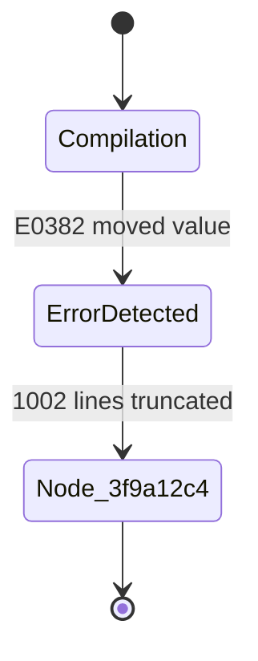

# FastMCP Protocol & Tool Contracts

K0maru implements an embedded JSON-RPC 2.0 server adhering to Anthropic's Model Context Protocol (FastMCP) standard. When launched via `k0maru mcp`, it exposes 6 native tools over standard I/O (`stdio`).

---

## Tool Overview

| Native Tool Name | Core Responsibility | Typical Calling Scenario |
| :--- | :--- | :--- |
| [`get_project_loadout`](#1-get-project-loadout) | Extract project vision & L3 invariants (<300 tokens) | Session bootstrap and initial background alignment |
| [`recall_memory`](#2-recall-memory) | Multi-channel hybrid search (BM25 + vector + graph boost) | Recalling past architectural decisions and incident fixes |
| [`offload_context`](#3-offload-context) | Offload long terminal output into a Mermaid state diagram | Truncating verbose test crashes and build errors |
| [`inspect_log_node`](#4-inspect-log-node) | Retrieve untruncated raw log slices by Node ID | Inspecting detailed stack traces on-demand |
| [`flush_session`](#5-flush-session) | Crystallize decisions and lessons into Markdown notes | Persisting solutions upon completing a task or milestone |
| [`distill_session_skill`](#6-distill-session-skill) | Synthesize troubleshooting playbooks from traces | Exporting automated playbooks to the Hermes ecosystem |

---

## 1. `get_project_loadout`

### Description
Extracts a concise project vision, technology stack declaration, and 1-hop associated L3 architecture invariants strictly constrained to `< 300 tokens`, preventing hallucination and attention drift.

### JSON Schema Contract
```json
{
  "name": "get_project_loadout",
  "description": "Generate a compact sub-300-token project context loadout (vision, L3 principles, recent L2 logs)",
  "inputSchema": {
    "type": "object",
    "properties": {
      "project_name": {
        "type": "string",
        "description": "Target project name or keyword"
      }
    },
    "required": ["project_name"]
  }
}
```

### Example Input Payload
```json
{
  "project_name": "payment-gateway"
}
```

### Return Format (Markdown)
```markdown
# Context Loadout: Payment Gateway Core
- Root: `10_Projects/payment-gateway.md`
- Core Stack: Go 1.22, Redis 7, PostgreSQL 16

## L3 Invariants & Decisions:
- [[adr-001-idempotency]]: Acquire Redis mutex via `SET lock:payment:{event_id} "1" NX EX 30`; verify `STATUS_PENDING` in transaction.

## Recent L2 Logs:
- 2026-10-08: Resolved Stripe Webhook retry storm cascade.
```

---

## 2. `recall_memory`

### Description
Searches the knowledge base using Reciprocal Rank Fusion ($k=60$) combining SQLite FTS5 BM25 lexical search, 384-dimensional dense vectors, and 1-hop WikiLinks graph topology boost.

### JSON Schema Contract
```json
{
  "name": "recall_memory",
  "description": "Search knowledge hub memories and notes using hybrid RRF retrieval (BM25 full-text + vector embeddings + graph links)",
  "inputSchema": {
    "type": "object",
    "properties": {
      "query": {
        "type": "string",
        "description": "Search query keywords or questions"
      },
      "limit": {
        "type": "integer",
        "description": "Maximum number of results to return (default: 5)"
      }
    },
    "required": ["query"]
  }
}
```

### Example Input Payload
```json
{
  "query": "Stripe webhook idempotency rules deduplication",
  "limit": 3
}
```

### Return Format
Returns high-relevance note excerpts ordered by descending composite RRF score, delimited by horizontal separators.

---

## 3. `offload_context`

### Description
Truncates and externalizes raw terminal output exceeding 50 lines, persisting slices to disk and returning a 15-line Mermaid state diagram with a unique `node_id`.

### JSON Schema Contract
```json
{
  "name": "offload_context",
  "description": "Truncate and externalize long text/logs (>50 lines) to disk references, returning a Mermaid diagram and node_id",
  "inputSchema": {
    "type": "object",
    "properties": {
      "raw_text": {
        "type": "string",
        "description": "Raw log or output text to be offloaded"
      },
      "task_name": {
        "type": "string",
        "description": "Optional task identifier prefix"
      }
    },
    "required": ["raw_text"]
  }
}
```

### Example Input Payload
```json
{
  "raw_text": "Stack frame 0...\n[1,000 lines truncated]...\nerror[E0382]: use of moved value",
  "task_name": "build_worker"
}
```

### Return Format
````markdown


✓ Log offloaded (1002 lines, 99.4% token reduction)
  Reference ID: node_3f9a12c4
  Use 'inspect_log_node' to view raw stack frames.
````

---

## 4. `inspect_log_node`

### Description
Retrieves the uncompressed raw log slice associated with a specific Node ID from the offline storage pool.

### JSON Schema Contract
```json
{
  "name": "inspect_log_node",
  "description": "Inspect and retrieve the full offloaded raw log content by its node ID",
  "inputSchema": {
    "type": "object",
    "properties": {
      "node_id": {
        "type": "string",
        "description": "Offloaded log node identifier (e.g., node_3f9a12c4)"
      }
    },
    "required": ["node_id"]
  }
}
```

### Example Input Payload
```json
{
  "node_id": "node_3f9a12c4"
}
```

### Return Format
Returns the complete raw text of the target log slice.

---

## 5. `flush_session`

### Description
Crystallizes architectural decisions, debugging lessons, or task milestones into Markdown notes adhering to vault conventions, automatically generating YAML frontmatter and formatting `[[WikiLinks]]`.

### JSON Schema Contract
```json
{
  "name": "flush_session",
  "description": "Crystallize learnings, architectural decisions, or task summaries back into the Markdown knowledge base according to the vault's conventions",
  "inputSchema": {
    "type": "object",
    "properties": {
      "title": {
        "type": "string",
        "description": "Title of the decision or log note"
      },
      "content": {
        "type": "string",
        "description": "Detailed Markdown content"
      },
      "summary": {
        "type": "string",
        "description": "Brief one-line summary or executive conclusion"
      },
      "category": {
        "type": "string",
        "description": "Category: 'decision', 'log', 'concept', or custom (default: 'log')"
      },
      "tags": {
        "type": "array",
        "items": { "type": "string" },
        "description": "Associated tags"
      },
      "related_notes": {
        "type": "array",
        "items": { "type": "string" },
        "description": "Related existing notes to link via WikiLinks"
      }
    },
    "required": ["title", "content"]
  }
}
```

### Example Input Payload
```json
{
  "title": "ADR-PAY-012: Stripe Webhook Distributed Lock Guard",
  "category": "decision",
  "summary": "Return HTTP 200 on duplicate callbacks to prevent retry storm cascades",
  "tags": ["stripe", "webhook", "redis", "idempotency"],
  "related_notes": ["L3_payment_callback_idempotency_rules", "payment-gateway"],
  "content": "## Context\nHigh concurrency triggers duplicate callbacks...\n## Decision\nAcquire Redis mutex lock..."
}
```

### Return Format
```text
✓ Crystallized note into vault.
Relative Path: 20_Cards/adr-pay-012-stripe-webhook-distributed-lock-guard.md
Category: decision
WikiLinks: [[L3_payment_callback_idempotency_rules]], [[payment-gateway]]
```

---

## 6. `distill_session_skill`

### Description
Synthesizes a standardized, reusable troubleshooting playbook from terminal crash logs or offloaded slices, with optional export to the Nous Research Hermes Agent skill ecosystem.

### JSON Schema Contract
```json
{
  "name": "distill_session_skill",
  "description": "Distill an execution trace, error log, or troubleshooting session into a reusable skill note and crystallize it into the vault.",
  "inputSchema": {
    "type": "object",
    "properties": {
      "raw_trace": {
        "type": "string",
        "description": "Raw execution log, error stack trace, or debugging terminal output"
      },
      "node_id": {
        "type": "string",
        "description": "Optional offloaded node ID from offload_context (e.g., node_3f9a12c4)"
      },
      "title": {
        "type": "string",
        "description": "Optional explicit skill title (auto-inferred if omitted)"
      },
      "context_hint": {
        "type": "string",
        "description": "Optional context hint or explanation describing the failure"
      },
      "category": {
        "type": "string",
        "description": "Target category (defaults to 'skill')"
      },
      "tags": {
        "type": "array",
        "items": { "type": "string" },
        "description": "Optional tags array"
      },
      "related_notes": {
        "type": "array",
        "items": { "type": "string" },
        "description": "Optional related notes or WikiLinks array"
      },
      "dry_run": {
        "type": "boolean",
        "description": "If true, simulates distillation and returns preview without writing to disk"
      },
      "target": {
        "type": "string",
        "enum": ["default", "hermes"],
        "description": "Optional target ecosystem: 'default' (Obsidian) or 'hermes' (Nous Research Hermes dynamic skill)"
      }
    }
  }
}
```

### Example Input Payload
```json
{
  "node_id": "node_3f9a12c4",
  "title": "Rust E0382 Ownership Move Diagnostic & Remediation",
  "target": "hermes"
}
```

### Return Format
```text
✓ Crystallized skill note into vault.
Title: Rust E0382 Ownership Move Diagnostic & Remediation
Relative Path: playbooks/rust-e0382-ownership-move-diagnostic.md
Category: skill
WikiLinks: [[payment-gateway]]
```
