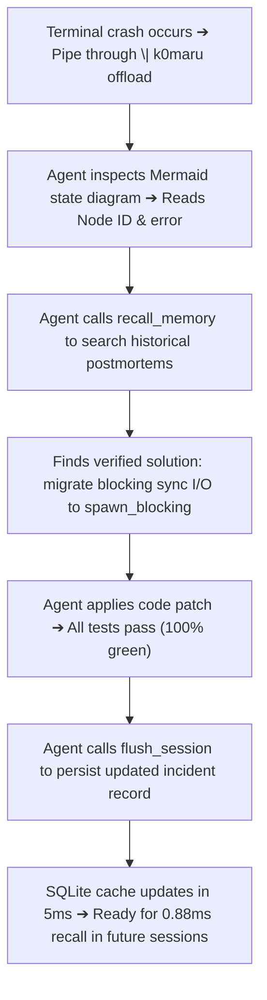

# Industrial Production Scenarios

This chapter demonstrates how K0maru-Agent-Memory enforces architectural invariants, enables self-healing debugging loops, and distills reusable skills through three real-world production scenarios.

---

## Scenario A: Enterprise LLM-Wiki Maintenance (Guarding Distributed Lock & Idempotency Invariants)

### Business Context
In financial acquiring services, duplicate webhook deliveries and concurrent retries cause double debits and fund loss. The engineering team established an L3 architecture card in `20_Cards/L3_payment_callback_idempotency_rules.md`:
1. Acquire a Redis distributed mutex lock: `SET lock:payment:callback:{event_id} "1" NX EX 30`;
2. If lock acquisition fails, return HTTP 429 immediately to trigger payment gateway exponential backoff;
3. Verify that the order status is `STATUS_PENDING` within a single database transaction. If the order is already processed, return HTTP 200 OK immediately to acknowledge delivery.

### Real Agent Execution Trajectory (Qwen3.8-27B with K0maru)

```text
[User Prompt] Implement a production-grade Go HTTP handler for Stripe webhook callbacks in payment-gateway.

--- Turn 1: Pre-flight Inspection ---
⚡ [Agent Tool Call] `get_project_loadout` {"project_name": "payment-gateway"}
   ↳ Extracts stack & dependencies: Go 1.22 + Gin + Redis 7 + PostgreSQL 16
⚡ [Agent Tool Call] `recall_memory` {"query": "Stripe webhook idempotency rules deduplication", "limit": 5}
   ↳ Hits L3_payment_callback_idempotency_rules (Score: 7.05, Rank #1)
⚡ [Agent Tool Call] `recall_memory` {"query": "webhook signature verification security incident", "limit": 5}
   ↳ Hits 2026-10-08-incident-retry-storm postmortem note

--- Turn 2: Invariant-Compliant Implementation ---
Assistant generates invariant-compliant Go code:
```

```go
package handler

import (
    "context"
    "net/http"
    "time"
    "github.com/gin-gonic/gin"
    "github.com/redis/go-redis/v9"
    "github.com/stripe/stripe-go/v78/webhook"
)

func StripeWebhookHandler(rdb *redis.Client, db *Database) gin.HandlerFunc {
    return func(c *gin.Context) {
        // 1. Verify cryptographic webhook signature
        payload, err := c.GetRawData()
        if err != nil {
            c.AbortWithStatus(http.StatusBadRequest)
            return
        }
        event, err := webhook.ConstructEvent(payload, c.GetHeader("Stripe-Signature"), webhookSecret)
        if err != nil {
            c.AbortWithStatus(http.StatusUnauthorized)
            return
        }

        // 2. Enforce L3 architecture invariant: acquire Redis mutex lock
        lockKey := "lock:payment:callback:" + event.ID
        ok, err := rdb.SetNX(c.Request.Context(), lockKey, "1", 30*time.Second).Result()
        if err != nil || !ok {
            // Return 429 to trigger gateway backoff and eliminate race conditions
            c.AbortWithStatus(http.StatusTooManyRequests)
            return
        }
        defer rdb.Del(context.Background(), lockKey)

        // 3. Idempotency guard: verify state machine status
        order, err := db.GetOrder(event.Data.Object["client_reference_id"])
        if order.Status != StatusPending {
            c.JSON(http.StatusOK, gin.H{"status": "already_processed"})
            return
        }

        // 4. Atomic transaction state transition
        if err := db.AtomicTransitionToSuccess(order.ID); err != nil {
            c.AbortWithStatus(http.StatusInternalServerError)
            return
        }
        c.JSON(http.StatusOK, gin.H{"status": "success"})
    }
}
```

```text
--- Turn 3: Session Crystallization (flush_session) ---
⚡ [Agent Tool Call] `flush_session` {
  "title": "ADR-PAY-012: Stripe Webhook Handler with Distributed Lock Guard",
  "category": "decision",
  "tags": ["stripe", "webhook", "idempotency", "redis", "distributed-lock"],
  "related_notes": ["L3_payment_callback_idempotency_rules", "payment-gateway"],
  "content": "..."
}
↳ FlushEngine saves to 20_Cards/adr-pay-012-...md and links [[WikiLinks]] automatically
```

By querying K0maru before generating code, the agent avoids typical financial race conditions, such as querying databases before locking or discarding HTTP 429 retry responses.

---

## Scenario B: Cross-Session Debugging & Self-Healing Loop

### Business Context
During Rust asynchronous service development, an application encounters worker thread starvation. In unmanaged environments, an agent restarts investigation from scratch every session, guessing at deadlocks.

### 3-Step Self-Healing Loop



1. **Terminal Capture & Noise Offloading**:
   ```bash
   cargo test --test concurrency 2>&1 | k0maru offload
   ```
   K0maru compresses 1,200 lines of execution traces into a 15-line Mermaid diagram, showing that `dispatch_loop()` stalled for >5,000 ms.
2. **Active Postmortem Recall**:
   The agent calls `recall_memory("Tokio worker thread starvation blocking")` and retrieves `2026-09-24-tokio-blocking-postmortem.md`.
3. **Patch Application & Crystallization**:
   The agent replaces `std::fs::read` with `tokio::task::spawn_blocking`. Once tests pass, the agent invokes `flush_session` to record the fix. The cache syncs within 5 ms, arming future sessions against the same defect.

---

## Scenario C: Dynamic Skill Distillation & Playbook Reuse (Trace-to-Skill)

### Business Context
When team members or autonomous subagents tackle recurring errors like Python `asyncio` unawaited task leaks or C `heap-use-after-free` faults, manual investigation wastes hours.

### Automated Distillation via `k0maru distill`
Once an agent resolves an incident in the terminal, run `distill` to synthesize a standardized troubleshooting playbook:

```bash
k0maru distill \
  --node node_54697ed3 \
  --title "Python Asyncio InvalidStateError Diagnostic & Remediation Manual" \
  --context "Fixing memory leaks caused by unawaited futures in pytest suites" \
  --tags "python,asyncio,leak,playbook" \
  --export-hermes
```

### Generated Skill Note
`DistillEngine` formats the playbook, saves it to `playbooks/` in your vault, and exports it to `~/.hermes/skills/`:

```markdown
---
title: Python Asyncio InvalidStateError Diagnostic & Remediation Manual
category: skill
tags: [python, asyncio, leak, playbook]
date: 2026-10-09
---

# Python Asyncio InvalidStateError Diagnostic & Remediation Manual

## 1. Symptom & Signatures
- **Exception signature**: `asyncio.exceptions.InvalidStateError: RESULT: state=PENDING`
- **Root cause**: Calling `.result()` directly on an uncompleted coroutine instead of `await task`, or failing to isolate exceptions across task sets.

## 2. Standard Diagnostic Checklist
1. Search for unmonitored `asyncio.create_task()` invocations.
2. Verify whether task unpackers catch task exceptions.

## 3. Verified Code Pattern
Apply safe awaiting semantics using `asyncio.gather`:
```python
results = await asyncio.gather(*tasks, return_exceptions=True)
for res in results:
    if isinstance(res, Exception):
        logger.error(f"Task failed: {res}")
```

## 4. Associated Architectural Notes
- [[2026-10-08-incident-retry-storm]]
- [[payment-gateway]]
```

Autonomous agents running inside Nous Research Hermes Agent or Claude Code read this playbook directly from disk, preventing recurring debugging mistakes.
