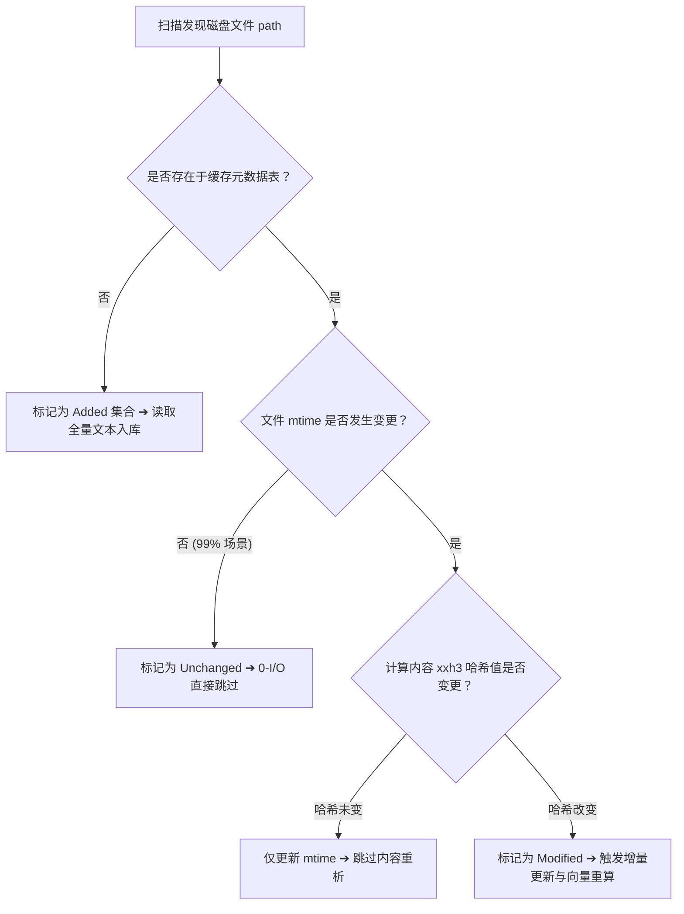

# 核心算法与关键模块深度实现

本文深入剖析 K0maru-Agent-Memory 底层 8 大关键技术模块的内部机制、工程选型与核心算法实现。

---

## 1. xxh3 增量扫描状态机与 0-I/O 脏文件判定

为了在数千篇笔记的知识库中实现无感知的毫秒级刷新，K0maru 拒绝无脑全量遍历与高频磁盘 I/O。

### 状态机三级过滤管道
扫描引擎（`IncrementalScanner`）通过内存元数据映射建立三级快速旁路决策：



1. **第一级（缓存存在性检查）**：对比磁盘文件相对路径与 SQLite `documents` 表中预热的哈希表，未录入的文件直接归入 `added` 集合；
2. **第二级（mtime 亚纳秒检查）**：获取文件系统的 `mtime`（修改时间戳）。对于未修改的文件，耗时仅涉及单次 `stat()` 系统调用，**不发生任何文本读取 I/O**；
3. **第三级（xxh3 64 位极速内容摘要）**：若 `mtime` 改变，使用 SIMD 加速的 `xxh3_64` 算法对文件内容进行摘要计算。若哈希值与缓存一致（例如用户仅仅执行了 `touch` 操作），则跳过昂贵的语法解析与向量计算。

在 500 篇文档的真实测试集上，无变更扫描仅耗时 **11.67 ms**；全量重建吞吐高达 **6,746 篇/秒**。

---

## 2. BM25 + ONNX 向量 + 1-Hop 图谱加权 RRF 混合检索算法

传统的单一向量检索在面对代码精确符号（如 `SQLITE_BUSY`、`E0502`、`Option<&mut T>`）时经常发生语义漂移；而传统全文检索又无法推导近义词与高级架构概念。K0maru 采用三路融合算法。

### 数学公式推导

对于候选文档集合中的任一文档 $d$，其综合得分定义为倒数排名融合（Reciprocal Rank Fusion，RRF）叠加图谱跃迁增益：

$$\text{Score}_{\text{RRF}}(d) = \sum_{m \in \{\text{BM25}, \text{Vector}\}} \frac{w_m}{k + \text{Rank}_m(d)} + \text{GraphBoost}(d)$$

其中各参数含义与工程默认值如下：
- $k$：平滑常数，默认取 **$k = 60$**（经过 TREC 与 BEIR 基准测试验证的最优超参数，有效削弱头部排名的极端方差）；
- $w_{\text{BM25}}$ 与 $w_{\text{Vector}}$：归一化融合权重，默认各取 **$0.5$**；
- $\text{Rank}_m(d)$：文档 $d$ 在对应检索通道中的 1-based 序号。若文档未进入某通道前 $N$ 名候选池，则该项分值为 $0$；
- $\text{GraphBoost}(d)$：**+0.05 拓扑加权增益**。

### 1-Hop WikiLinks 图谱双向拓扑加权
在取得初步的候选文档池（通常为 `limit * 3` 且至少 20 篇）后，图谱引擎遍历候选池内的所有两两组合：
1. **正向出链匹配（Forward Link）**：检查文档 $A$ 的 Markdown 正文中是否存在形如 `[[B]]` 的双向链接，且 $B$ 位于当前候选池中；
2. **反向入链匹配（Backlink）**：检查文档 $B$ 的反向引用表中是否链接回文档 $A$。

若候选文档与候选池中其他任意候选者存在 1-Hop 图谱连通关系，系统即刻为其施加 **$+0.05$** 的额外增益。此举能够将作为核心枢纽（Map of Content，MOC）或系统规范定义的母卡片在排名中显著提升。

---

## 3. FastMCP Stdio 协议与自然语言意图无缝映射

市面上许多工具要求开发者在提示词中输入僵硬的「魔法触发词」。K0maru 遵循 Anthropic Model Context Protocol（FastMCP）官方标准，通过标准输入输出流（stdio）进行非阻塞 JSON-RPC 2.0 交互。

### 自然语言意图自适应路由
K0maru 的 FastMCP 工具描述经过专门的人类意图对齐优化，外部智能体（Claude 3.5 Sonnet、GPT-4o、Qwen2.5-Coder、DeepSeek-R1）在理解用户自然口语时，会自主发起精准工具调用：

| 开发者自然对话表达 | AI 自动判定的底层意图 | 自动调用的 FastMCP 原生工具 |
| :--- | :--- | :--- |
| *“开始接手这个微服务，帮我梳理下项目核心规范”* | 项目初始化读档 | `get_project_loadout` |
| *“这个报错怎么解决？查查以前有没有记录过”* | 知识库经验检索 | `recall_memory` |
| *“刚才跑单测报了很长一段错，看看堆栈细节”* | 日志切片按需提取 | `inspect_log_node` |
| *“把刚才商讨出的分布式锁续期方案存下来”* | 会话决策沉淀落盘 | `flush_session` |
| *“从这段编译器报错中提炼出排障手册”* | 故障经验提炼技能 | `distill_session_skill` |

由于完全基于标准 stdio 运行，进程由智能体宿主按需拉起与关闭，**零网络监听端口，零跨主机反向代理开销**。

---

## 4. 符号化日志状态机离线提取与 SVG Mermaid 渲染

当面对成百上千行的编译器调用栈或测试崩溃转储时，`k0maru offload` 采用基于 AST 与状态机的轻量级流式解析器（`OffloadEngine`）。

### 符号化抽象与切片存储流程
1. **行数门限触发**：默认阈值为 50 行（可通过 `--threshold` 自定义）。低于 50 行的常规输出原样透传；
2. **流式特征提取**：
   - 提取错误类型代码（如 Rust `E0382`、`E0502`，Python `InvalidStateError`，Go `fatal error: all goroutines are asleep`）；
   - 定位初次发生故障的源文件路径与行号（如 `src/worker.rs:42`）；
3. **物理切片落盘**：将原始未截断日志全量落盘至 `.k0maru/refs/<task_id>_<node_id>.log`；
4. **生成 Mermaid 状态时序图**：生成标准的 15 行 Mermaid 纯文本并在终端渲染，提示词压缩率达 **97% ~ 99.4%**。

### 零外部依赖 SVG 纯离线渲染
在内置的 WebUI 中，K0maru 不依赖庞大的 Headless Chrome 或动态 CDN，直接在本地由轻量级解析器将 Mermaid 转换为原生内联 SVG，秒级响应且可在完全断网环境下使用。

---

## 5. 异构知识库拓扑自适应嗅探器（ConventionSniffer）

不同开发者和团队的 Markdown 知识库具有极其迥异的目录结构与排版偏好。K0maru 拒绝强行推行某种死板的知识库形态，内置了强大的 `ConventionSniffer`：

```rust
pub struct ConventionRules {
    pub category_folders: HashMap<String, String>,
    pub file_naming_style: NamingStyle, // DateSlug vs SlugOnly
    pub template_path: Option<PathBuf>,
}
```

### 规约探测优先级链
1. **声明式规约（Explicit Config）**：优先读取知识库根目录下 `.k0maru/rules.md` 或 `AGENTS.md` / `CONVENTIONS.md` 中的映射声明；
2. **拓扑特征探测（Directory Heuristic）**：
   - 探测是否存在 `10_Projects/`、`20_Cards/`、`00_Logs/`（标准 Johnny Decimal / Obsidian 架构）；
   - 探测是否存在 `docs/adr/`、`decisions/`、`journal/` 等扁平架构；
3. **命名风格推断**：自动分析既有文件的命名特征，智能对齐 `YYYY-MM-DD-title.md` 或纯 `title.md` 命名风格。

---

## 6. 经验原子结晶引擎（FlushEngine）防碰撞机制

在多智能体并发工作或多次执行结晶时，同名卡片覆盖是导致数据损毁的高危操作。`FlushEngine` 实现了严密的防碰撞与幂等机制：

```rust
// 防碰撞与幂等处理逻辑
if target_path.exists() {
    let existing_content = fs::read_to_string(&target_path)?;
    if existing_content == new_content {
        // 幂等：内容完全相同，静默成功，无需二次写盘
        return Ok(FlushOutcome::UpToDate);
    }
    // 碰撞：内容不一致，自动追加版本号后缀
    target_path = resolve_collision_path(&target_path); // 如 adr-001-v2.md
}
```

- **防覆盖后缀序列**：当检测到同名且内容不同的文件时，自动派生 `-v2.md`、`-v3.md`，确保人类与智能体的已有笔记不受损坏；
- **Frontmatter 注入与 WikiLinks 编织**：自动注入 `date`、`tags`、`category` 等标准 YAML 元数据，并将声明的 `related_notes` 包装为标准的 `[[Target Note]]` 双链。

---

## 7. 故障排障痕迹智能提炼引擎（Trace-to-Skill）

受到前沿开源社区 Nous Research Hermes Agent 的动态技能启发，K0maru 实现了将单次排障经验自动升华为通用技能（Skill）的启发式提炼引擎（`DistillEngine`）。

### 提炼四步工序
1. **报错特征提取**：从 `raw_trace` 或卸载的 `node_id` 中提取技术栈类别（Rust、Python、TypeScript、Go、C）；
2. **根因归纳**：识别核心异常标识符（如 `BorrowMutError`、`heap-use-after-free`）；
3. **结构化技能卡片生成**：生成包含「故障现场特征」、「排查定位链路」、「通用修复方案」的标准 Markdown 技能卡片；
4. **Hermes 动态技能生态导出（`--export-hermes`）**：支持一键将提炼出的卡片直接写入 `~/.hermes/skills/`，使外部智能体在后续会话中无需重新学习即可直接复用该排障 Playbook。

---

## 8. 内嵌式极客暗黑调试控制台（WebUI）

为了赋予开发者直观洞察知识库与排障过程的能力，K0maru 内置了单二进制内嵌的 WebUI 控制台。

```bash
k0maru ui --vault ~/my-vault --open
```


### 关键实现特色
- **零外部资源依赖**：基于 Axum 异步 HTTP 框架，前端 HTML、CSS、JS 与图标资产通过 `rust-embed` 编译进单一二进制文件，无须配置 Node.js 或 Nginx；
- **检索可解释性调试器（Search Debugger）**：直观展示每个候选命中项的 BM25 排名、向量余弦得分与 Emerald 绿色的 `+0.05 Graph Boost` 图谱跃迁标记；
- **Token 经济学仪表盘（Token Scoreboard）**：实时计算在当前项目中通过长日志符号化卸载累计为开发者节省的 Token 总数与折合 API 美元账单；
- **极客暗黑 Cockpit 美学**：深色背景（`#0F172A`）配以翡翠绿（`#22C55E`）主色调与 `JetBrains Mono` 代码字体，与终端体验严丝合缝；
- **进程退出即释放**：在终端按下 `Ctrl+C` 即刻终止服务，端口立即归还操作系统，绝不留存任何后台孤儿进程。
