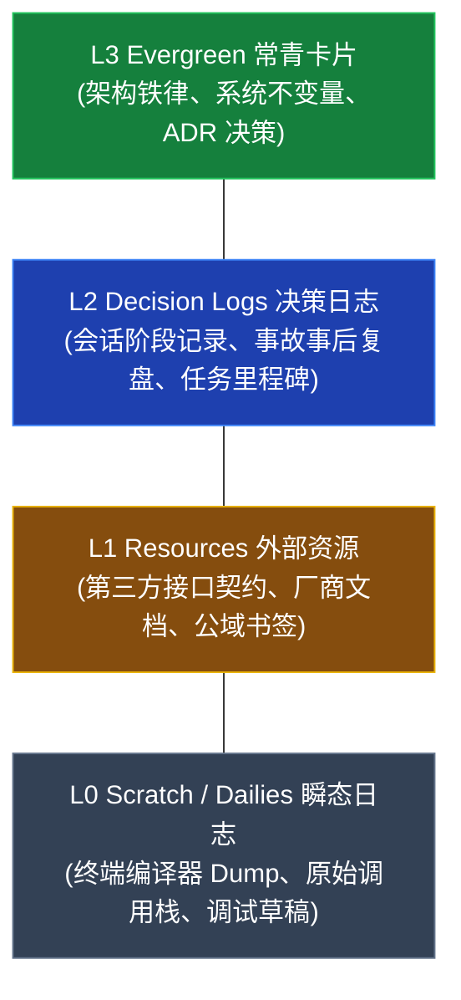
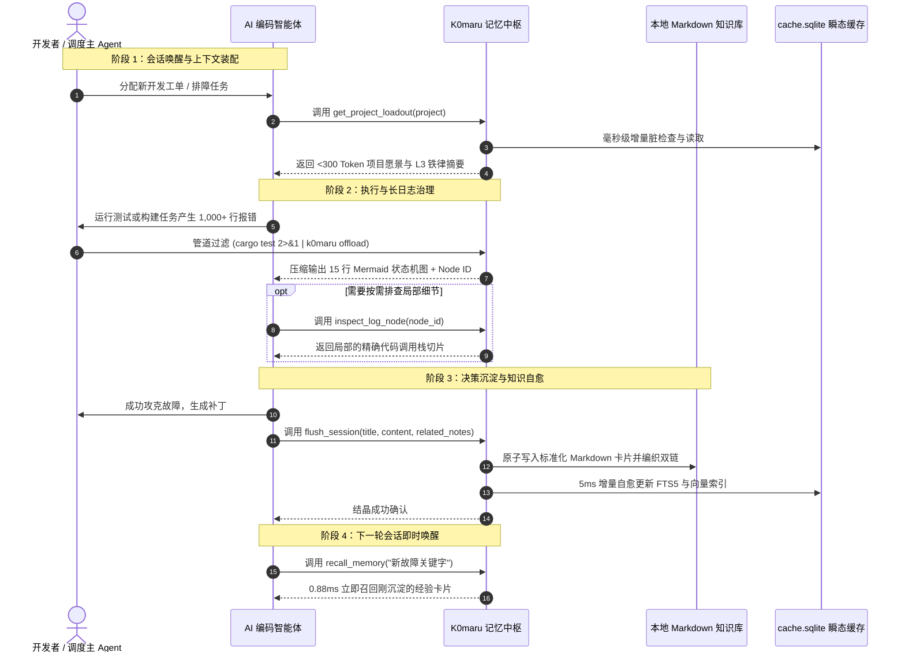

# 四层架构与核心数据流

K0maru-Agent-Memory 确立了面向 AI 编码智能体长程记忆治理的四层解耦架构模型。通过严格的职责边界与零守护进程设计，实现毫秒级启动与极高的运行稳定性。

---

## 🏗️ 四层解耦架构全景

### 1. 协议与表现层（Presentation & Protocol Layer）
负责与终端开发者以及各类外部 AI 智能体客户端进行标准化的双向通信：
- **CLI 命令行子系统**：基于 Rust `clap` 框架构建，支持 Unix 管道过滤器（`| k0maru offload`）、环境体检（`k0maru doctor`）、上下文提取（`k0maru loadout`）以及检索、结晶命令；
- **FastMCP Stdio 服务端**：严格遵循 Anthropic 官方的 Model Context Protocol（MCP）规范，采用标准 `stdio` 输入输出流承载 JSON-RPC 2.0 协议，无需常驻守护进程或开放网络端口；
- **嵌入式极客控制台（Axum WebUI）**：基于 `axum` 与 `rust-embed` 单二进制内嵌轻量级 HTTP 调试服务，提供可视化检索分析与离线 SVG Mermaid 渲染，退出即销毁。

### 2. 领域与处理层（Domain & Processing Layer）
负责业务规则调度、日志语法分析与知识库自适应规约处理：
- **增量扫描引擎（Incremental Scanner）**：利用 `xxh3` 极速内容哈希与文件元数据修改时间（`mtime`）构建脏文件状态机，实现零不必要 I/O 的增量感知；
- **自适应规约嗅探器（Convention Sniffer）**：自动嗅探知识库现有的目录组织拓扑（扁平或分层）、命名法风格（`date_slug` vs `slug_only`）与 YAML Frontmatter 格式；
- **故障排障痕迹提炼引擎（Distill Heuristic Engine）**：对编译器及单测报错调用栈进行规则推导与 AST 模式匹配，将长报错压缩为结构化故障特征；
- **原子结晶引擎（Flush Engine）**：处理笔记生成过程中的防碰撞后缀判定、双向 WikiLinks 拓扑编织与写入后缓存自愈同步。

### 3. 检索与融合层（Retrieval & Fusion Layer）
将词法精准匹配、深度语义表征与双向图谱拓扑融为一体：
- **BM25 词法全文检索**：基于 SQLite FTS5 原生虚拟表，对代码标识符、专用术语与错误代号实现亚毫秒级倒排匹配；
- **ONNX 向量表征引擎**：基于 `fastembed-rs` 与 `all-MiniLM-L6-v2` 本地预加载 384 维向量模型，计算知识片段的语义嵌入；
- **RRF 融合排序算法（$k=60$）**：通过倒数排名融合（Reciprocal Rank Fusion）平衡不同量纲的词法与向量得分；
- **1-Hop WikiLinks 图谱拓扑跃迁（Graph Boost +0.05）**：在候选集内双向评估引用关联，若候选文档间存在直接或间接超链接，自动予以加权顶出核心枢纽笔记。

### 4. 物理存储与缓存层（Storage & Persistence Layer）
严格践行「文件系统即唯一真理源」与「瞬态缓存随时可弃」原则：
- **标准 Markdown 文件系统（Source of Truth）**：用户本地磁盘上的 Obsidian 目录树或 LLM-Wiki 纯文本笔记，100% 格式开源，天然支持 Git 追溯；
- **单文件瞬态 SQLite 缓存（`cache.sqlite`）**：位于知识库根目录 `.k0maru/cache.sqlite`，挂载 FTS5 虚表与 `sqlite-vec` 向量虚表。该文件随时可以物理删除，扫描器可在 74 ms 内全量重建；
- **离线切片引用存储池（`.k0maru/refs/`）**：存放被 `offload` 截断的超长原始堆栈日志，供智能体按 Node ID 按需提取。

---

## 📚 知识库四级层级规范（Memory Hierarchy）

K0maru 将智能体交互中涉及的所有信息资产划分为严格的四级金字塔模型（L0 至 L3）：

### 1. L3 Evergreen（常青卡片与架构不变量）
- **存放位置**：`20_Cards/`、`docs/adr/`、`concepts/`
- **定义**：高价值、极少变更、全局必须遵守的架构铁律与技术决策记录（ADR）。
- **示例**：`adr-008-distributed-lock.md`（定义 Redis `SET NX EX 30` 互斥锁规范与状态机防重不变量）。

### 2. L2 Decision Logs（任务日志与事故复盘）
- **存放位置**：`00_Logs/`、`logs/`、`journal/`
- **定义**：记录特定迭代、特定工单或紧急故障排查的完整上下文与根因结论。
- **示例**：`2026-10-08-incident-retry-storm.md`（记录 Stripe 重试风暴复盘与规避措施）。

### 3. L1 Resources（外部技术资源与契约）
- **存放位置**：`30_Resources/`、`specs/`
- **定义**：外部依赖库的使用指南、第三方 API 接口定义以及团队统一开发规约。
- **示例**：`stripe-webhook-v2024-api.md`。

### 4. L0 Scratch / Dailies（瞬态调试碎片）
- **存放位置**：`.scratch/`、`.k0maru/refs/`
- **定义**：被 `offload` 卸载的千行原始终端日志切片与临时草稿，生命周期极短，随时由系统自动清理或覆盖。

---

## 🔄 记忆生命周期流转模型

通过这一闭环，每一次故障排查与技术决策都会转化为可被后续所有终端会话秒级唤醒的数字资产，实现工程经验的真正持续自增利。
