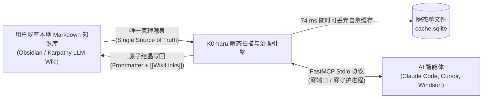

# 项目介绍与设计哲学

K0maru-Agent-Memory（简称 K0maru）是一个面向个人 Markdown 知识库与本地 LLM-Wiki 的**单静态二进制、零常驻守护进程、轻量级 AI 编码智能体长期记忆中枢与上下文治理工具**。

在日常工程实践中，开发者配合 AI 编码智能体（如 Claude Code、Cursor、Windsurf 等）进行复杂系统构建与排障时，往往频繁遭遇两大根本性痛点：**跨会话失忆（Amnesia）** 与 **终端编译/测试日志爆炸（Terminal Log Bloat）**。

K0maru 专为单机开发机打造，通过纯 Rust 的极简机械复杂度交付工业级性能。

---

## 💥 传统方案三大工程痛点分析

### 1. 跨会话失忆：开发经验无法实现复利积累

现代 AI 编码工具在每个新建的终端会话或窗口中都是一次「全新初始化」。
- **既往决策丢失**：上周敲定的分布式锁续期方案、接口幂等性规范或状态机跳转不变量，在开启新会话后完全丢失；
- **历史踩坑重复**：当项目再次出现类似报错时，智能体无法调阅上一次事故复盘（Postmortem）中记录的根因与临时规避措施，不得不重新进行漫长的摸索与试错。

传统的应对方案往往依赖人工手动复制粘贴上下文，或在 `AGENTS.md` 中静态堆砌规则。然而，随着项目演进，静态规则要么迅速膨胀并撑爆注意力窗口，要么年久失修脱离真实业务逻辑。

### 2. 编译与排障长日志爆炸：上下文窗口雪崩与注意力漂移

在自动化排障、单元测试或大型工程构建过程中，`cargo test`、`npm test` 或系统崩溃转储常常瞬间倾泻出 500 至 2,500 行的巨幅调用栈回溯（5,000 ~ 80,000 Tokens）。
- **中途迷失（Lost-in-the-Middle）**：巨量噪声堆栈迅速挤占大语言模型的有限注意力空间，导致模型对最初的业务目标产生注意力漂移；
- **窗口击穿与高昂账单**：在多轮连续排障交互中，裸机未治理状态通常在第 6 轮交互便击穿 128k 窗口限制，且每轮重复发送历史报错导致 API 调用费用呈二次方暴涨。

### 3. 重型微服务容器反模式：高昂的资源浪费与端口争用

市面上主流的智能体长程记忆框架往往借鉴云原生微服务架构，要求开发者在本地拉起庞大的 Docker Compose 集群（包含 PostgreSQL、pgvector、Redis、FastAPI 容器）。
- **内存侵占过高**：常年霸占宿主机 1 GB ~ 2.5 GB 物理内存；
- **冷启动严重滞后**：容器与 Python 运行时冷启动需要 2,500 ms ~ 3,800 ms，无法适应终端命令行秒级响应的高频工作流；
- **网络端口与进程假死**：监听多个本地端口（如 `8080`、`5432`、`8283`），容易引发网络端口冲突、防火墙拦截以及僵死容器难以彻底清理等运维负担。

---

## 🌟 核心哲学：Bring Your Own Markdown (BYOM)

K0maru 坚决贯彻 **「自备纯文本 Markdown（Bring Your Own Markdown，BYOM）」** 核心哲学：

### 1. 本地纯文本文件系统是唯一真理源泉（Single Source of Truth）
用户本地既有的 Markdown 笔记（如 Obsidian Vault 或 Andrej Karpathy 提倡的 LLM-Wiki）就是记忆中枢的数据基座。K0maru 不发明任何私有专有数据格式，所有沉淀的架构决策记录（ADR）、排障日志与技术卡片均以符合业界标准的 Markdown 存储，具备天然的可读性、可搜索性与 Git 版本控制能力。

### 2. 随时可抛弃的瞬态索引缓存（Disposable Cache Invariant）
K0maru 在知识库根目录的 `.k0maru/` 文件夹下仅维护一个单文件 SQLite 数据库（`cache.sqlite`），用于托管 FTS5 全文倒排索引与 `sqlite-vec` 向量虚表。
- **物理独立**：该数据库纯属加速缓存；
- **极速自愈**：开发者随时可以安全删除该文件（`rm .k0maru/cache.sqlite`），K0maru 的 xxh3 增量扫描器可在 **74 ms 内全量自愈重建 500 篇文档的索引**，彻底免除专有数据库文件损坏导致的不可逆数据灾难。

### 3. 绝对零守护进程与极致冷启动（Zero-Daemon Architecture）
K0maru 编译为单一的静态 Rust 原生可执行程序，体积仅为 **3.66 MB**。
- **零常驻开销**：不运行后台 Daemon，不开启网络监听端口；
- **即调即走**：冷启动中位数仅需 **3.38 ms**，常驻内存仅 ~11.7 MB。一旦 CLI 命令或 FastMCP 工具调用完成，操作系统立即回收全部物理内存。

---

## 📊 核心竞品全景对比矩阵

下表将 K0maru 与行业主流的智能体记忆方案进行了多维度的横向工程评测：

| 评估维度 | 原生人工拷贝 (Vanilla Context) | Mem0 (mem0ai) | Letta (MemGPT) | Chroma 外部向量库 | SQLite 裸向量自建 | **K0maru-Agent-Memory (本项目)** |
| :--- | :--- | :--- | :--- | :--- | :--- | :--- |
| **存储媒介** | 瞬态会话窗口 | 专有向量库 / 云端托管 | PostgreSQL + pgvector | 专有 Parquet / 嵌入式向量表 | 纯 SQLite 向量扩展 | **本地纯文本 Markdown (Obsidian / LLM-Wiki)** |
| **部署与运行模型** | 纯手动 | Python 驻留服务 / 云端 API | 容器化 REST (FastAPI + Docker) | Python 服务端 / 嵌入式库 | 单文件 C 库绑定 | **单静态二进制原生程序 (Rust 编译)** |
| **后台守护进程 (Daemon)** | 无 | 必须后台常驻 | 必须启动后台服务端 | 需常驻后台服务器 | 无 | **绝对零守护进程 (Zero-Daemon，按需调用)** |
| **网络端口占用** | 0 端口 | 1 个端口 | 1 ~ 2 个端口 (`8283`) | 1 个端口 (`8000`) | 0 端口 | **0 开放端口 (纯 Unix 管道与 Stdio 通信)** |
| **冷启动延迟** | 即时 | 1,200 ms ~ 1,800 ms | 2,800 ms ~ 3,500 ms | 800 ms ~ 1,500 ms | 5 ms ~ 20 ms | **3.38 ms (Rust 原生执行)** |
| **常驻内存开销** | 0 MB | ~150 MB ~ 250 MB | ~850 MB ~ 1,200 MB | ~350 MB ~ 600 MB | ~15 MB ~ 30 MB | **~11.7 MB (命令执行完即刻彻底释放)** |
| **数据格式锁死** | 易丢失 | 专有向量黑盒，格式锁死 | 专有关系型表结构锁死 | 专有向量存储格式 | 仅保存向量二进制 Float 数组 | **100% 纯 Markdown，零格式锁死，支持 Git** |
| **Tool Calling 原生契约** | 无 | 专有 Python SDK | 专有 REST 接口 | 需手工封装客户端 | 需手写 SQL 适配 | **官方标准 FastMCP Stdio (JSON-RPC 2.0)** |
| **长日志治理能力** | 人工截断 | 无 | 依赖上下文窗口溢出滑动 | 无 | 无 | **标准 Unix 管道过滤器 (`\| k0maru offload`)** |
| **多路召回与融合算法** | 无 | 单一向量余弦检索 | 标量过滤 + 向量检索 | 纯向量近似最近邻 (ANN) | 纯向量欧氏/余弦距离 | **BM25 + ONNX 向量 + 1-Hop 图谱加权 RRF** |
| **索引自愈与重建吞吐** | 无 | 索引损坏不可逆 | 强依赖外部数据库快照备份 | 需全量重算向量 | 需重新遍历文件写入 | **`cache.sqlite` 随时可删，6,746 篇/秒极速重建** |

---

## 🎯 总结与方案定位

K0maru 并不试图替代人类主导的知识体系构建，而是作为**智能体与本地知识库之间的润滑剂与调度器**：
1. **输入阶段**：通过 `k0maru loadout` 提供受控在 `< 300 Token` 的紧凑愿景与架构约束，杜绝模型幻觉；
2. **执行阶段**：通过 `k0maru offload` 拦截数千行终端杂音，提炼为 15 行 Mermaid 状态机时序图；
3. **沉淀阶段**：通过 `k0maru flush` / `distill` 将一次性排障经验原子化结晶为长青笔记，形成知识复利闭环。
