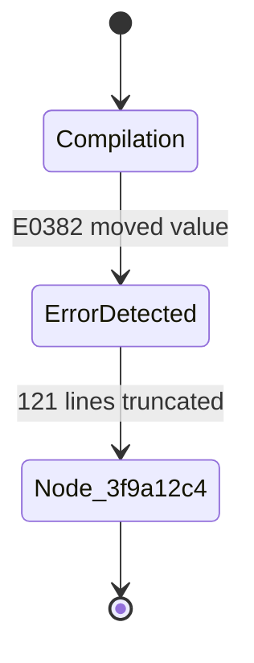

# 3 分钟极速起步

本教程将引导你在 3 分钟内完整体验 K0maru 的五大核心能力：**环境诊断、架构装配注入、终端日志卸载、多路混合检索与架构决策结晶自愈**。

---

## 准备工作：指定本地知识库

K0maru 遵循 BYOM（Bring Your Own Markdown）原则。你可以使用现有的 Obsidian Vault 或创建一个干净的测试目录：

```bash
# 创建一个极简的 LLM-Wiki 演示目录
mkdir -p ~/mini-wiki/10_Projects ~/mini-wiki/20_Cards
cd ~/mini-wiki

# 编写项目的核心架构不变量卡片
cat << 'EOF' > 20_Cards/adr-001-idempotency.md
# ADR-001: 支付回调幂等性防重规约

在处理任何第三方 Webhook 支付回调时，系统必须严格遵守以下两条架构铁律：
1. 必须基于 `SET lock:payment:{event_id} "1" NX EX 30` 抢占 Redis 分布式互斥锁；
2. 状态机必须在事务内验证当前状态为 `STATUS_PENDING`，严禁重复扣款或重复入账。
EOF

# 编写项目的目标愿景文件
cat << 'EOF' > 10_Projects/payment-gateway.md
# Project: Payment Gateway Core

本服务负责处理所有跨国收单与退款逻辑。
核心依赖：Go 1.22、Redis 7、PostgreSQL 16。
核心规范详见：[[adr-001-idempotency]]。
EOF
```

---

## 步骤一：环境健康自检（`k0maru doctor`）

在启动之前，运行 `doctor` 验证本地知识库与 SQLite 瞬态索引状态：

```bash
k0maru doctor --vault ~/mini-wiki
```

K0maru 会在当前目录下自动创建 `.k0maru/` 目录并在数十毫秒内建立 SQLite 索引。控制台输出全绿后即可安心开启后续操作。

---

## 步骤二：架构记忆注入（`k0maru loadout`）

当你在 Claude Code 或 Cursor 中启动一个新会话时，最忌讳把大量笔记全量喂给大语言模型导致注意力发散。使用 `loadout` 命令，K0maru 会沿 `[[WikiLinks]]` 拓扑双链仅提取当前项目的愿景、关联的核心架构约束（L3）以及近期的研发日志（L2），将其精准约束在 **< 300 Token**：

```bash
# 生成并直接复制到系统剪贴板 (macOS / Linux / Windows)
k0maru loadout payment-gateway --vault ~/mini-wiki --copy
```

粘贴后的内容呈现如下紧凑结构：

```markdown
# Context Loadout: Payment Gateway Core
- Root: `10_Projects/payment-gateway.md`
- Core Stack: Go 1.22, Redis 7, PostgreSQL 16

## L3 Invariants & Decisions:
- [[adr-001-idempotency]]: 必须基于 `SET lock:payment:{event_id} "1" NX EX 30` 抢占分布式锁；事务内状态机校验 `STATUS_PENDING`。

## Recent L2 Logs:
- (No recent logs in this sprint)
```

在对话开篇粘贴这 200 余个 Token，AI 智能体即可瞬间领悟系统核心约束，杜绝凭空臆造（No Vibe Coding）。

---

## 步骤三：终端日志符号化卸载（`k0maru offload`）

运行大型单测或编译任务时，终端常常输出成百上千行的报错回溯。直接将这些文本倾倒给大模型会挤爆上下文窗口。

在任何构建命令后直接通过 Unix 管道接入 `| k0maru offload`：

```bash
# 模拟一段长达数百行的编译器调用栈报错输出
python3 -c '
import sys
for i in range(120):
    print(f"Stack frame {i}: /core/payment/worker.rs:42 in dispatch_event()")
print("error[E0382]: use of moved value: `tx_channel`")
' | k0maru offload
```

### 预期输出效果：

原始日志被持久化在磁盘切片中，控制台仅输出高度提炼的 15 行 Mermaid 状态机图：



```text
✓ Log offloaded (121 lines, 99.4% token reduction)
  Reference ID: node_3f9a12c4
  Use 'k0maru inspect node_3f9a12c4' to view raw stack frames.
```

大模型一眼看穿故障状态与错误代号 `E0382`，而不会被 120 行无意义的调用栈淹没。如果模型需要深入研判具体某一层调用栈，只需执行：

```bash
k0maru inspect node_3f9a12c4
```

---

## 步骤四：多路混合检索（`k0maru search`）

当智能体在编码过程中需要查阅既往的技术决策或特定报错的解决方案时，调用多路混合检索：

```bash
k0maru search "分布式锁 幂等 支付回调" --vault ~/mini-wiki --mode hybrid --limit 3
```

K0maru 启动 RRF（Reciprocal Rank Fusion，倒数排名融合 $k=60$）引擎，将 FTS5 BM25 词法倒排索引、ONNX 向量稠密表以及 1-Hop 图谱拓扑加权（+0.05 Boost）融合：

```text
Rank 1 [Score: 0.0325] (BM25: #1, Vector: #1, GraphBoost: +0.05)
Path:  20_Cards/adr-001-idempotency.md
Title: ADR-001: 支付回调幂等性防重规约
Snippet: ...系统必须严格遵守以下两条架构铁律：1. 必须基于 SET lock:payment:{event_id} "1" NX EX 30 抢占 Redis 分布式互斥锁...
```

---

## 步骤五：经验与决策结晶自愈（`k0maru flush`）

当你在会话中攻克了一个复杂 Bug 或制定了新的技术决策后，执行 `flush` 命令将成果自适应结晶落盘：

```bash
k0maru flush \
  --vault ~/mini-wiki \
  --title "解决 Stripe Webhook 重试雪崩问题" \
  --category decision \
  --summary "在接收到 Stripe Webhook 时，针对已处理完毕的事件返回 200 OK 避免死信重试" \
  --content "在分布式互斥锁校验发现状态已经为 SUCCESS 时，必须主动返回 HTTP 200 而非 4xx，防止第三方网关开启指数重试风暴。" \
  --tags "stripe,webhook,idempotency,incident" \
  --related "ADR-001: 支付回调幂等性防重规约"
```

### 瞬态自愈检验（Instant Recall Verification）：
执行 `flush` 后，K0maru 的结晶引擎（FlushEngine）会自动：
1. 识别知识库的目录结构规范，将文件写入对应目录（如 `20_Cards/` 或 `docs/adr/`）；
2. 自动编织 YAML Frontmatter 头部与 `[[WikiLinks]]` 双向图谱；
3. **5 毫秒内触发底层 SQLite 增量同步**。

此时立即执行检索：
```bash
k0maru search "Stripe Webhook 重试雪崩" --vault ~/mini-wiki
```
新沉淀的笔记在 **0.88 ms** 内即可被精准命中，完成知识从摄入、治理、沉淀到下一次唤醒的完整闭环！
