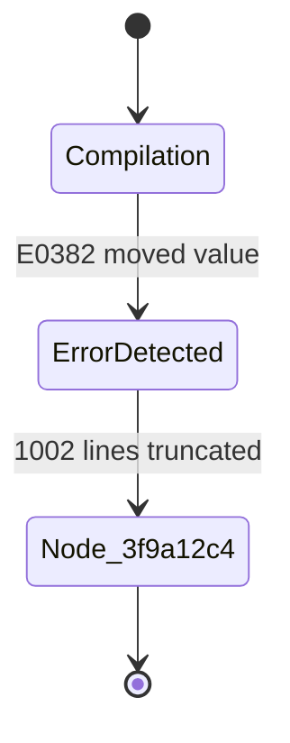

# FastMCP 协议规范与工具契约

K0maru 原生内嵌了符合 Anthropic Model Context Protocol（FastMCP）标准的 JSON-RPC 2.0 服务端。当通过 `k0maru mcp` 启动时，它在标准输入输出流（stdio）上暴露以下 6 大原生工具。

---

## 工具接口全景一览

| 原生工具名称 | 核心职责 | 典型调用场景 |
| :--- | :--- | :--- |
| [`get_project_loadout`](#1-get-project-loadout) | 提取项目愿景与 L3 铁律（<300 Token） | 智能体在开辟新会话时进行背景对齐与读档 |
| [`recall_memory`](#2-recall-memory) | 多路混合检索（BM25 + 向量 + 图谱加权） | 编写核心逻辑或排查疑难 Bug 时查阅知识库 |
| [`offload_context`](#3-offload-context) | 终端长日志卸载为 Mermaid 状态图 | 运行测试或构建产生超长回溯时截断上下文 |
| [`inspect_log_node`](#4-inspect-log-node) | 凭 Node ID 提取原始未截断日志切片 | 智能体需要精确定位某层具体报错调用栈 |
| [`flush_session`](#5-flush-session) | 会话关键决策与架构心得原子结晶落盘 | 任务交付或完成重大架构决策后持久化 |
| [`distill_session_skill`](#6-distill-session-skill) | 故障排障痕迹智能提炼为通用技能 | 从失败回溯中提取自动化排障 Playbook |

---

## 1. `get_project_loadout`

### 工具描述
提取目标项目的极简愿景概括、技术栈声明与 1-Hop 关联的核心 L3 架构不变量（约束在 `< 300 Token`），杜绝智能体注意力漂移与架构幻觉。

### JSON Schema 契约
```json
{
  "name": "get_project_loadout",
  "description": "Generate a compact sub-300-token project context loadout (vision, L3 principles, recent L2 logs)",
  "inputSchema": {
    "type": "object",
    "properties": {
      "project_name": {
        "type": "string",
        "description": "Target project name or keyword"
      }
    },
    "required": ["project_name"]
  }
}
```

### 调用输入示例
```json
{
  "project_name": "payment-gateway"
}
```

### 返回值格式（Markdown 文本）
```markdown
# Context Loadout: Payment Gateway Core
- Root: `10_Projects/payment-gateway.md`
- Core Stack: Go 1.22, Redis 7, PostgreSQL 16

## L3 Invariants & Decisions:
- [[adr-001-idempotency]]: 必须基于 `SET lock:payment:{event_id} "1" NX EX 30` 抢占分布式锁；事务内状态机校验 `STATUS_PENDING`。

## Recent L2 Logs:
- 2026-10-08: 修复 Stripe Webhook 重试风暴事故。
```

---

## 2. `recall_memory`

### 工具描述
使用 RRF 混合检索算法（FTS5 BM25 词法倒排 + 384 维稠密向量 + 1-Hop 图谱双向拓扑加权）召回知识库中的高相关笔记与历史决策。

### JSON Schema 契约
```json
{
  "name": "recall_memory",
  "description": "Search knowledge hub memories and notes using hybrid RRF retrieval (BM25 full-text + vector embeddings + graph links)",
  "inputSchema": {
    "type": "object",
    "properties": {
      "query": {
        "type": "string",
        "description": "Search query keywords"
      },
      "limit": {
        "type": "integer",
        "description": "Maximum number of results to return (default: 5)"
      }
    },
    "required": ["query"]
  }
}
```

### 调用输入示例
```json
{
  "query": "Stripe webhook idempotency rules deduplication",
  "limit": 3
}
```

### 返回值格式
返回以分割线连接的按 RRF 综合得分降序排列的高匹配度卡片正文片段。

---

## 3. `offload_context`

### 工具描述
截断并持久化超过 50 行的终端原始巨幅报错日志，返回高度凝练的 15 行 Mermaid 状态机图与唯一 `node_id`。

### JSON Schema 契约
```json
{
  "name": "offload_context",
  "description": "Truncate and externalize long text/logs (>50 lines) to disk references, returning a Mermaid diagram and node_id",
  "inputSchema": {
    "type": "object",
    "properties": {
      "raw_text": {
        "type": "string",
        "description": "Raw log or output text to be offloaded"
      },
      "task_name": {
        "type": "string",
        "description": "Optional task identifier prefix"
      }
    },
    "required": ["raw_text"]
  }
}
```

### 调用输入示例
```json
{
  "raw_text": "Stack trace line 1...\n[1,000 lines truncated]...\nerror[E0382]: use of moved value",
  "task_name": "build_worker"
}
```

### 返回值格式
```markdown


✓ Log offloaded (1002 lines, 99.4% token reduction)
  Reference ID: node_3f9a12c4
  Use 'inspect_log_node' to view raw stack frames.
```

---

## 4. `inspect_log_node`

### 工具描述
凭 Node ID 从本地离线切片存储池中提取未截断的局部原始日志。

### JSON Schema 契约
```json
{
  "name": "inspect_log_node",
  "description": "Inspect and retrieve the full offloaded raw log content by its node ID",
  "inputSchema": {
    "type": "object",
    "properties": {
      "node_id": {
        "type": "string",
        "description": "Offloaded log node identifier (e.g. node_1a2b3c4d)"
      }
    },
    "required": ["node_id"]
  }
}
```

### 调用输入示例
```json
{
  "node_id": "node_3f9a12c4"
}
```

### 返回值格式
返回目标 Node ID 对应的未截断原始日志切片文本。

---

## 5. `flush_session`

### 工具描述
遵循知识库现有的目录组织形式与命名风格，自动生成标准 YAML Frontmatter 并将决策内容持久化落盘，自动编织关联笔记的 `[[WikiLinks]]`。

### JSON Schema 契约
```json
{
  "name": "flush_session",
  "description": "Crystallize learnings, architectural decisions, or task summaries back into the Markdown knowledge base according to the vault's conventions",
  "inputSchema": {
    "type": "object",
    "properties": {
      "title": {
        "type": "string",
        "description": "Title of the decision or log note"
      },
      "content": {
        "type": "string",
        "description": "Detailed Markdown content"
      },
      "summary": {
        "type": "string",
        "description": "Brief one-line summary or executive conclusion"
      },
      "category": {
        "type": "string",
        "description": "Category: 'decision', 'log', 'concept', or custom (default: 'log')"
      },
      "tags": {
        "type": "array",
        "items": { "type": "string" },
        "description": "Associated tags"
      },
      "related_notes": {
        "type": "array",
        "items": { "type": "string" },
        "description": "Related existing notes to link via WikiLinks"
      }
    },
    "required": ["title", "content"]
  }
}
```

### 调用输入示例
```json
{
  "title": "ADR-PAY-012: Stripe Webhook Distributed Lock Guard",
  "category": "decision",
  "summary": "在 Redis 互斥锁校验中对重复回调返回 200 OK 避免死信重试风暴",
  "tags": ["stripe", "webhook", "redis", "idempotency"],
  "related_notes": ["L3_payment_callback_idempotency_rules", "payment-gateway"],
  "content": "## 背景\n在高并发下 Stripe 重复回调引发竞争...\n## 解决方案\n引入分布式锁守护..."
}
```

### 返回值格式
```text
✓ Crystallized note into vault.
Relative Path: 20_Cards/adr-pay-012-stripe-webhook-distributed-lock-guard.md
Category: decision
WikiLinks: [[L3_payment_callback_idempotency_rules]], [[payment-gateway]]
```

---

## 6. `distill_session_skill`

### 工具描述
从终端执行回溯、报错堆栈或已卸载的日志切片中自动提炼通用技能，并可选择导出至 Nous Research Hermes Agent 等动态技能生态中。

### JSON Schema 契约
```json
{
  "name": "distill_session_skill",
  "description": "Distill an execution trace, error log, or troubleshooting session into a reusable skill note and crystallize it into the vault.",
  "inputSchema": {
    "type": "object",
    "properties": {
      "raw_trace": {
        "type": "string",
        "description": "Raw execution log, error stack trace, or debugging terminal output"
      },
      "node_id": {
        "type": "string",
        "description": "Optional offloaded node ID from offload_context (e.g. node_1a2b3c4d)"
      },
      "title": {
        "type": "string",
        "description": "Optional explicit skill title (auto-inferred if omitted)"
      },
      "context_hint": {
        "type": "string",
        "description": "Optional context hint or explanation describing what was happening"
      },
      "category": {
        "type": "string",
        "description": "Target category (defaults to 'skill')"
      },
      "tags": {
        "type": "array",
        "items": { "type": "string" },
        "description": "Optional tags array"
      },
      "related_notes": {
        "type": "array",
        "items": { "type": "string" },
        "description": "Optional related notes or WikiLinks array"
      },
      "dry_run": {
        "type": "boolean",
        "description": "If true, simulates distillation and returns preview without writing to vault"
      },
      "target": {
        "type": "string",
        "enum": ["default", "hermes"],
        "description": "Optional target ecosystem schema: 'default' (Obsidian) or 'hermes' (Nous Research Hermes dynamic skill)"
      }
    }
  }
}
```

### 调用输入示例
```json
{
  "node_id": "node_3f9a12c4",
  "title": "Rust E0382 所有权移动故障排查与修复",
  "target": "hermes"
}
```

### 返回值格式
```text
✓ Crystallized skill note into vault.
Title: Rust E0382 所有权移动故障排查与修复
Relative Path: playbooks/rust-e0382-all-ownership-move-troubleshooting.md
Category: skill
WikiLinks: [[payment-gateway]]
```
