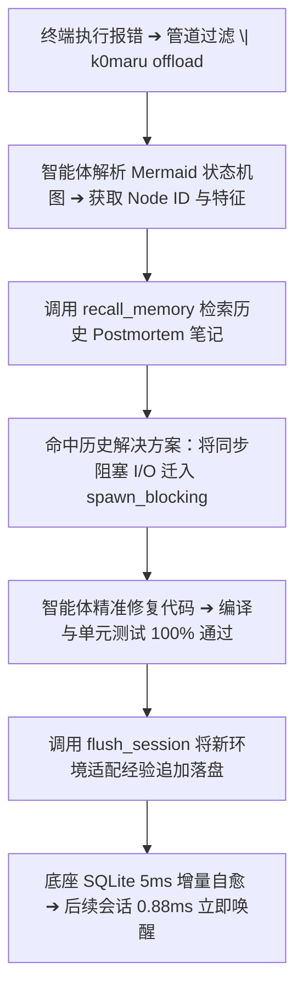

# 工业级应用场景实战

本文通过 3 个源自真实工业级研发一线的端到端场景，详细展示 K0maru-Agent-Memory 如何赋能开发者与 AI 智能体守护系统不变量、闭环自愈排障以及提炼可复用动态技能。

---

## 场景 A：企业级 LLM-Wiki 维护（守护分布式锁与状态机防重不变量）

### 业务背景
在金融收单服务中，重复出款或重复回调极易导致严重资损事故。团队在知识库中沉淀了核心 L3 规约 `20_Cards/L3_payment_callback_idempotency_rules.md`：
1. 必须通过 Redis 抢占分布式互斥锁：`SET lock:payment:callback:{event_id} "1" NX EX 30`；
2. 抢锁失败立即返回 HTTP 429 触发网关指数退避；
3. 状态机在单数据库事务内校验当前状态为 `STATUS_PENDING`；若非 PENDING 则直接返回 200 OK，防止重复扣款。

### 智能体真实执行轨迹实录（Qwen3.8-27B 挂载 K0maru）

```text
[用户指令] 请为 payment-gateway 模块实现生产级 Go 语言 Stripe Webhook 回调 Handler

--- 轮次 1：编码前主动预检 (Pre-flight Inspection) ---
⚡ [Agent Tool Call] `get_project_loadout` {"project_name": "payment-gateway"}
   ↳ 提取技术栈与依赖不变量：Go 1.22 + Gin + Redis 7 + PostgreSQL 16
⚡ [Agent Tool Call] `recall_memory` {"query": "Stripe webhook idempotency rules deduplication", "limit": 5}
   ↳ 命中 L3_payment_callback_idempotency_rules（得分 7.05，全库首位）
⚡ [Agent Tool Call] `recall_memory` {"query": "webhook signature verification security incident", "limit": 5}
   ↳ 命中 2026-10-08-incident-retry-storm 事故复盘笔记

--- 轮次 2：守约代码生成 (Invariant-Compliant Implementation) ---
Assistant 生成完全合规的 Go 代码：
```

```go
package handler

import (
    "context"
    "net/http"
    "time"
    "github.com/gin-gonic/gin"
    "github.com/redis/go-redis/v9"
    "github.com/stripe/stripe-go/v78/webhook"
)

func StripeWebhookHandler(rdb *redis.Client, db *Database) gin.HandlerFunc {
    return func(c *gin.Context) {
        // 1. 签名防伪造校验
        payload, err := c.GetRawData()
        if err != nil {
            c.AbortWithStatus(http.StatusBadRequest)
            return
        }
        event, err := webhook.ConstructEvent(payload, c.GetHeader("Stripe-Signature"), webhookSecret)
        if err != nil {
            c.AbortWithStatus(http.StatusUnauthorized)
            return
        }

        // 2. 遵守 ADR-001 架构铁律：抢占 Redis 分布式互斥锁
        lockKey := "lock:payment:callback:" + event.ID
        ok, err := rdb.SetNX(c.Request.Context(), lockKey, "1", 30*time.Second).Result()
        if err != nil || !ok {
            // 抢锁失败立即返回 429 触发 Stripe 指数退避重试，杜绝并发竞争
            c.AbortWithStatus(http.StatusTooManyRequests)
            return
        }
        defer rdb.Del(context.Background(), lockKey)

        // 3. 状态机防重门禁：若非 PENDING 立即返回 200 OK 幂等确认
        order, err := db.GetOrder(event.Data.Object["client_reference_id"])
        if order.Status != StatusPending {
            c.JSON(http.StatusOK, gin.H{"status": "already_processed"})
            return
        }

        // 4. 原子入账事务
        if err := db.AtomicTransitionToSuccess(order.ID); err != nil {
            c.AbortWithStatus(http.StatusInternalServerError)
            return
        }
        c.JSON(http.StatusOK, gin.H{"status": "success"})
    }
}
```

```text
--- 轮次 3：决策结晶自愈 (Session Flush) ---
⚡ [Agent Tool Call] `flush_session` {
  "title": "ADR-PAY-012: Stripe Webhook Handler with Distributed Lock Guard",
  "category": "decision",
  "tags": ["stripe", "webhook", "idempotency", "redis", "distributed-lock"],
  "related_notes": ["L3_payment_callback_idempotency_rules", "payment-gateway"],
  "content": "..."
}
↳ FlushEngine 自动落盘至 20_Cards/adr-pay-012-...md，并自动与 L3 规则织入双链
```

通过这一流程，模型摆脱了在未受约束状态下容易写出「先查数据库再抢锁」或者「忽略 429 竞争重试」等典型资损漏洞的代码。

---

## 场景 B：跨会话排障与自愈闭环（自适应查阅 Postmortem 并结晶修复）

### 业务背景
开发者在进行 Rust 异步服务开发时，偶发性遭遇 `Tokio task blocking / worker thread starvation` 严重性能衰退。在未挂载 K0maru 的裸机环境中，每次遭遇此问题智能体都会从头猜测是否存在死锁。

### 闭环工作流三步曲



1. **终端捕获与压缩**：
   ```bash
   cargo test --test concurrency 2>&1 | k0maru offload
   ```
   长达 1,200 行的调度回溯被压缩为 15 行 Mermaid 时序图，精准指示在 `dispatch_loop()` 中耗时超过 5,000 ms；
2. **主动调阅历史排障卡片**：
   智能体调用 `recall_memory("Tokio worker thread starvation blocking")`，瞬间检索出半个月前团队沉淀的 `2026-09-24-tokio-blocking-postmortem.md`；
3. **精准生成补丁与落盘自愈**：
   智能体根据历史记录迅速将 `std::fs::read` 替换为 `tokio::task::spawn_blocking`。测试全绿后，智能体调用 `flush_session` 沉淀当期工单总结，新卡片在 5 毫秒内同步入库，形成可持续闭环。

---

## 场景 C：动态技能提炼与团队协作（Trace-to-Skill）

### 业务背景
团队中有初级工程师或新加入的智能体需要排查诸如 `C 语言双重释放 (heap-use-after-free)` 或 `Python Asyncio 异步任务未等待异常` 等复杂缺陷。

### 自动化提炼流程（`k0maru distill`）

当智能体在终端解决完一次疑难排障后，可以直接通过 CLI 或 FastMCP 工具提炼标准化排障 Playbook：

```bash
k0maru distill \
  --node node_54697ed3 \
  --title "Python Asyncio InvalidStateError 排查与修复标准手册" \
  --context "排查 pytest 测试中因未等待 Future 导致的异步任务内存泄漏" \
  --tags "python,asyncio,leak,playbook" \
  --export-hermes
```

### 提炼产物展示：
提炼引擎自动生成结构化技能笔记并写入知识库的 `playbooks/` 目录，并同步导出至 `~/.hermes/skills/`：

```markdown
---
title: Python Asyncio InvalidStateError 排查与修复标准手册
category: skill
tags: [python, asyncio, leak, playbook]
date: 2026-10-09
---

# Python Asyncio InvalidStateError 排查与修复标准手册

## 1. 现象与特征
- **异常特征**：`asyncio.exceptions.InvalidStateError: RESULT: state=PENDING`
- **典型诱因**：在协程中直接调用 `.result()`，而非 `await task`；或在异常穿透时未捕获任务集合。

## 2. 标准排查链路
1. 检查是否存在裸调用的 `asyncio.create_task()` 未加入全局监视；
2. 检查批量任务是否使用了不带异常阻断的直接解包。

## 3. 标准修复模版
必须使用具备安全等待语义的重构方案：
```python
results = await asyncio.gather(*tasks, return_exceptions=True)
for res in results:
    if isinstance(res, Exception):
        logger.error(f"Task failed: {res}")
```

## 4. 关联架构笔记
- [[2026-10-08-incident-retry-storm]]
- [[payment-gateway]]
```

后续无论是人类团队成员还是自主运行的 Nous Research Hermes Agent，都可直接在对应目录中读取该技能手册，避免重复踩坑。
